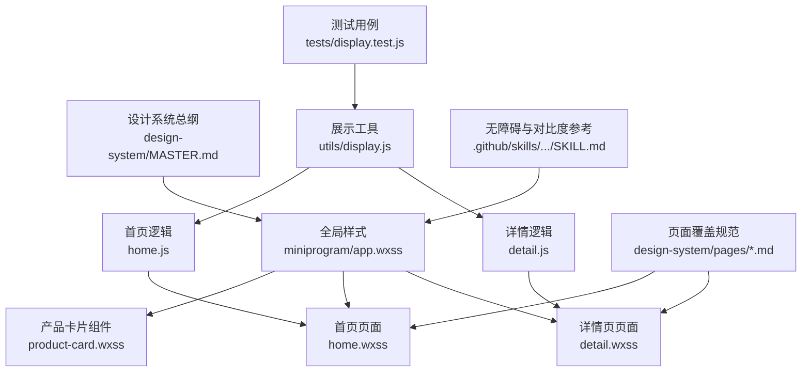
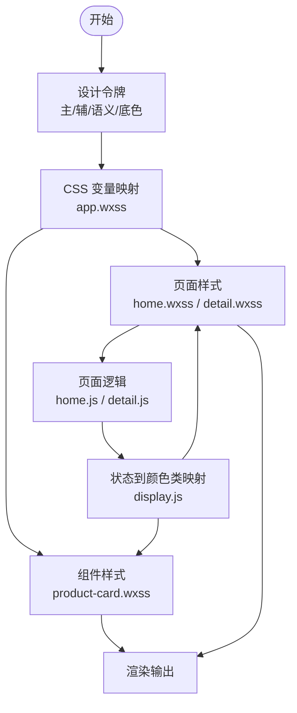
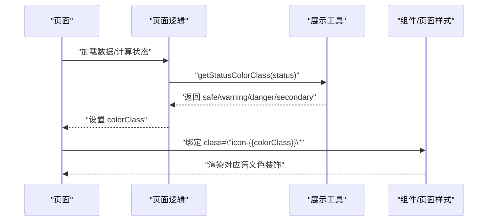
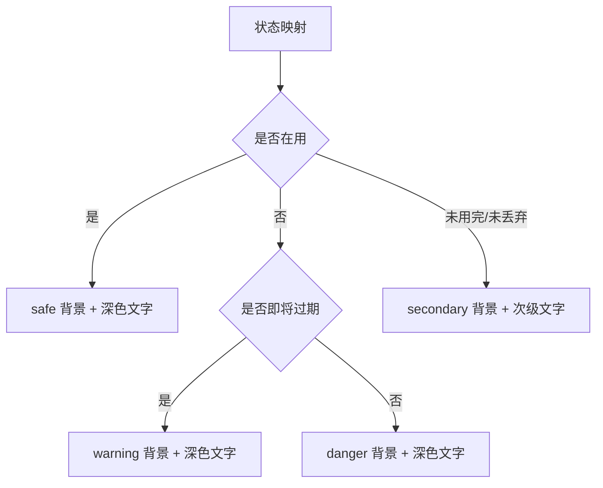
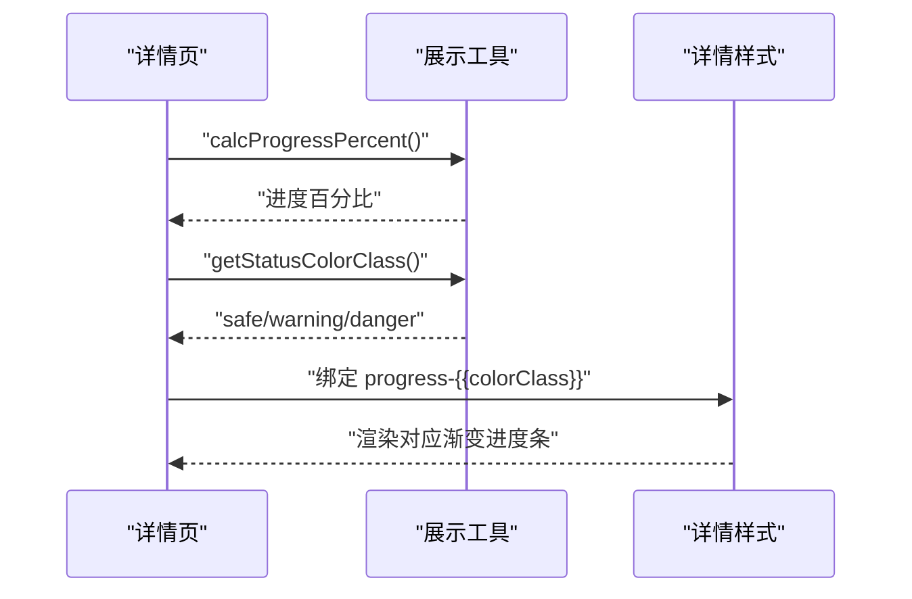
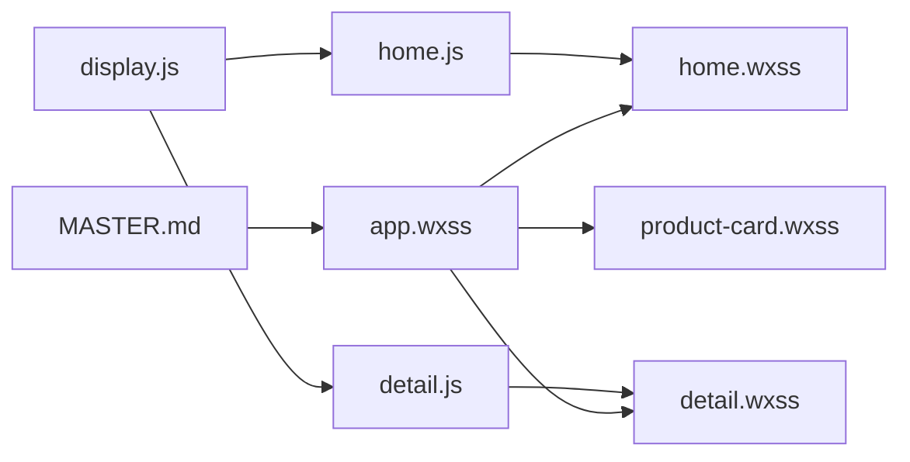

# 色彩系统

<cite>
**本文引用的文件**
- [design-system/MASTER.md](file://design-system/MASTER.md)
- [miniprogram/app.wxss](file://miniprogram/app.wxss)
- [miniprogram/components/product-card/product-card.wxss](file://miniprogram/components/product-card/product-card.wxss)
- [miniprogram/pages/home/home.wxss](file://miniprogram/pages/home/home.wxss)
- [miniprogram/pages/detail/detail.wxss](file://miniprogram/pages/detail/detail.wxss)
- [miniprogram/pages/home/home.js](file://miniprogram/pages/home/home.js)
- [miniprogram/pages/detail/detail.js](file://miniprogram/pages/detail/detail.js)
- [miniprogram/utils/display.js](file://miniprogram/utils/display.js)
- [design-system/pages/home.md](file://design-system/pages/home.md)
- [design-system/pages/detail.md](file://design-system/pages/detail.md)
- [.github/skills/ui-ux-pro-max/SKILL.md](file://.github/skills/ui-ux-pro-max/SKILL.md)
- [tests/display.test.js](file://tests/display.test.js)
</cite>

## 目录
1. [简介](#简介)
2. [项目结构](#项目结构)
3. [核心组件](#核心组件)
4. [架构总览](#架构总览)
5. [详细组件分析](#详细组件分析)
6. [依赖分析](#依赖分析)
7. [性能考量](#性能考量)
8. [故障排查指南](#故障排查指南)
9. [结论](#结论)
10. [附录](#附录)

## 简介
本文件为“CosmeticBox”微信小程序的色彩系统规范文档，围绕主色（珊瑚粉）、辅色（薰衣草紫）、语义色（安全/警告/危险/信息）与底色体系进行系统化梳理，并结合全局样式、组件与页面的实际落地，给出使用场景、心理暗示、对比度与无障碍建议及最佳实践。

## 项目结构
- 设计系统总纲：统一的色彩、字体、圆角、阴影、间距与动画规范
- 全局样式：将设计令牌映射为小程序 CSS 变量与通用工具类
- 组件与页面：在卡片、徽章、进度条、按钮、输入框等元素中落地色彩规范
- 工具与测试：状态到颜色类的映射与测试保障

图表来源
- [design-system/MASTER.md:13-60](file://design-system/MASTER.md#L13-L60)
- [miniprogram/app.wxss:7-76](file://miniprogram/app.wxss#L7-L76)
- [miniprogram/components/product-card/product-card.wxss:1-122](file://miniprogram/components/product-card/product-card.wxss#L1-L122)
- [miniprogram/pages/home/home.wxss:1-324](file://miniprogram/pages/home/home.wxss#L1-L324)
- [miniprogram/pages/detail/detail.wxss:1-269](file://miniprogram/pages/detail/detail.wxss#L1-L269)
- [miniprogram/pages/home/home.js:1-119](file://miniprogram/pages/home/home.js#L1-L119)
- [miniprogram/pages/detail/detail.js:1-122](file://miniprogram/pages/detail/detail.js#L1-L122)
- [miniprogram/utils/display.js:1-75](file://miniprogram/utils/display.js#L1-L75)
- [design-system/pages/home.md:1-52](file://design-system/pages/home.md#L1-L52)
- [design-system/pages/detail.md:1-52](file://design-system/pages/detail.md#L1-L52)
- [.github/skills/ui-ux-pro-max/SKILL.md:65-604](file://.github/skills/ui-ux-pro-max/SKILL.md#L65-L604)
- [tests/display.test.js:1-111](file://tests/display.test.js#L1-L111)

章节来源
- [design-system/MASTER.md:13-60](file://design-system/MASTER.md#L13-L60)
- [miniprogram/app.wxss:7-76](file://miniprogram/app.wxss#L7-L76)

## 核心组件
- 主色·Primary（珊瑚粉）：温暖、有活力、美妆调性，用于品牌色、主按钮、导航高亮、关键操作；提供主色、浅色、更浅色与主色背景的完整梯度
- 辅色·Secondary（薰衣草紫）：精致、年轻、有游戏感，用于辅助操作、徽章、装饰元素；提供辅色、浅色、更浅色与辅色背景
- 语义色·Semantic：安全（绿色系）、警告（黄色系）、危险（红色系）、信息（蓝色系）；配套语义色与对应背景色
- 底色·Surfaces：页面背景（暖白）、卡片背景、文字颜色（主/次/占位符）、边框颜色

章节来源
- [design-system/MASTER.md:15-59](file://design-system/MASTER.md#L15-L59)
- [miniprogram/app.wxss:7-36](file://miniprogram/app.wxss#L7-L36)

## 架构总览
色彩系统通过“设计令牌 → CSS 变量 → 组件/页面样式 → 业务逻辑”的链路实现：
- 设计令牌定义主/辅/语义/底色的色值与用途
- 全局样式将令牌映射为 CSS 变量与通用工具类
- 组件与页面通过变量与工具类落地规范
- 业务逻辑根据状态动态选择颜色类，确保一致性

图表来源
- [design-system/MASTER.md:15-59](file://design-system/MASTER.md#L15-L59)
- [miniprogram/app.wxss:7-76](file://miniprogram/app.wxss#L7-L76)
- [miniprogram/components/product-card/product-card.wxss:1-122](file://miniprogram/components/product-card/product-card.wxss#L1-L122)
- [miniprogram/pages/home/home.wxss:1-324](file://miniprogram/pages/home/home.wxss#L1-L324)
- [miniprogram/pages/detail/detail.wxss:1-269](file://miniprogram/pages/detail/detail.wxss#L1-L269)
- [miniprogram/pages/home/home.js:1-119](file://miniprogram/pages/home/home.js#L1-L119)
- [miniprogram/pages/detail/detail.js:1-122](file://miniprogram/pages/detail/detail.js#L1-L122)
- [miniprogram/utils/display.js:55-68](file://miniprogram/utils/display.js#L55-L68)

## 详细组件分析

### 主色·Primary（珊瑚粉）：温暖活力与关键场景
- 心理特质：温暖、有活力、美妆调性，不甜腻
- 色值与梯度：主色、浅色、更浅色、主色背景
- 关键场景：
  - 品牌色与主按钮：使用主色，确保在页面背景上具备足够对比度
  - 导航高亮：用于 TabBar 或侧边导航的激活态
  - 关键操作：购买、提交、确认等重要动作
- 页面落地：
  - 主按钮：使用主色背景与白色文字
  - 顶部渐变背景：首页头部使用多色渐变，融合主色
  - 几何装饰：主色半透明圆形作为背景装饰

图表来源
- [miniprogram/pages/home/home.js:54-69](file://miniprogram/pages/home/home.js#L54-L69)
- [miniprogram/pages/detail/detail.js:54-69](file://miniprogram/pages/detail/detail.js#L54-L69)
- [miniprogram/utils/display.js:55-68](file://miniprogram/utils/display.js#L55-L68)
- [miniprogram/components/product-card/product-card.wxml:8](file://miniprogram/components/product-card/product-card.wxml#L8)
- [miniprogram/pages/home/home.wxss:139-145](file://miniprogram/pages/home/home.wxss#L139-L145)

章节来源
- [design-system/MASTER.md:15-25](file://design-system/MASTER.md#L15-L25)
- [miniprogram/app.wxss:8-12](file://miniprogram/app.wxss#L8-L12)
- [miniprogram/pages/home/home.wxss:11-17](file://miniprogram/pages/home/home.wxss#L11-L17)
- [miniprogram/pages/home/home.wxss:139-145](file://miniprogram/pages/home/home.wxss#L139-L145)

### 辅色·Secondary（薰衣草紫）：精致年轻与辅助场景
- 心理特质：精致、年轻、有游戏感
- 色值与梯度：辅色、浅色、更浅色、辅色背景
- 辅助场景：
  - 辅助操作：次要按钮、取消、返回
  - 徽章与装饰：轻强调标签、装饰性图标容器
- 页面落地：
  - 图标容器渐变：首页“最近添加”与空状态使用主/辅色渐变
  - 分类标签：详情页头部使用主色背景+主色文字，体现层次

图表来源
- [miniprogram/utils/display.js:55-68](file://miniprogram/utils/display.js#L55-L68)
- [miniprogram/pages/detail/detail.wxss:67-71](file://miniprogram/pages/detail/detail.wxss#L67-L71)
- [miniprogram/pages/home/home.wxss:219-224](file://miniprogram/pages/home/home.wxss#L219-L224)

章节来源
- [design-system/MASTER.md:26-36](file://design-system/MASTER.md#L26-L36)
- [miniprogram/app.wxss:14-18](file://miniprogram/app.wxss#L14-L18)
- [miniprogram/pages/detail/detail.wxss:67-71](file://miniprogram/pages/detail/detail.wxss#L67-L71)
- [miniprogram/pages/home/home.wxss:219-224](file://miniprogram/pages/home/home.wxss#L219-L224)

### 语义色·Semantic：安全/警告/危险/信息
- 安全（绿色系）：产品在用/安全状态，搭配浅绿背景
- 警告（黄色系）：即将过期，搭配浅黄背景
- 危险（红色系）：已过期，搭配浅红背景
- 信息（蓝色系）：提示信息，搭配浅蓝背景
- 页面落地：
  - 保质期进度条：使用对应语义色的渐变填充
  - 状态标签：背景使用语义色背景，文字使用深色变体
  - 边框高亮：首页“即将过期”卡片使用警告/危险左边界

图表来源
- [miniprogram/pages/detail/detail.js:54-69](file://miniprogram/pages/detail/detail.js#L54-L69)
- [miniprogram/utils/display.js:13-27](file://miniprogram/utils/display.js#L13-L27)
- [miniprogram/utils/display.js:55-68](file://miniprogram/utils/display.js#L55-L68)
- [miniprogram/pages/detail/detail.wxss:113-126](file://miniprogram/pages/detail/detail.wxss#L113-L126)
- [miniprogram/pages/detail/detail.wxss:190-200](file://miniprogram/pages/detail/detail.wxss#L190-L200)

章节来源
- [design-system/MASTER.md:37-49](file://design-system/MASTER.md#L37-L49)
- [miniprogram/app.wxss:20-28](file://miniprogram/app.wxss#L20-L28)
- [miniprogram/pages/detail/detail.wxss:113-126](file://miniprogram/pages/detail/detail.wxss#L113-L126)
- [miniprogram/pages/home/home.wxss:139-145](file://miniprogram/pages/home/home.wxss#L139-L145)

### 底色体系：页面背景、卡片、文字与边框
- 页面背景：暖白（非纯白），营造柔和、不冰冷的阅读体验
- 卡片背景：纯白，与页面背景形成清晰的层次
- 文字颜色：主文字（暖黑）、次文字、占位符
- 边框：低饱和度半透明黑，用于分隔线与输入框边框
- 页面落地：
  - 全局 page 设置背景与文字色
  - 卡片、输入框、按钮等使用统一圆角与阴影

章节来源
- [design-system/MASTER.md:50-59](file://design-system/MASTER.md#L50-L59)
- [miniprogram/app.wxss:30-36](file://miniprogram/app.wxss#L30-L36)
- [miniprogram/app.wxss:130-165](file://miniprogram/app.wxss#L130-L165)

## 依赖分析
- 设计令牌到 CSS 变量：全局样式集中定义，保证一致性
- 组件与页面：通过变量与工具类复用，避免硬编码色值
- 业务逻辑：通过状态映射函数统一颜色类，减少分支与重复判断
- 页面覆盖：首页与详情页在总纲基础上补充布局与场景规范

图表来源
- [design-system/MASTER.md:13-60](file://design-system/MASTER.md#L13-L60)
- [miniprogram/app.wxss:7-76](file://miniprogram/app.wxss#L7-L76)
- [miniprogram/components/product-card/product-card.wxss:1-122](file://miniprogram/components/product-card/product-card.wxss#L1-L122)
- [miniprogram/pages/home/home.wxss:1-324](file://miniprogram/pages/home/home.wxss#L1-L324)
- [miniprogram/pages/detail/detail.wxss:1-269](file://miniprogram/pages/detail/detail.wxss#L1-L269)
- [miniprogram/pages/home/home.js:1-119](file://miniprogram/pages/home/home.js#L1-L119)
- [miniprogram/pages/detail/detail.js:1-122](file://miniprogram/pages/detail/detail.js#L1-L122)
- [miniprogram/utils/display.js:55-68](file://miniprogram/utils/display.js#L55-L68)

章节来源
- [design-system/MASTER.md:13-60](file://design-system/MASTER.md#L13-L60)
- [miniprogram/app.wxss:7-76](file://miniprogram/app.wxss#L7-L76)
- [miniprogram/utils/display.js:55-68](file://miniprogram/utils/display.js#L55-L68)

## 性能考量
- 使用 CSS 变量与工具类：减少重复样式与运行时计算
- 渐变背景与进度条：采用线性渐变与固定尺寸，避免复杂滤镜
- 状态映射：在 JS 层一次性计算颜色类，减少模板渲染分支
- 页面覆盖：通过页面级样式覆盖，避免全局样式冲突

## 故障排查指南
- 状态颜色不正确
  - 检查状态枚举与映射函数是否一致
  - 确认页面逻辑是否正确传入状态并设置 colorClass
- 对比度不足
  - 使用无障碍参考标准检查文本与背景的对比度
  - 避免仅用颜色传达信息，增加图标或文字说明
- 样式未生效
  - 确认全局样式变量是否正确引入
  - 检查组件/页面样式是否优先级正确

章节来源
- [tests/display.test.js:90-110](file://tests/display.test.js#L90-L110)
- [.github/skills/ui-ux-pro-max/SKILL.md:65-83](file://.github/skills/ui-ux-pro-max/SKILL.md#L65-L83)

## 结论
本色彩系统以“清新柔和”的设计理念为核心，通过主色（珊瑚粉）与辅色（薰衣草紫）构建品牌识别，以语义色强化状态表达，以底色体系保障可读性与层次感。配合全局样式、组件与页面的落地，以及状态到颜色类的映射机制，实现了高一致性与可维护性的视觉语言。

## 附录

### 色彩令牌与使用场景速览
- 主色（珊瑚粉）：品牌色、主按钮、导航高亮、关键操作
- 辅色（薰衣草紫）：辅助操作、徽章、装饰元素
- 语义色：安全（绿）、警告（黄）、危险（红）、信息（蓝）
- 底色：页面背景（暖白）、卡片背景（白）、文字（主/次/占位符）、边框

章节来源
- [design-system/MASTER.md:15-59](file://design-system/MASTER.md#L15-L59)