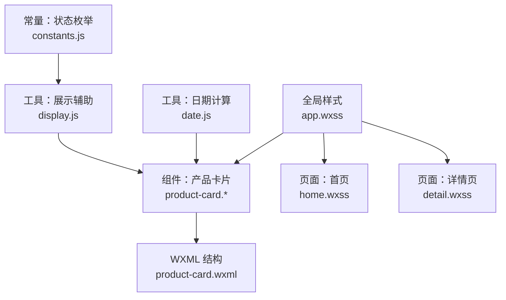
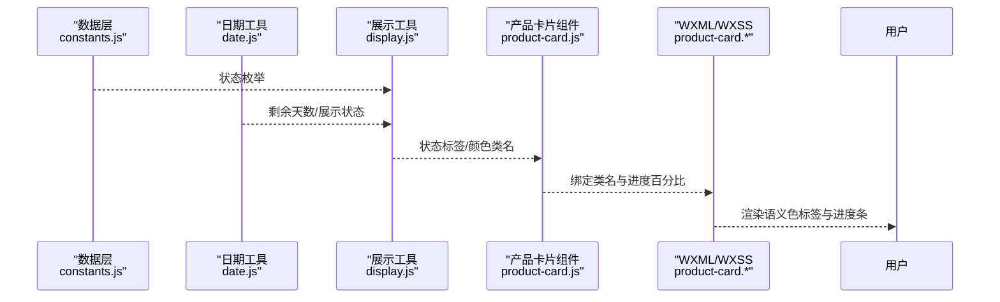
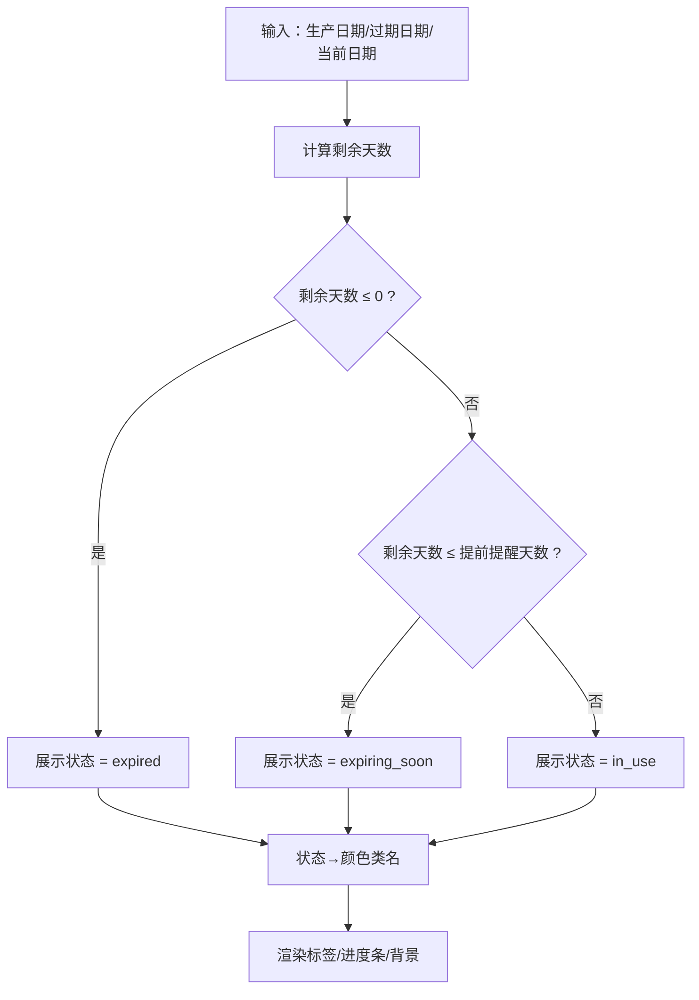
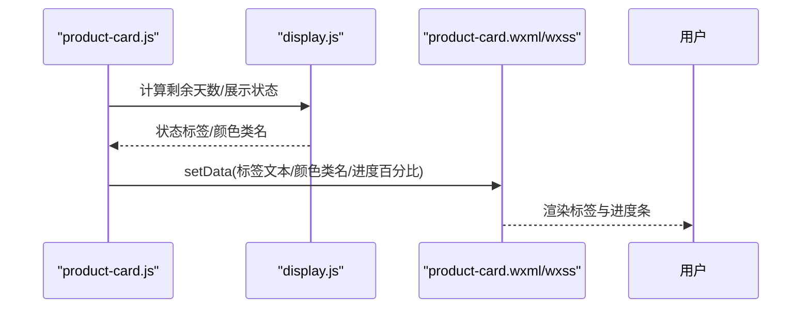
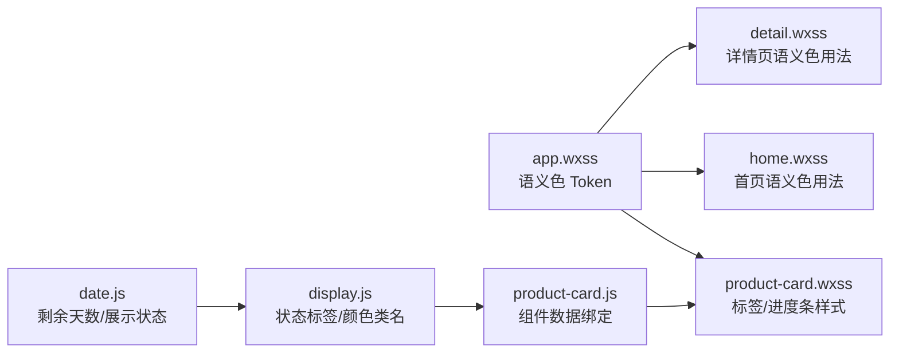

# 语义色系统

<cite>
**本文引用的文件**
- [design-system/MASTER.md](file://design-system/MASTER.md)
- [miniprogram/app.wxss](file://miniprogram/app.wxss)
- [miniprogram/components/product-card/product-card.wxml](file://miniprogram/components/product-card/product-card.wxml)
- [miniprogram/components/product-card/product-card.wxss](file://miniprogram/components/product-card/product-card.wxss)
- [miniprogram/components/product-card/product-card.js](file://miniprogram/components/product-card/product-card.js)
- [miniprogram/utils/display.js](file://miniprogram/utils/display.js)
- [miniprogram/utils/date.js](file://miniprogram/utils/date.js)
- [miniprogram/utils/constants.js](file://miniprogram/utils/constants.js)
- [miniprogram/pages/home/home.wxss](file://miniprogram/pages/home/home.wxss)
- [miniprogram/pages/detail/detail.wxss](file://miniprogram/pages/detail/detail.wxss)
- [.github/skills/ui-ux-pro-max/SKILL.md](file://.github/skills/ui-ux-pro-max/SKILL.md)
</cite>

## 目录
1. [简介](#简介)
2. [项目结构](#项目结构)
3. [核心组件](#核心组件)
4. [架构总览](#架构总览)
5. [详细组件分析](#详细组件分析)
6. [依赖分析](#依赖分析)
7. [性能考量](#性能考量)
8. [无障碍设计与对比度](#无障碍设计与对比度)
9. [故障排查指南](#故障排查指南)
10. [结论](#结论)

## 简介
本文件为“语义色系统”的专业色彩规范文档，围绕四种核心语义色（安全色、警告色、危险色、信息色）展开，系统阐述其心理学含义、视觉传达效果、配套体系（主色、背景色、文本色、渐变与边框）、在产品状态标识、进度条配色、标签系统中的具体应用，并结合仓库中的实际实现进行可视化说明与最佳实践建议。

## 项目结构
语义色系统贯穿全局样式、组件与页面，形成统一的设计语言：
- 全局变量与工具类：位于全局样式文件，提供语义色 Token 与通用工具类
- 组件层：产品卡片组件根据状态动态绑定语义色类名与进度条颜色
- 页面层：首页与详情页使用语义色构建统计卡片、状态提示与进度条
- 工具层：日期与展示工具负责状态推导、进度计算与文案格式化

图表来源
- [miniprogram/app.wxss:1-201](file://miniprogram/app.wxss#L1-L201)
- [miniprogram/components/product-card/product-card.js:1-51](file://miniprogram/components/product-card/product-card.js#L1-L51)
- [miniprogram/components/product-card/product-card.wxml:1-29](file://miniprogram/components/product-card/product-card.wxml#L1-L29)
- [miniprogram/pages/home/home.wxss:1-324](file://miniprogram/pages/home/home.wxss#L1-L324)
- [miniprogram/pages/detail/detail.wxss:1-269](file://miniprogram/pages/detail/detail.wxss#L1-L269)
- [miniprogram/utils/date.js:1-76](file://miniprogram/utils/date.js#L1-L76)
- [miniprogram/utils/display.js:1-76](file://miniprogram/utils/display.js#L1-L76)
- [miniprogram/utils/constants.js:1-100](file://miniprogram/utils/constants.js#L1-L100)

章节来源
- [design-system/MASTER.md:13-60](file://design-system/MASTER.md#L13-L60)
- [miniprogram/app.wxss:1-201](file://miniprogram/app.wxss#L1-L201)

## 核心组件
- 语义色 Token 与配套体系
  - 安全色：主色 --color-safe（#34D399），背景 --color-safe-bg（#DCFCE7），文本色在组件中使用深绿（#059669）
  - 警告色：主色 --color-warning（#FBBF24），背景 --color-warning-bg（#FEF3C7），文本色在组件中使用深黄（#D97706）
  - 危险色：主色 --color-danger（#F87171），背景 --color-danger-bg（#FEE2E2），文本色在组件中使用深红（#DC2626）
  - 信息色：主色 --color-info（#60A5FA），背景 --color-info-bg（#DBEAFE）
- 语义色在组件与页面中的落地
  - 产品卡片：状态标签与进度条按状态绑定语义色类名
  - 首页：统计卡片、安全提示横幅、边框强调使用语义色
  - 详情页：头部图标容器、状态卡片背景、进度条使用语义色

章节来源
- [design-system/MASTER.md:37-49](file://design-system/MASTER.md#L37-L49)
- [miniprogram/app.wxss:20-28](file://miniprogram/app.wxss#L20-L28)
- [miniprogram/components/product-card/product-card.wxss:81-121](file://miniprogram/components/product-card/product-card.wxss#L81-L121)
- [miniprogram/pages/home/home.wxss:134-204](file://miniprogram/pages/home/home.wxss#L134-L204)
- [miniprogram/pages/detail/detail.wxss:32-90](file://miniprogram/pages/detail/detail.wxss#L32-L90)

## 架构总览
语义色系统以“状态驱动”为核心，从数据到视图的映射链路如下：
- 数据层：产品状态枚举与日期计算
- 业务层：展示工具根据剩余天数与提前提醒天数推导展示状态
- 视图层：组件与页面根据状态选择语义色类名与配色方案

图表来源
- [miniprogram/utils/constants.js:6-12](file://miniprogram/utils/constants.js#L6-L12)
- [miniprogram/utils/date.js:42-57](file://miniprogram/utils/date.js#L42-L57)
- [miniprogram/utils/display.js:55-68](file://miniprogram/utils/display.js#L55-L68)
- [miniprogram/components/product-card/product-card.js:20-32](file://miniprogram/components/product-card/product-card.js#L20-L32)
- [miniprogram/components/product-card/product-card.wxml:16-27](file://miniprogram/components/product-card/product-card.wxml#L16-L27)

## 详细组件分析

### 语义色配套体系与应用规范
- 安全色（#34D399）
  - 心理学含义：稳定、信任、健康、成长
  - 视觉传达：绿色系，传达“在用/安全”状态
  - 配套 Token：--color-safe、--color-safe-bg；组件文本色使用深绿（#059669）
  - 应用场景：产品卡片状态标签、首页统计卡片、安全提示横幅
- 警告色（#FBBF24）
  - 心理学含义：注意、提醒、警示
  - 视觉传达：明亮黄色，提示“即将过期”
  - 配套 Token：--color-warning、--color-warning-bg；组件文本色使用深黄（#D97706）
  - 应用场景：产品卡片状态标签、首页警告边框
- 危险色（#F87171）
  - 心理学含义：危险、停止、不可用
  - 视觉传达：暖红，警示“已过期”
  - 配套 Token：--color-danger、--color-danger-bg；组件文本色使用深红（#DC2626）
  - 应用场景：产品卡片状态标签、详情页状态卡片背景
- 信息色（#60A5FA）
  - 心理学含义：理性、清晰、引导
  - 视觉传达：蓝色系，传达“提示信息”
  - 配套 Token：--color-info、--color-info-bg
  - 应用场景：页面辅助信息、说明性标签

章节来源
- [design-system/MASTER.md:37-49](file://design-system/MASTER.md#L37-L49)
- [miniprogram/app.wxss:20-28](file://miniprogram/app.wxss#L20-L28)
- [miniprogram/components/product-card/product-card.wxss:81-121](file://miniprogram/components/product-card/product-card.wxss#L81-L121)
- [miniprogram/pages/home/home.wxss:134-204](file://miniprogram/pages/home/home.wxss#L134-L204)
- [miniprogram/pages/detail/detail.wxss:32-90](file://miniprogram/pages/detail/detail.wxss#L32-L90)

### 状态到颜色的映射与流程
- 状态枚举：in_use、expiring_soon、expired、used_up、discarded
- 映射规则：in_use→safe，expiring_soon→warning，expired→danger，used_up/discarded→secondary
- 推导流程：根据剩余天数与提前提醒天数，决定展示状态；再由展示状态映射到颜色类名

图表来源
- [miniprogram/utils/date.js:42-57](file://miniprogram/utils/date.js#L42-L57)
- [miniprogram/utils/display.js:55-68](file://miniprogram/utils/display.js#L55-L68)
- [miniprogram/utils/constants.js:6-12](file://miniprogram/utils/constants.js#L6-L12)

章节来源
- [miniprogram/utils/date.js:42-57](file://miniprogram/utils/date.js#L42-L57)
- [miniprogram/utils/display.js:55-68](file://miniprogram/utils/display.js#L55-L68)
- [miniprogram/utils/constants.js:6-12](file://miniprogram/utils/constants.js#L6-L12)

### 产品卡片组件中的语义色应用
- 绑定逻辑：组件根据展示状态动态设置标签文本、颜色类名与进度条宽度
- 视图渲染：WXML 使用类名绑定，WXSS 提供对应颜色与渐变
- 文案与颜色：剩余天数文案由展示工具生成；标签颜色与背景来自语义色 Token

图表来源
- [miniprogram/components/product-card/product-card.js:20-32](file://miniprogram/components/product-card/product-card.js#L20-L32)
- [miniprogram/components/product-card/product-card.wxml:16-27](file://miniprogram/components/product-card/product-card.wxml#L16-L27)
- [miniprogram/components/product-card/product-card.wxss:81-121](file://miniprogram/components/product-card/product-card.wxss#L81-L121)

章节来源
- [miniprogram/components/product-card/product-card.js:1-51](file://miniprogram/components/product-card/product-card.js#L1-L51)
- [miniprogram/components/product-card/product-card.wxml:1-29](file://miniprogram/components/product-card/product-card.wxml#L1-L29)
- [miniprogram/components/product-card/product-card.wxss:81-121](file://miniprogram/components/product-card/product-card.wxss#L81-L121)

### 页面中的语义色落地
- 首页
  - 统计卡片：使用安全/警告/辅色渐变背景
  - 安全提示横幅：使用 --color-safe-bg 背景
  - 警告边框：左侧使用 --color-warning 强化提醒
- 详情页
  - 头部图标容器：按状态使用对应渐变背景
  - 状态卡片背景：使用 --color-*-bg
  - 进度条：使用对应状态的渐变填充

章节来源
- [miniprogram/pages/home/home.wxss:13-204](file://miniprogram/pages/home/home.wxss#L13-L204)
- [miniprogram/pages/detail/detail.wxss:32-90](file://miniprogram/pages/detail/detail.wxss#L32-L90)

## 依赖分析
- 组件依赖
  - 产品卡片组件依赖日期工具与展示工具，以状态驱动 UI
- 工具依赖
  - 展示工具依赖状态枚举，提供状态标签与颜色类名映射
- 样式依赖
  - 所有语义色在全局样式中定义为 CSS 变量，组件与页面通过类名引用

图表来源
- [miniprogram/app.wxss:1-201](file://miniprogram/app.wxss#L1-L201)
- [miniprogram/components/product-card/product-card.wxss:81-121](file://miniprogram/components/product-card/product-card.wxss#L81-L121)
- [miniprogram/pages/home/home.wxss:13-204](file://miniprogram/pages/home/home.wxss#L13-L204)
- [miniprogram/pages/detail/detail.wxss:32-90](file://miniprogram/pages/detail/detail.wxss#L32-L90)
- [miniprogram/utils/date.js:42-57](file://miniprogram/utils/date.js#L42-L57)
- [miniprogram/utils/display.js:55-68](file://miniprogram/utils/display.js#L55-L68)
- [miniprogram/components/product-card/product-card.js:20-32](file://miniprogram/components/product-card/product-card.js#L20-L32)

章节来源
- [miniprogram/app.wxss:1-201](file://miniprogram/app.wxss#L1-L201)
- [miniprogram/utils/date.js:42-57](file://miniprogram/utils/date.js#L42-L57)
- [miniprogram/utils/display.js:55-68](file://miniprogram/utils/display.js#L55-L68)
- [miniprogram/components/product-card/product-card.js:20-32](file://miniprogram/components/product-card/product-card.js#L20-L32)

## 性能考量
- 状态计算与渲染
  - 进度百分比计算为纯数值运算，复杂度低，适合高频更新
  - 标签文本与颜色类名在组件观测器中一次性计算并 setData，避免重复计算
- 样式渲染
  - 使用 CSS 变量与类名切换，减少内联样式的开销
  - 进度条使用过渡动画，时长与缓动符合设计系统规范，兼顾流畅与性能

## 无障碍设计与对比度
- 对比度要求
  - 正常文字对比度应≥4.5:1，大字号文字对比度≥3:1
  - 语义色文本在组件中采用深色变体（如深绿/深黄/深红），确保与浅背景的对比度达标
- 其他无障碍要点
  - 不要仅凭颜色传递信息，需配合图标或文字
  - 交互元素需具备可见焦点状态与键盘可达性
  - 尊重用户的“减少动态”偏好设置

章节来源
- [.github/skills/ui-ux-pro-max/SKILL.md:67-83](file://.github/skills/ui-ux-pro-max/SKILL.md#L67-L83)
- [.github/skills/ui-ux-pro-max/SKILL.md:592-604](file://.github/skills/ui-ux-pro-max/SKILL.md#L592-L604)

## 故障排查指南
- 状态标签为空
  - 检查展示工具的状态映射是否包含该状态
  - 确认组件传入的展示状态是否正确
- 进度条不更新
  - 检查日期工具的剩余天数计算是否异常
  - 确认组件观测器是否触发 setData
- 颜色类名不生效
  - 检查 WXSS 是否存在对应类名（如 .tag-safe/.progress-safe）
  - 确认全局样式中的语义色 Token 是否正确加载

章节来源
- [miniprogram/utils/display.js:55-68](file://miniprogram/utils/display.js#L55-L68)
- [miniprogram/utils/date.js:42-57](file://miniprogram/utils/date.js#L42-L57)
- [miniprogram/components/product-card/product-card.js:20-32](file://miniprogram/components/product-card/product-card.js#L20-L32)
- [miniprogram/components/product-card/product-card.wxss:81-121](file://miniprogram/components/product-card/product-card.wxss#L81-L121)

## 结论
语义色系统通过明确的心理学语义与统一的配套 Token，在组件与页面中实现了稳定一致的视觉语言。结合状态驱动的数据流与清晰的映射规则，既能快速传达产品状态，又能提升用户的理解效率与操作体验。建议在后续迭代中持续关注对比度与无障碍细节，确保在不同主题与设备上的一致可读性。