# 辅色系统

<cite>
**本文档引用的文件**
- [app.wxss](file://miniprogram/app.wxss)
- [MASTER.md](file://design-system/MASTER.md)
- [product-card.wxss](file://miniprogram/components/product-card/product-card.wxss)
- [home.wxss](file://miniprogram/pages/home/home.wxss)
- [inventory.wxss](file://miniprogram/pages/inventory/inventory.wxss)
- [profile.wxss](file://miniprogram/pages/profile/profile.wxss)
- [detail.wxss](file://miniprogram/pages/detail/detail.wxss)
- [category.wxss](file://miniprogram/pages/category/category.wxss)
- [design-system.html](file://.superpowers/brainstorm/2203-1774970558/design-system.html)
</cite>

## 目录
1. [简介](#简介)
2. [设计理念](#设计理念)
3. [色彩体系概览](#色彩体系概览)
4. [薰衣草紫色（#8B5CF6）深度解析](#薰衣草紫色8b5cf6深度解析)
5. [辅色完整色阶体系](#辅色完整色阶体系)
6. [应用场景规范](#应用场景规范)
7. [搭配原则与对比度要求](#搭配原则与对比度要求)
8. [实现细节与最佳实践](#实现细节与最佳实践)
9. [故障排除指南](#故障排除指南)
10. [总结](#总结)

## 简介

辅色系统是CosmeticBox设计系统的重要组成部分，以薰衣草紫色（#8B5CF6）为核心，为应用程序提供精致、年轻且富有游戏感的视觉体验。该系统不仅体现了"清新柔和"的设计理念，更通过精心设计的色阶体系和应用场景规范，确保整体界面的和谐统一。

## 设计理念

辅色系统的设计理念源于CosmeticBox的核心设计支柱：

- **极简几何**：通过简洁的线条和几何形状营造纯净有序的视觉感受
- **激励反馈**：借鉴Duolingo的游戏化思维，让库存管理过程充满成就感
- **清新柔和**：采用暖色调，避免传统管理软件的冷色调，营造年轻而不幼稚的氛围

薰衣草紫色作为辅色，承载着"精致、年轻、有游戏感"的特质，与主色珊瑚粉形成完美的色彩协奏。

## 色彩体系概览

### 主色与辅色的关系

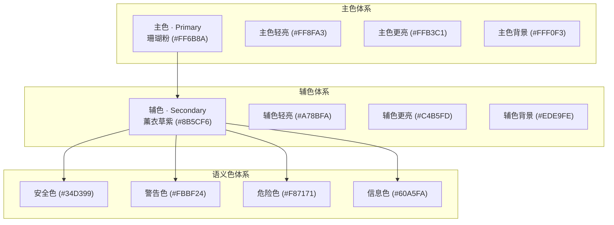

**图表来源**
- [MASTER.md: 15-48:15-48](file://design-system/MASTER.md#L15-L48)
- [app.wxss: 8-28:8-28](file://miniprogram/app.wxss#L8-L28)

## 薰衣草紫色（#8B5CF6）深度解析

### 色彩属性分析

薰衣草紫色（#8B5CF6）作为辅色的核心，具有以下色彩属性：

- **色相值**：260°（紫色系）
- **饱和度**：60%（中等饱和度）
- **明度**：54%（中等明度）
- **命名**：薰衣草紫（Lavender Purple）

### 设计特征

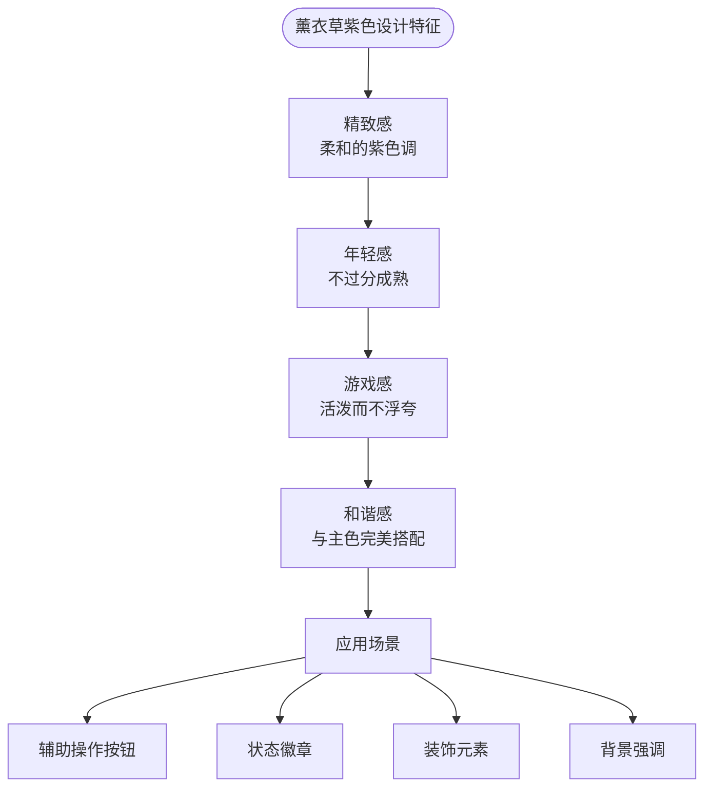

**图表来源**
- [MASTER.md: 26-35:26-35](file://design-system/MASTER.md#L26-L35)

### 心理学影响

薰衣草紫色在心理学层面具有以下特质：
- **创造力激发**：紫色常与创意和想象力联系
- **优雅感**：比深紫色更显优雅而非神秘
- **平衡感**：既不过于鲜艳也不过于沉闷
- **包容性**：能够很好地与其他色彩融合

## 辅色完整色阶体系

### 标准色阶定义

| Token | 色值 | 明度等级 | 主要用途 |
|-------|------|----------|----------|
| `--color-secondary` | `#8B5CF6` | 54% | 主要辅色、核心装饰元素 |
| `--color-secondary-light` | `#A78BFA` | 65% | 悬停状态、次要装饰 |
| `--color-secondary-lighter` | `#C4B5FD` | 76% | 标签、弱强调元素 |
| `--color-secondary-bg` | `#EDE9FE` | 93% | 背景区域、弱对比强调 |

### 色阶层次结构

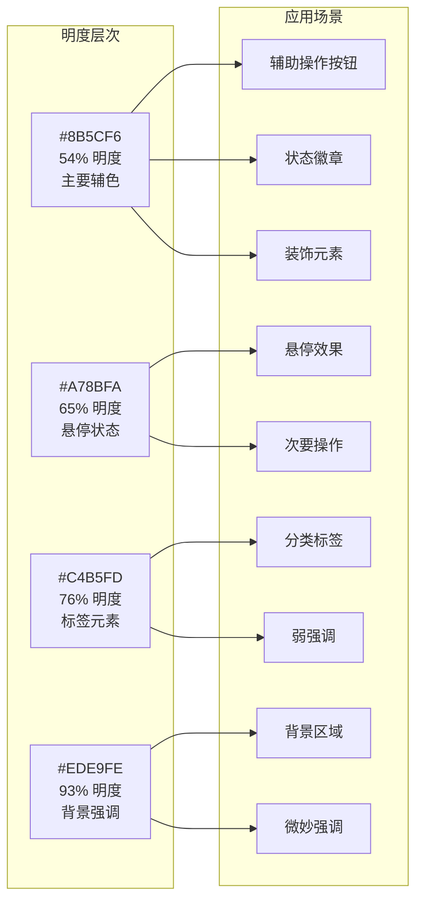

**图表来源**
- [MASTER.md: 30-35:30-35](file://design-system/MASTER.md#L30-L35)
- [app.wxss: 14-18:14-18](file://miniprogram/app.wxss#L14-L18)

### 颜色变量映射

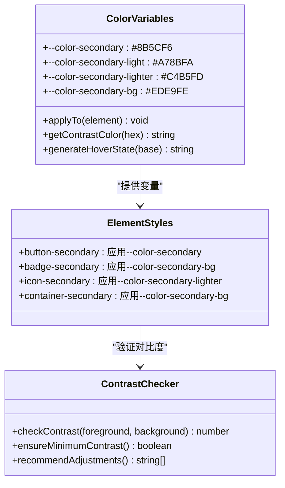

**图表来源**
- [app.wxss: 14-18:14-18](file://miniprogram/app.wxss#L14-L18)
- [product-card.wxss: 96-99:96-99](file://miniprogram/components/product-card/product-card.wxss#L96-L99)

**章节来源**
- [MASTER.md: 26-35:26-35](file://design-system/MASTER.md#L26-L35)
- [app.wxss: 14-18:14-18](file://miniprogram/app.wxss#L14-L18)

## 应用场景规范

### 辅助操作按钮

#### 设计规范

辅助操作按钮是辅色最重要的应用场景之一，主要用于非关键性的用户操作：

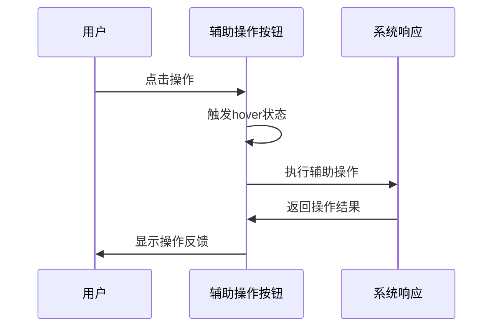

**图表来源**
- [detail.wxss: 46-50:46-50](file://miniprogram/pages/detail/detail.wxss#L46-L50)

#### 实现要点

- **颜色应用**：使用 `--color-secondary` 作为按钮主色
- **悬停效果**：过渡到 `--color-secondary-light` 
- **文本对比**：使用白色或浅色文本确保可读性
- **圆角设计**：采用 `--radius-button` (12px) 圆角
- **尺寸规范**：高度保持44px，符合触摸目标要求

### 状态徽章

#### 微观装饰元素

状态徽章是辅色在界面中最为常见的装饰元素：

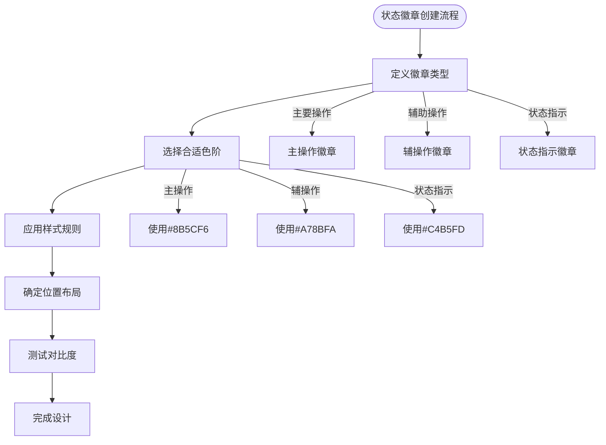

**图表来源**
- [product-card.wxss: 73-99:73-99](file://miniprogram/components/product-card/product-card.wxss#L73-L99)

#### 具体实现

徽章组件通过CSS类实现不同状态的视觉表现：

- **`.tag-secondary`**：使用浅灰色背景和辅色文本
- **`.status-tag`**：标准化的标签样式，圆角8px
- **字体规范**：11px字号，SemiBold字重

### 装饰元素

#### 幾何图形装饰

装饰元素是辅色系统中最具创意的应用场景：

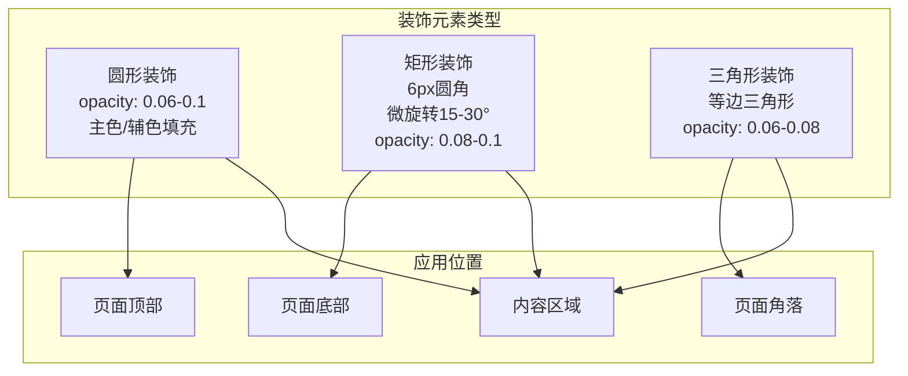

**图表来源**
- [MASTER.md: 167-175:167-175](file://design-system/MASTER.md#L167-L175)

#### 渐变背景应用

首页顶部装饰背景使用渐变色组合：

- **渐变色组合**：`linear-gradient(135deg, #FFF0F3 0%, #EDE9FE 50%, #DCFCE7 100%)`
- **色彩分布**：主色背景到辅色背景再到安全色背景的自然过渡
- **视觉效果**：营造温暖、柔和且富有层次感的背景氛围

**章节来源**
- [product-card.wxss: 39-41:39-41](file://miniprogram/components/product-card/product-card.wxss#L39-L41)
- [home.wxss: 219](file://miniprogram/pages/home/home.wxss#L219)
- [home.wxss: 283](file://miniprogram/pages/home/home.wxss#L283)
- [inventory.wxss: 116](file://miniprogram/pages/inventory/inventory.wxss#L116)

## 搭配原则与对比度要求

### 色彩搭配原则

#### 主辅色协调原则

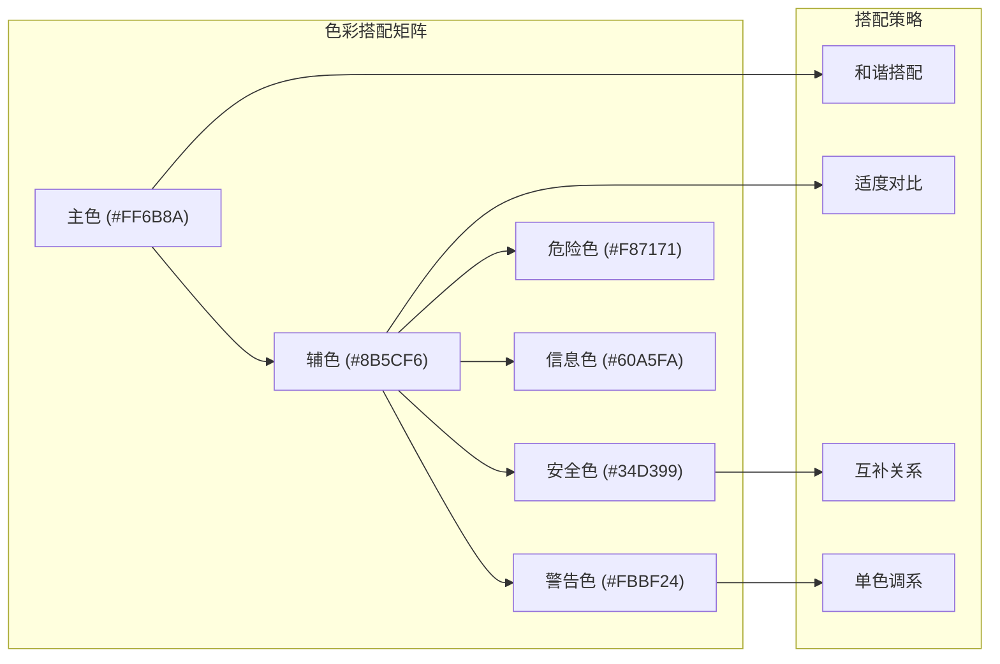

**图表来源**
- [MASTER.md: 15-48:15-48](file://design-system/MASTER.md#L15-L48)

#### 对比度标准

根据WCAG 2.1标准，辅色在不同场景下的对比度要求：

| 场景类型 | 最低对比度 | 适用情况 |
|----------|------------|----------|
| 主要文本 | 4.5:1 | 正文、标题 |
| 次要文本 | 3:1 | 说明文字、辅助信息 |
| 图标装饰 | 3:1 | 装饰性图标 |
| 状态徽章 | 3:1 | 徽章文字 |
| 按钮文字 | 4.5:1 | 操作按钮 |

### 色彩层次设计

#### 明度层次规划

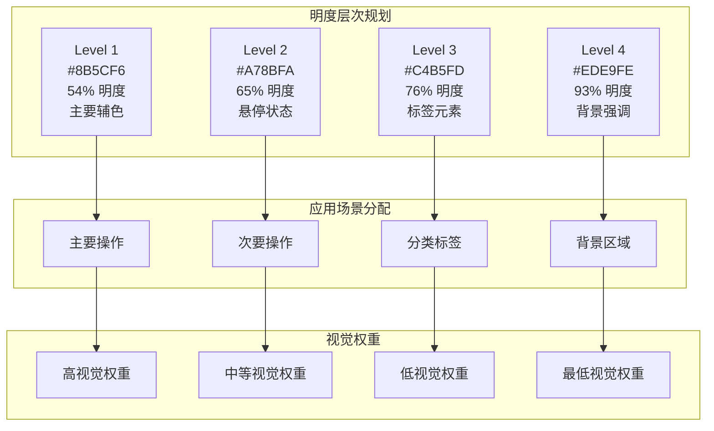

**图表来源**
- [MASTER.md: 30-35:30-35](file://design-system/MASTER.md#L30-L35)

### 饱和度与明度调节

#### 动态调节策略

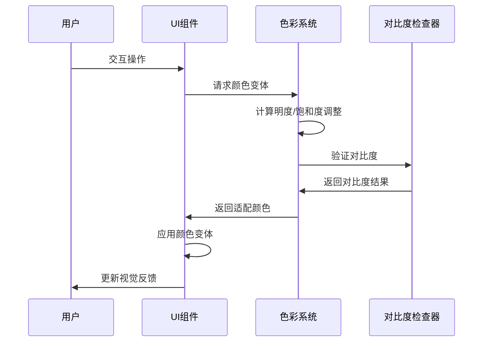

**图表来源**
- [app.wxss: 14-18:14-18](file://miniprogram/app.wxss#L14-L18)

**章节来源**
- [MASTER.md: 177-190:177-190](file://design-system/MASTER.md#L177-L190)
- [app.wxss: 14-18:14-18](file://miniprogram/app.wxss#L14-L18)

## 实现细节与最佳实践

### CSS变量系统

#### 变量定义与使用

辅色系统通过CSS自定义属性实现统一的颜色管理：

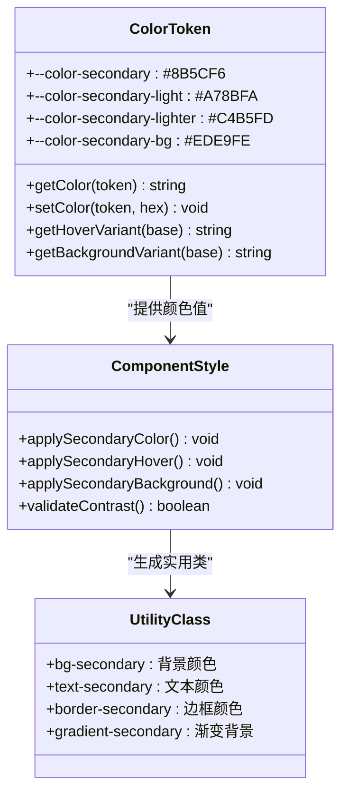

**图表来源**
- [app.wxss: 14-18:14-18](file://miniprogram/app.wxss#L14-L18)
- [app.wxss: 87-89:87-89](file://miniprogram/app.wxss#L87-L89)

#### 实用类扩展

除了标准的CSS变量，系统还提供了便捷的实用类：

- **`.bg-secondary`**：应用 `--color-secondary-bg` 作为背景色
- **`.text-secondary`**：应用 `var(--color-text-secondary)` 作为文本色
- **`.border-secondary`**：应用辅色作为边框颜色

### 组件集成策略

#### 产品卡片中的辅色应用

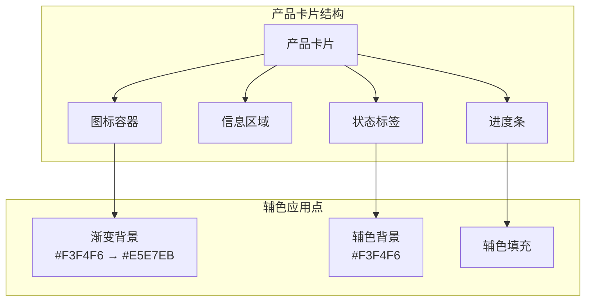

**图表来源**
- [product-card.wxss: 39-41:39-41](file://miniprogram/components/product-card/product-card.wxss#L39-L41)
- [product-card.wxss: 96-99:96-99](file://miniprogram/components/product-card/product-card.wxss#L96-L99)

#### 页面级应用模式

首页和库存页面展示了辅色在不同场景下的应用：

- **渐变背景**：`linear-gradient(135deg, var(--color-primary-bg), var(--color-secondary-bg))`
- **装饰图标**：使用辅色的浅色变体作为渐变背景
- **空状态**：结合主色和辅色背景营造温馨氛围

### 性能优化建议

#### 颜色缓存策略

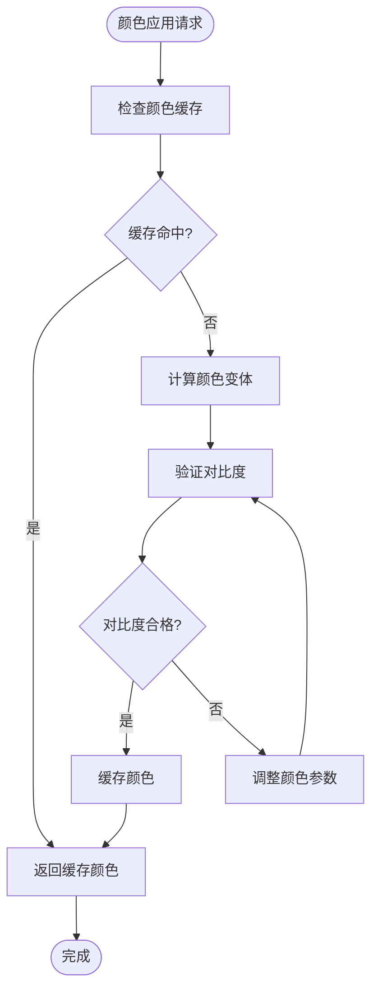

**图表来源**
- [app.wxss: 14-18:14-18](file://miniprogram/app.wxss#L14-L18)

**章节来源**
- [product-card.wxss: 39-41:39-41](file://miniprogram/components/product-card/product-card.wxss#L39-L41)
- [home.wxss: 219](file://miniprogram/pages/home/home.wxss#L219)
- [home.wxss: 283](file://miniprogram/pages/home/home.wxss#L283)
- [inventory.wxss: 116](file://miniprogram/pages/inventory/inventory.wxss#L116)

## 故障排除指南

### 常见问题诊断

#### 对比度不足问题

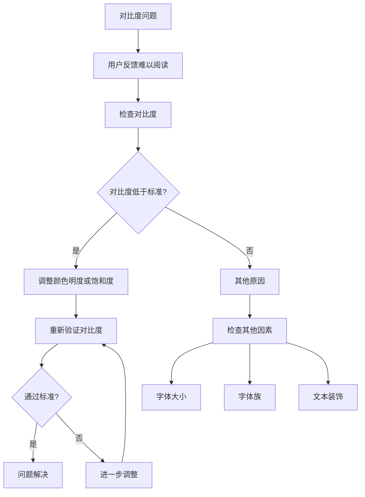

#### 颜色一致性问题

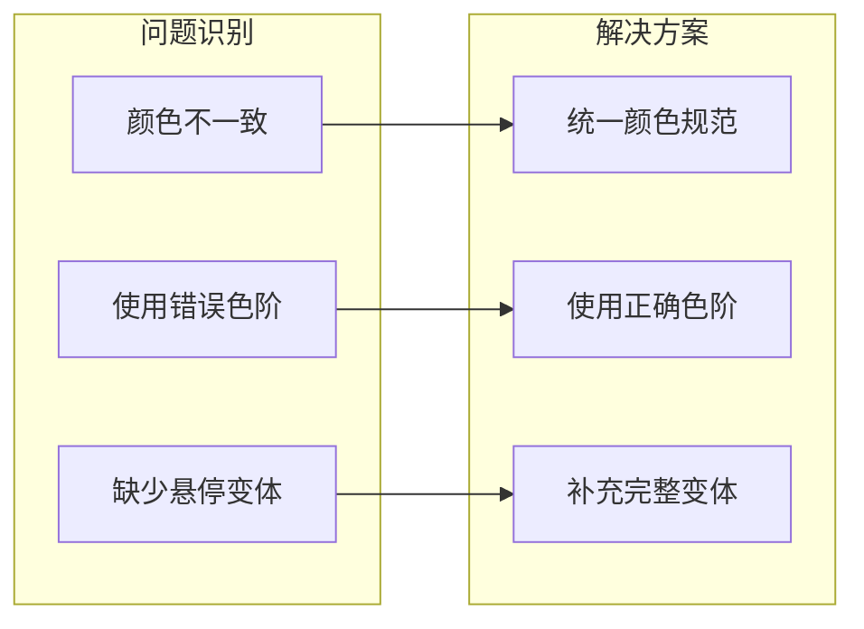

### 调试工具与方法

#### 在线对比度检查器

推荐使用以下工具进行颜色对比度验证：

- **WebAIM Contrast Checker**：在线对比度检查
- **Colorable**：移动端颜色对比度测试
- **Chrome DevTools**：开发者工具中的颜色检查

#### 本地开发调试

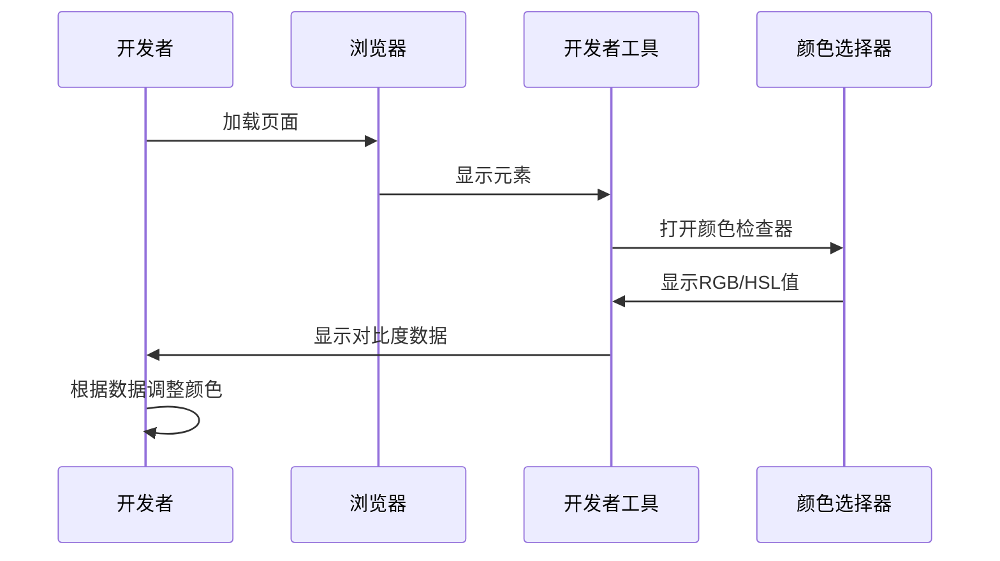

**章节来源**
- [MASTER.md: 177-190:177-190](file://design-system/MASTER.md#L177-L190)

## 总结

辅色系统通过薰衣草紫色（#8B5CF6）这一精心选择的核心色彩，成功地为CosmeticBox应用程序建立了独特的视觉识别系统。该系统不仅在美学层面体现了"清新柔和"的设计理念，更在功能层面通过完整的色阶体系和明确的应用场景规范，确保了界面的一致性和用户体验的连贯性。

### 核心价值体现

1. **设计一致性**：通过标准化的CSS变量和实用类，确保辅色在整个应用中的统一使用
2. **层次清晰**：完整的色阶体系为不同重要程度的操作提供了明确的视觉层次
3. **用户体验**：精致而不过分的色彩运用，营造了年轻而不幼稚的使用感受
4. **可维护性**：模块化的颜色管理机制便于未来的扩展和修改

### 未来发展方向

随着应用功能的不断丰富，辅色系统可以在以下方面进一步发展：

- **动态主题支持**：考虑支持深色模式下的辅色变体
- **无障碍优化**：进一步提升颜色对比度以满足更严格的无障碍标准
- **动画集成**：将辅色融入现有的动画系统，增强交互体验
- **组件扩展**：为更多UI组件添加辅色支持，扩大应用范围

通过持续的优化和完善，辅色系统将继续为CosmeticBox用户提供优美、实用且富有游戏感的视觉体验。