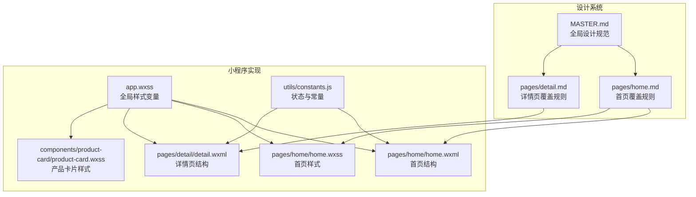
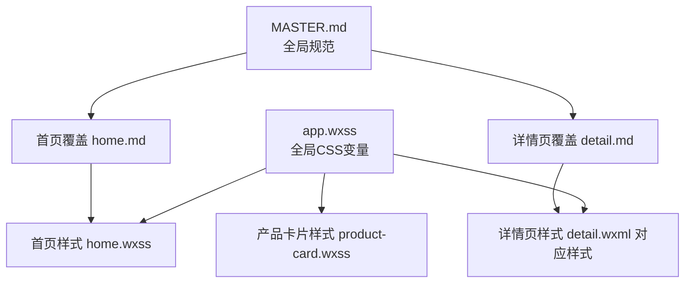
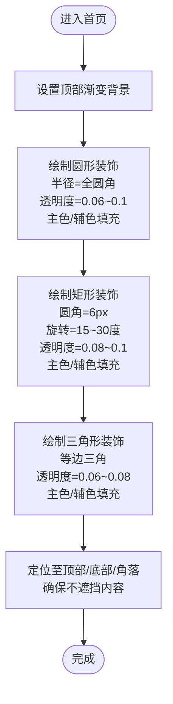
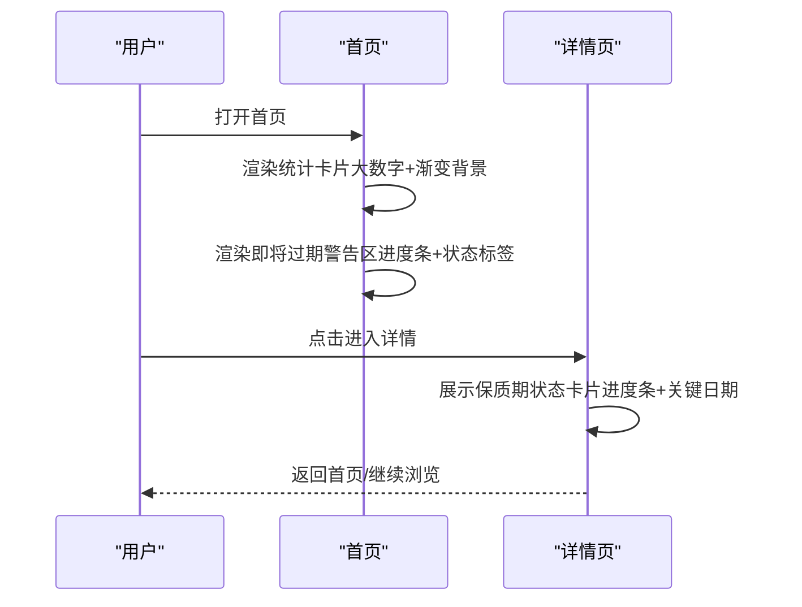
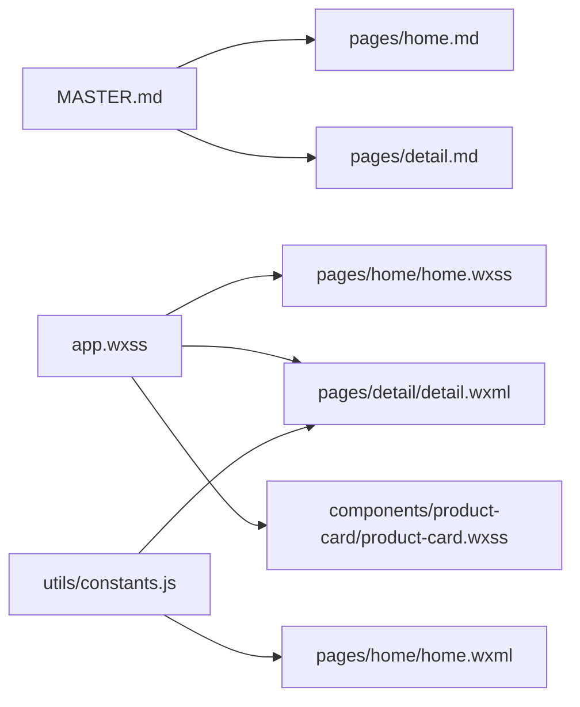

# 设计原则与反模式

<cite>
**本文引用的文件**
- [design-system/MASTER.md](file://design-system/MASTER.md)
- [design-system/pages/home.md](file://design-system/pages/home.md)
- [design-system/pages/detail.md](file://design-system/pages/detail.md)
- [miniprogram/app.wxss](file://miniprogram/app.wxss)
- [miniprogram/pages/home/home.wxml](file://miniprogram/pages/home/home.wxml)
- [miniprogram/pages/home/home.wxss](file://miniprogram/pages/home/home.wxss)
- [miniprogram/pages/detail/detail.wxml](file://miniprogram/pages/detail/detail.wxml)
- [miniprogram/components/product-card/product-card.wxss](file://miniprogram/components/product-card/product-card.wxss)
- [miniprogram/utils/constants.js](file://miniprogram/utils/constants.js)
</cite>

## 目录
1. [引言](#引言)
2. [项目结构](#项目结构)
3. [核心组件](#核心组件)
4. [架构总览](#架构总览)
5. [详细组件分析](#详细组件分析)
6. [依赖分析](#依赖分析)
7. [性能考虑](#性能考虑)
8. [故障排查指南](#故障排查指南)
9. [结论](#结论)
10. [附录](#附录)

## 引言
本文件面向CosmeticBox设计系统，聚焦“设计原则与反模式”，系统化阐述几何装饰语言与游戏化元素的设计规范，并提供可执行的评估标准与质量检查清单，帮助团队在小程序开发中统一视觉语言与交互体验。

## 项目结构
- 设计系统文档位于 design-system 目录，包含全局规范与页面级覆盖。
- 小程序样式与页面实现位于 miniprogram 目录，通过全局样式变量与组件化结构落地设计系统。
- 页面与组件通过 WXML/WXSS 实现，配合工具常量模块进行状态与数据处理。



图表来源
- [design-system/MASTER.md](file://design-system/MASTER.md)
- [design-system/pages/home.md](file://design-system/pages/home.md)
- [design-system/pages/detail.md](file://design-system/pages/detail.md)
- [miniprogram/pages/home/home.wxml](file://miniprogram/pages/home/home.wxml)
- [miniprogram/pages/home/home.wxss](file://miniprogram/pages/home/home.wxss)
- [miniprogram/pages/detail/detail.wxml](file://miniprogram/pages/detail/detail.wxml)
- [miniprogram/app.wxss](file://miniprogram/app.wxss)
- [miniprogram/components/product-card/product-card.wxss](file://miniprogram/components/product-card/product-card.wxss)
- [miniprogram/utils/constants.js](file://miniprogram/utils/constants.js)

章节来源
- [design-system/MASTER.md](file://design-system/MASTER.md)
- [design-system/pages/home.md](file://design-system/pages/home.md)
- [design-system/pages/detail.md](file://design-system/pages/detail.md)
- [miniprogram/app.wxss](file://miniprogram/app.wxss)
- [miniprogram/pages/home/home.wxml](file://miniprogram/pages/home/home.wxml)
- [miniprogram/pages/home/home.wxss](file://miniprogram/pages/home/home.wxss)
- [miniprogram/pages/detail/detail.wxml](file://miniprogram/pages/detail/detail.wxml)
- [miniprogram/components/product-card/product-card.wxss](file://miniprogram/components/product-card/product-card.wxss)
- [miniprogram/utils/constants.js](file://miniprogram/utils/constants.js)

## 核心组件
- 几何装饰语言：以圆形、矩形、三角形为装饰元素，限定透明度、圆角与旋转范围，用于首页顶部背景，营造“Monument Valley”式的纯净与呼吸感。
- 游戏化元素：统计卡片采用大字号数字与语义色渐变背景；保质期进度条按状态使用渐变色填充；状态标签语义化着色与字号规范。
- 组件与页面：首页与详情页分别体现统计卡片、进度条与状态标签的落地实现；产品卡片组件承载状态标签与进度条的基础样式。

章节来源
- [design-system/MASTER.md](file://design-system/MASTER.md)
- [design-system/pages/home.md](file://design-system/pages/home.md)
- [design-system/pages/detail.md](file://design-system/pages/detail.md)
- [miniprogram/pages/home/home.wxss](file://miniprogram/pages/home/home.wxss)
- [miniprogram/pages/detail/detail.wxml](file://miniprogram/pages/detail/detail.wxml)
- [miniprogram/components/product-card/product-card.wxss](file://miniprogram/components/product-card/product-card.wxss)

## 架构总览
设计系统通过“全局样式变量 + 页面覆盖规则 + 组件样式”的分层实现，确保一致性与可扩展性。全局变量集中于 app.wxss，页面覆盖规则在 pages/*.md 中细化，组件样式在各自 wxss 中复用全局变量。



图表来源
- [miniprogram/app.wxss](file://miniprogram/app.wxss)
- [miniprogram/pages/home/home.wxss](file://miniprogram/pages/home/home.wxss)
- [miniprogram/pages/detail/detail.wxml](file://miniprogram/pages/detail/detail.wxml)
- [miniprogram/components/product-card/product-card.wxss](file://miniprogram/components/product-card/product-card.wxss)
- [design-system/MASTER.md](file://design-system/MASTER.md)
- [design-system/pages/home.md](file://design-system/pages/home.md)
- [design-system/pages/detail.md](file://design-system/pages/detail.md)

## 详细组件分析

### 几何装饰语言规范
- 圆形：半径使用全局圆角全值，透明度范围 0.06–0.1，主色/辅色填充，位置置于页面顶部/底部/角落，不遮挡内容。
- 矩形：6px 圆角，微旋转 15–30°，透明度 0.08–0.1，主色/辅色填充。
- 三角形：使用 CSS 边框技巧绘制等边三角，透明度 0.06–0.08，主色/辅色填充。
- 首页顶部区域：多色渐变背景叠加几何装饰，形成轻盈的视觉引导。



图表来源
- [design-system/MASTER.md](file://design-system/MASTER.md)
- [miniprogram/pages/home/home.wxss](file://miniprogram/pages/home/home.wxss)
- [miniprogram/pages/home/home.wxml](file://miniprogram/pages/home/home.wxml)

章节来源
- [design-system/MASTER.md](file://design-system/MASTER.md)
- [miniprogram/pages/home/home.wxss](file://miniprogram/pages/home/home.wxss)
- [miniprogram/pages/home/home.wxml](file://miniprogram/pages/home/home.wxml)

### 游戏化元素规范
- 统计卡片：大号数字字号与字重，搭配语义色浅色渐变背景，突出关键指标。
- 保质期进度条：高度与圆角符合全局进度条规范，填充色随状态变化（安全/警告/危险）。
- 状态标签：圆角、内边距、字号与语义色背景/文字色组合，保证可读性与一致性。



图表来源
- [design-system/pages/home.md](file://design-system/pages/home.md)
- [design-system/pages/detail.md](file://design-system/pages/detail.md)
- [miniprogram/pages/home/home.wxml](file://miniprogram/pages/home/home.wxml)
- [miniprogram/pages/detail/detail.wxml](file://miniprogram/pages/detail/detail.wxml)
- [miniprogram/app.wxss](file://miniprogram/app.wxss)

章节来源
- [design-system/pages/home.md](file://design-system/pages/home.md)
- [design-system/pages/detail.md](file://design-system/pages/detail.md)
- [miniprogram/app.wxss](file://miniprogram/app.wxss)
- [miniprogram/pages/home/home.wxml](file://miniprogram/pages/home/home.wxml)
- [miniprogram/pages/detail/detail.wxml](file://miniprogram/pages/detail/detail.wxml)

### 组件与页面落地
- 产品卡片组件：提供状态标签与进度条的基础样式，支持安全/警告/危险等语义色。
- 首页与详情页：通过 WXML 结构与 WXSS 样式，结合全局变量，实现统计卡片、进度条与状态标签的一致呈现。

```mermaid
classDiagram
class AppStyles {
"+全局CSS变量"
"+字体/圆角/阴影/间距"
}
class HomeWXML {
"+首页结构"
"+统计卡片/进度条/状态标签"
}
class HomeWXSS {
"+首页样式"
"+几何装饰/统计卡片"
}
class DetailWXML {
"+详情页结构"
"+保质期状态卡片"
}
class ProductCardWXSS {
"+状态标签/进度条样式"
}
AppStyles --> HomeWXML : "提供变量"
AppStyles --> HomeWXSS : "提供变量"
AppStyles --> DetailWXML : "提供变量"
AppStyles --> ProductCardWXSS : "提供变量"
```

图表来源
- [miniprogram/app.wxss](file://miniprogram/app.wxss)
- [miniprogram/pages/home/home.wxml](file://miniprogram/pages/home/home.wxml)
- [miniprogram/pages/home/home.wxss](file://miniprogram/pages/home/home.wxss)
- [miniprogram/pages/detail/detail.wxml](file://miniprogram/pages/detail/detail.wxml)
- [miniprogram/components/product-card/product-card.wxss](file://miniprogram/components/product-card/product-card.wxss)

章节来源
- [miniprogram/components/product-card/product-card.wxss](file://miniprogram/components/product-card/product-card.wxss)
- [miniprogram/pages/home/home.wxml](file://miniprogram/pages/home/home.wxml)
- [miniprogram/pages/home/home.wxss](file://miniprogram/pages/home/home.wxss)
- [miniprogram/pages/detail/detail.wxml](file://miniprogram/pages/detail/detail.wxml)
- [miniprogram/app.wxss](file://miniprogram/app.wxss)

## 依赖分析
- 设计系统依赖：MASTER.md 为全局规范，home.md 与 detail.md 为页面覆盖规则。
- 实现依赖：app.wxss 提供全局变量，各页面与组件样式依赖这些变量；WXML 结构与 WXSS 样式共同构成最终视觉。
- 数据与状态：constants.js 提供状态枚举与工具函数，为页面逻辑与渲染提供依据。



图表来源
- [design-system/MASTER.md](file://design-system/MASTER.md)
- [design-system/pages/home.md](file://design-system/pages/home.md)
- [design-system/pages/detail.md](file://design-system/pages/detail.md)
- [miniprogram/app.wxss](file://miniprogram/app.wxss)
- [miniprogram/pages/home/home.wxss](file://miniprogram/pages/home/home.wxss)
- [miniprogram/pages/detail/detail.wxml](file://miniprogram/pages/detail/detail.wxml)
- [miniprogram/components/product-card/product-card.wxss](file://miniprogram/components/product-card/product-card.wxss)
- [miniprogram/utils/constants.js](file://miniprogram/utils/constants.js)

章节来源
- [design-system/MASTER.md](file://design-system/MASTER.md)
- [design-system/pages/home.md](file://design-system/pages/home.md)
- [design-system/pages/detail.md](file://design-system/pages/detail.md)
- [miniprogram/app.wxss](file://miniprogram/app.wxss)
- [miniprogram/utils/constants.js](file://miniprogram/utils/constants.js)

## 性能考虑
- 样式变量复用：通过全局 CSS 变量减少重复定义，提升维护效率与渲染一致性。
- 组件化样式：将状态标签与进度条样式下沉至组件，降低页面样式复杂度。
- 动画与过渡：进度条动画时长与缓动曲线已在全局规范中定义，避免页面层面重复配置。

## 故障排查指南
- 几何装饰未生效
  - 检查首页样式是否正确引入几何装饰类与背景渐变。
  - 确认透明度与颜色值是否符合规范范围。
- 统计卡片数字不突出
  - 检查字号与字重是否使用大号数字规范。
  - 确认渐变背景与语义色搭配是否正确。
- 进度条颜色异常
  - 检查进度条填充类名与状态是否匹配。
  - 确认渐变色与进度条高度/圆角是否符合全局规范。
- 状态标签可读性差
  - 检查标签背景色与文字色是否使用语义色对应变体。
  - 确认圆角、内边距与字号是否符合规范。

章节来源
- [design-system/MASTER.md](file://design-system/MASTER.md)
- [miniprogram/pages/home/home.wxss](file://miniprogram/pages/home/home.wxss)
- [miniprogram/pages/detail/detail.wxml](file://miniprogram/pages/detail/detail.wxml)
- [miniprogram/components/product-card/product-card.wxss](file://miniprogram/components/product-card/product-card.wxss)

## 结论
通过统一的设计系统与严格的实现规范，CosmeticBox 在几何装饰语言与游戏化元素方面建立了清晰的视觉与交互语言。建议在后续迭代中持续以“评估标准与质量检查清单”为依据，确保设计一致性与用户体验的稳定性。

## 附录

### 设计原则与反模式清单
- 几何装饰语言
  - 圆形：透明度 0.06–0.1，主色/辅色填充。
  - 矩形：6px 圆角，微旋转 15–30°，透明度 0.08–0.1，主色/辅色填充。
  - 三角形：等边三角，透明度 0.06–0.08，主色/辅色填充。
  - 位置：顶部/底部/角落，不遮挡内容。
- 游戏化元素
  - 统计卡片：大号数字 + 渐变底色 + SVG 图标。
  - 保质期进度条：高度与圆角符合全局规范，填充色随状态变化。
  - 状态标签：圆角、内边距、字号与语义色背景/文字色组合。
- 反模式
  - 避免使用冷调蓝绿色、高饱和彩虹色、直角/尖锐形状、Emoji 功能图标、纯白背景、纯黑文字、无意义装饰性动画、同时混用 Filled 与 Outline 图标、密集排列无留白。

章节来源
- [design-system/MASTER.md](file://design-system/MASTER.md)
- [design-system/pages/home.md](file://design-system/pages/home.md)
- [design-system/pages/detail.md](file://design-system/pages/detail.md)

### 设计决策评估标准与质量检查清单
- 一致性
  - 是否使用全局 CSS 变量？
  - 是否遵循页面覆盖规则？
- 可读性
  - 字号与字重是否符合规范？
  - 颜色对比度是否满足可读性要求？
- 语义化
  - 状态标签与进度条颜色是否与状态一致？
  - 图标风格是否统一？
- 视觉呼吸感
  - 是否避免直角/尖锐形状？
  - 是否避免纯黑/纯白等“冰冷”元素？
  - 是否避免 Emoji 作为功能图标？

章节来源
- [design-system/MASTER.md](file://design-system/MASTER.md)
- [miniprogram/app.wxss](file://miniprogram/app.wxss)
- [miniprogram/pages/home/home.wxss](file://miniprogram/pages/home/home.wxss)
- [miniprogram/pages/detail/detail.wxml](file://miniprogram/pages/detail/detail.wxml)
- [miniprogram/components/product-card/product-card.wxss](file://miniprogram/components/product-card/product-card.wxss)