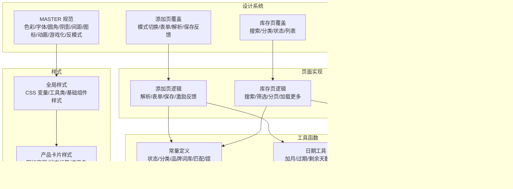
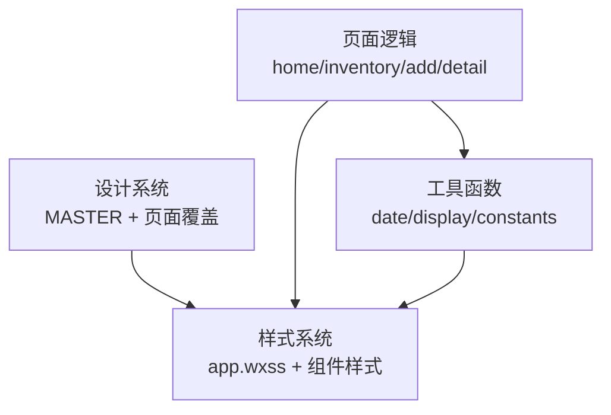
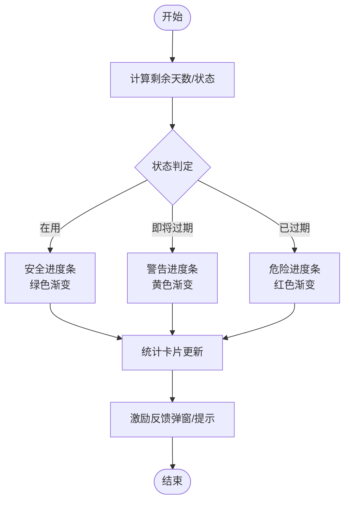
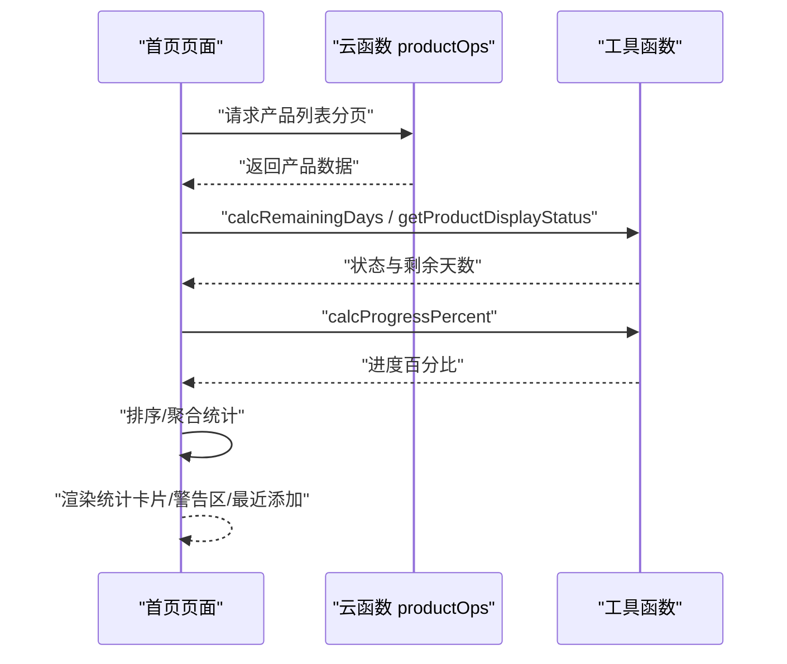
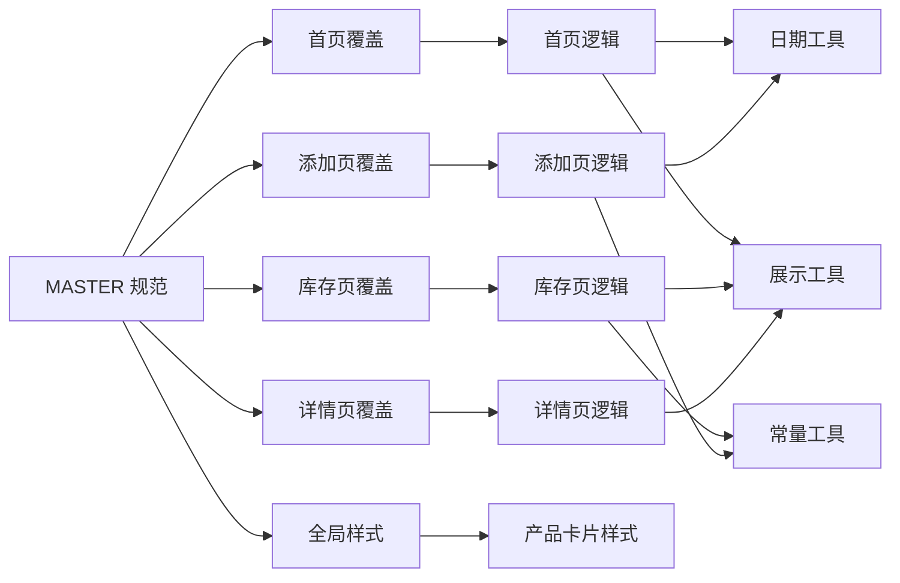

# 设计理念

<cite>
**本文引用的文件**
- [design-system/MASTER.md](file://design-system/MASTER.md)
- [design-system/pages/home.md](file://design-system/pages/home.md)
- [design-system/pages/inventory.md](file://design-system/pages/inventory.md)
- [design-system/pages/add.md](file://design-system/pages/add.md)
- [design-system/pages/detail.md](file://design-system/pages/detail.md)
- [miniprogram/app.wxss](file://miniprogram/app.wxss)
- [miniprogram/components/product-card/product-card.wxss](file://miniprogram/components/product-card/product-card.wxss)
- [miniprogram/pages/home/home.js](file://miniprogram/pages/home/home.js)
- [miniprogram/pages/inventory/inventory.js](file://miniprogram/pages/inventory/inventory.js)
- [miniprogram/utils/constants.js](file://miniprogram/utils/constants.js)
- [miniprogram/utils/date.js](file://miniprogram/utils/date.js)
- [miniprogram/utils/display.js](file://miniprogram/utils/display.js)
</cite>

## 目录
1. [引言](#引言)
2. [项目结构](#项目结构)
3. [核心组件](#核心组件)
4. [架构总览](#架构总览)
5. [详细组件分析](#详细组件分析)
6. [依赖分析](#依赖分析)
7. [性能考虑](#性能考虑)
8. [故障排查指南](#故障排查指南)
9. [结论](#结论)
10. [附录](#附录)

## 引言
本设计规范围绕“极简几何”“激励反馈”“清新柔和”三大核心设计支柱，结合小程序端的实现细节，系统化阐述如何通过圆、三角、方作为装饰语言营造纯净、有序、有呼吸感的视觉效果；如何运用进度条、统计数字、成就感等激励元素，让化妆品库存管理体验像完成游戏任务一样有趣；以及如何采用暖色调用色策略，在“年轻不幼稚、精致不严肃”的边界上取得平衡。本文同时给出在首页、库存页、添加页、详情页等页面中的具体落地方式与最佳实践。

## 项目结构
本项目采用“设计系统 + 页面实现 + 工具函数”的分层组织方式：
- 设计系统层：统一 MASTER 规范与页面级覆盖，定义色彩、字体、圆角、阴影、间距、图标、动画、游戏化元素与反模式清单。
- 页面实现层：各页面 JS 负责业务逻辑与数据流，WXSS 负责样式与组件样式。
- 工具函数层：日期计算、展示辅助、常量定义等，支撑业务状态与视觉映射。

图表来源
- [design-system/MASTER.md:1-190](file://design-system/MASTER.md#L1-L190)
- [design-system/pages/home.md:1-52](file://design-system/pages/home.md#L1-L52)
- [design-system/pages/inventory.md:1-62](file://design-system/pages/inventory.md#L1-L62)
- [design-system/pages/add.md:1-59](file://design-system/pages/add.md#L1-L59)
- [design-system/pages/detail.md:1-52](file://design-system/pages/detail.md#L1-L52)
- [miniprogram/app.wxss:1-201](file://miniprogram/app.wxss#L1-L201)
- [miniprogram/components/product-card/product-card.wxss:1-122](file://miniprogram/components/product-card/product-card.wxss#L1-L122)
- [miniprogram/pages/home/home.js:1-119](file://miniprogram/pages/home/home.js#L1-L119)
- [miniprogram/pages/inventory/inventory.js:1-117](file://miniprogram/pages/inventory/inventory.js#L1-L117)
- [miniprogram/utils/constants.js:1-100](file://miniprogram/utils/constants.js#L1-L100)
- [miniprogram/utils/date.js:1-76](file://miniprogram/utils/date.js#L1-L76)
- [miniprogram/utils/display.js:1-76](file://miniprogram/utils/display.js#L1-L76)

章节来源
- [design-system/MASTER.md:1-190](file://design-system/MASTER.md#L1-L190)
- [miniprogram/app.wxss:1-201](file://miniprogram/app.wxss#L1-L201)

## 核心组件
- 设计系统总纲：明确三大支柱、色彩体系、字体体系、圆角与阴影、间距、图标与动画规范，以及游戏化元素与反模式清单。
- 页面覆盖规范：首页、库存页、添加页、详情页分别给出布局职责、结构与特定规则，确保设计一致性与场景适配。
- 样式与组件：全局样式将设计令牌映射为 CSS 变量，产品卡片组件封装图标容器、状态标签与进度条，形成可复用的视觉与交互基元。
- 工具函数：日期与展示工具负责状态计算、进度百分比与文本格式化，为游戏化反馈提供数据基础。

章节来源
- [design-system/MASTER.md:5-190](file://design-system/MASTER.md#L5-L190)
- [design-system/pages/home.md:1-52](file://design-system/pages/home.md#L1-L52)
- [design-system/pages/inventory.md:1-62](file://design-system/pages/inventory.md#L1-L62)
- [design-system/pages/add.md:1-59](file://design-system/pages/add.md#L1-L59)
- [design-system/pages/detail.md:1-52](file://design-system/pages/detail.md#L1-L52)
- [miniprogram/app.wxss:1-201](file://miniprogram/app.wxss#L1-L201)
- [miniprogram/components/product-card/product-card.wxss:1-122](file://miniprogram/components/product-card/product-card.wxss#L1-L122)
- [miniprogram/utils/date.js:1-76](file://miniprogram/utils/date.js#L1-L76)
- [miniprogram/utils/display.js:1-76](file://miniprogram/utils/display.js#L1-L76)

## 架构总览
设计系统通过“令牌化设计 + 页面覆盖 + 组件化样式 + 工具函数”的方式，将抽象的设计理念转化为可执行的实现方案。页面逻辑通过云函数获取数据，再由工具函数进行状态与进度计算，最终以组件化样式呈现。

图表来源
- [design-system/MASTER.md:1-190](file://design-system/MASTER.md#L1-L190)
- [miniprogram/pages/home/home.js:1-119](file://miniprogram/pages/home/home.js#L1-L119)
- [miniprogram/pages/inventory/inventory.js:1-117](file://miniprogram/pages/inventory/inventory.js#L1-L117)
- [miniprogram/utils/date.js:1-76](file://miniprogram/utils/date.js#L1-L76)
- [miniprogram/utils/display.js:1-76](file://miniprogram/utils/display.js#L1-L76)
- [miniprogram/app.wxss:1-201](file://miniprogram/app.wxss#L1-L201)

## 详细组件分析

### 极简几何：圆、三角、方的装饰语言
- 设计要点
  - 圆：半透明主色/辅色填充，透明度 0.06-0.1，用于页面角落与背景，不遮挡内容。
  - 三角形：用 polygon 绘制等边三角，透明度 0.06-0.08，微旋转 15-30°，作为背景装饰。
  - 矩形：6px 圆角，微旋转 15-30°，透明度 0.08-0.1，强调几何秩序感。
  - 首页顶部可使用多色渐变背景，体现“几何+色彩”的融合。
- 实现参考
  - 设计系统覆盖了装饰几何的使用位置与透明度范围。
  - 首页顶部区域使用多色渐变背景，叠加几何装饰，形成“呼吸感”与“秩序感”的统一。
- 应用建议
  - 在页面背景与卡片外轮廓适度使用，避免密集排列造成拥挤。
  - 与主色/辅色搭配，保持低饱和度与高明度，强化“柔和”基调。

章节来源
- [design-system/MASTER.md:167-176](file://design-system/MASTER.md#L167-L176)
- [design-system/pages/home.md:31-36](file://design-system/pages/home.md#L31-L36)

### 激励反馈：进度条、统计数字、成就感
- 设计要点
  - 统计卡片：大号数字（24-28px，ExtraBold）+ 渐变底色 + SVG 图标，直观传达关键指标。
  - 保质期进度条：高度 6px，圆角 3px，颜色随状态变化（安全/警告/危险），进度 = 已用时间 / 总保质期。
  - 成就感反馈：保存成功弹窗使用弹性缓动曲线，增强“达成任务”的愉悦感。
- 实现参考
  - 全局样式定义进度条基础样式与状态色渐变。
  - 产品卡片样式封装图标容器、状态标签与进度条，便于在列表与详情页复用。
  - 首页与详情页均使用进度条与状态标签，库存页通过筛选与排序强化“任务完成”的节奏感。
- 应用建议
  - 进度条动画时长与缓动需与交互节奏一致，避免过快或过慢影响感知。
  - 统计卡片应与业务目标对齐，例如“安全率”“即将过期数量”，帮助用户快速评估状态。

图表来源
- [miniprogram/utils/date.js:42-57](file://miniprogram/utils/date.js#L42-L57)
- [miniprogram/utils/display.js:13-27](file://miniprogram/utils/display.js#L13-L27)
- [miniprogram/app.wxss:176-200](file://miniprogram/app.wxss#L176-L200)
- [miniprogram/components/product-card/product-card.wxss:101-116](file://miniprogram/components/product-card/product-card.wxss#L101-L116)
- [design-system/MASTER.md:143-166](file://design-system/MASTER.md#L143-L166)

章节来源
- [design-system/MASTER.md:143-166](file://design-system/MASTER.md#L143-L166)
- [miniprogram/app.wxss:176-200](file://miniprogram/app.wxss#L176-L200)
- [miniprogram/components/product-card/product-card.wxss:1-122](file://miniprogram/components/product-card/product-card.wxss#L1-L122)
- [miniprogram/pages/home/home.js:52-96](file://miniprogram/pages/home/home.js#L52-L96)
- [miniprogram/pages/detail/detail.js:1-120](file://miniprogram/pages/detail/detail.js#L1-L120)

### 清新柔和：暖色调用色策略
- 设计要点
  - 主色（珊瑚粉）：温暖、有活力、美妆调性，不甜腻；辅色（薰衣草紫）：精致、年轻、有游戏感。
  - 语义色：安全（绿）、警告（黄）、危险（红）、信息（蓝）；底色与表面色采用暖白与暖黑，避免冰冷感。
  - 反模式：避免冷调蓝绿色、高饱和彩虹色、直角/尖锐形状、Emoji 功能图标、纯白背景与纯黑文字。
- 实现参考
  - 设计系统 MASTER 明确主/辅/语义/表面色及其用途。
  - 全局样式将设计令牌映射为 CSS 变量，组件样式按状态映射颜色类名。
- 应用建议
  - 保持主色与辅色的高明度与低饱和度，避免过度鲜艳导致“幼稚感”。
  - 文字与边框使用暖黑与轻透明边框，提升柔和度与层次感。

章节来源
- [design-system/MASTER.md:13-59](file://design-system/MASTER.md#L13-L59)
- [miniprogram/app.wxss:7-76](file://miniprogram/app.wxss#L7-L76)
- [miniprogram/components/product-card/product-card.wxss:27-99](file://miniprogram/components/product-card/product-card.wxss#L27-L99)

### 页面级设计规范与落地

#### 首页（Home）
- 职责：仪表盘概览，包含统计卡片、即将过期警告区、最近添加。
- 落地要点：
  - 顶部多色渐变背景 + 几何装饰，统计卡片使用大数字与渐变底色 + SVG 图标。
  - 即将过期产品按“已过期优先、剩余天数升序”排序，卡片使用状态色左框。
  - 最近添加最多 5 件，点击跳转详情页。
- 数据流程：页面加载 -> 云函数获取产品列表 -> 计算状态与进度 -> 排序与聚合 -> 渲染。

图表来源
- [miniprogram/pages/home/home.js:28-101](file://miniprogram/pages/home/home.js#L28-L101)
- [miniprogram/utils/date.js:42-57](file://miniprogram/utils/date.js#L42-L57)
- [miniprogram/utils/display.js:13-27](file://miniprogram/utils/display.js#L13-L27)

章节来源
- [design-system/pages/home.md:1-52](file://design-system/pages/home.md#L1-L52)
- [miniprogram/pages/home/home.js:1-119](file://miniprogram/pages/home/home.js#L1-L119)

#### 库存页（Inventory）
- 职责：全部产品清单，支持搜索、分类筛选、状态过滤与分页加载。
- 落地要点：
  - 搜索栏圆角与阴影，占位文字提示；分类标签胶囊样式显示数量；状态过滤使用语义色背景。
  - 产品卡片包含图标容器、名称/分类、状态文字与进度条；空状态展示 SVG 插画与引导按钮。
  - 列表性能：超过 50 件产品时使用虚拟列表或 recycle-view。
- 数据流程：输入关键词/切换筛选 -> 云函数查询 -> 合并分页 -> 渲染列表。

章节来源
- [design-system/pages/inventory.md:1-62](file://design-system/pages/inventory.md#L1-L62)
- [miniprogram/pages/inventory/inventory.js:1-117](file://miniprogram/pages/inventory/inventory.js#L1-L117)

#### 添加页（Add）
- 职责：淘宝链接粘贴解析 + 手动表单录入，双模式切换。
- 落地要点：
  - 模式切换 Tab 使用胶囊样式与过渡动画；链接解析中显示加载状态，成功/失败分别提示。
  - 表单区域使用可见 label、输入框高度与分类标签组；过期时间自动计算并展示。
  - 保存按钮全宽、禁用与加载指示；保存成功弹出激励反馈（使用弹性缓动）。
- 数据流程：切换模式 -> 链接输入/解析 -> 表单填写 -> 保存 -> 成功反馈。

章节来源
- [design-system/pages/add.md:1-59](file://design-system/pages/add.md#L1-L59)
- [miniprogram/utils/constants.js:58-99](file://miniprogram/utils/constants.js#L58-L99)

#### 详情页（Detail）
- 职责：查看产品完整信息、标记用完/丢弃、删除。
- 落地要点：
  - 产品头部放大图标容器，品牌名与产品名层级清晰；分类标签使用主色底色与主色文字。
  - 保质期状态卡片突出剩余天数（大号数字），进度条放大至 8px；列出关键日期。
  - 操作按钮区区分视觉权重，“删除”使用危险色并弹出确认。
- 数据流程：进入详情 -> 加载产品信息 -> 计算状态与进度 -> 渲染头部/状态卡/操作区。

章节来源
- [design-system/pages/detail.md:1-52](file://design-system/pages/detail.md#L1-L52)
- [miniprogram/utils/display.js:29-53](file://miniprogram/utils/display.js#L29-L53)

## 依赖分析
- 设计系统与页面实现的耦合
  - 页面实现严格依赖 MASTER 规范中的令牌与组件样式，保证视觉一致性。
  - 页面逻辑依赖工具函数进行状态与进度计算，降低重复逻辑与错误风险。
- 组件与样式的耦合
  - 产品卡片样式与全局样式共同构成组件化视觉基元，便于在多个页面复用。
- 工具函数的职责边界
  - 日期工具负责业务时间计算与状态判定；展示工具负责 UI 层面的进度与标签映射；常量工具提供品牌与分类等预设数据。

图表来源
- [design-system/MASTER.md:1-190](file://design-system/MASTER.md#L1-L190)
- [miniprogram/app.wxss:1-201](file://miniprogram/app.wxss#L1-L201)
- [miniprogram/components/product-card/product-card.wxss:1-122](file://miniprogram/components/product-card/product-card.wxss#L1-L122)
- [miniprogram/pages/home/home.js:1-119](file://miniprogram/pages/home/home.js#L1-L119)
- [miniprogram/pages/inventory/inventory.js:1-117](file://miniprogram/pages/inventory/inventory.js#L1-L117)
- [miniprogram/utils/constants.js:1-100](file://miniprogram/utils/constants.js#L1-L100)
- [miniprogram/utils/date.js:1-76](file://miniprogram/utils/date.js#L1-L76)
- [miniprogram/utils/display.js:1-76](file://miniprogram/utils/display.js#L1-L76)

章节来源
- [design-system/MASTER.md:1-190](file://design-system/MASTER.md#L1-L190)
- [miniprogram/app.wxss:1-201](file://miniprogram/app.wxss#L1-L201)
- [miniprogram/components/product-card/product-card.wxss:1-122](file://miniprogram/components/product-card/product-card.wxss#L1-L122)
- [miniprogram/pages/home/home.js:1-119](file://miniprogram/pages/home/home.js#L1-L119)
- [miniprogram/pages/inventory/inventory.js:1-117](file://miniprogram/pages/inventory/inventory.js#L1-L117)
- [miniprogram/utils/constants.js:1-100](file://miniprogram/utils/constants.js#L1-L100)
- [miniprogram/utils/date.js:1-76](file://miniprogram/utils/date.js#L1-L76)
- [miniprogram/utils/display.js:1-76](file://miniprogram/utils/display.js#L1-L76)

## 性能考虑
- 列表性能：库存页在产品数量较多时采用虚拟列表或 recycle-view，减少节点数量与重绘开销。
- 动画节制：进度条动画时长与缓动符合 MASTER 规范，避免冗余动画消耗资源。
- 状态计算：在页面端进行状态与进度计算，尽量减少云端重复逻辑，提高响应速度。
- 图标与装饰：使用矢量 SVG 与几何装饰，避免位图带来的体积与渲染压力。

章节来源
- [design-system/MASTER.md:116-142](file://design-system/MASTER.md#L116-L142)
- [design-system/pages/inventory.md:59-62](file://design-system/pages/inventory.md#L59-L62)

## 故障排查指南
- 加载失败提示
  - 首页与库存页在云函数调用失败时统一显示 toast 提示，避免页面空白。
- 解析失败处理
  - 添加页解析链接失败时，显示红色提示并提供“切换手动录入”入口，保障用户路径连续性。
- 状态异常
  - 若出现状态标签颜色异常，检查状态枚举与颜色映射是否与工具函数一致。
- 进度条异常
  - 若进度条不更新，检查生产日期/过期日期是否正确传入，以及进度计算函数的边界条件。

章节来源
- [miniprogram/pages/home/home.js:38-42](file://miniprogram/pages/home/home.js#L38-L42)
- [miniprogram/pages/inventory/inventory.js:86-90](file://miniprogram/pages/inventory/inventory.js#L86-L90)
- [miniprogram/pages/add/add.js:1-200](file://miniprogram/pages/add/add.js#L1-L200)
- [miniprogram/utils/display.js:13-27](file://miniprogram/utils/display.js#L13-L27)

## 结论
本设计规范以“极简几何”“激励反馈”“清新柔和”为核心，通过令牌化的设计系统、组件化的样式与工具化的数据处理，将抽象理念转化为可执行的页面实现。在首页、库存页、添加页、详情页中，通过统计卡片、进度条与状态标签等游戏化元素，将化妆品库存管理从“日常事务”升级为“有节奏的体验”。配合暖色调用色策略与几何装饰语言，既保持年轻活力，又避免幼稚与浮夸，达到“精致不严肃”的平衡。

## 附录
- 设计系统令牌与变量映射：全局样式将 MASTER 中的令牌转换为 CSS 变量，确保跨页面一致性。
- 组件复用：产品卡片样式在首页、库存页、详情页中复用，降低维护成本并统一视觉语言。
- 最佳实践清单
  - 保持几何装饰的低密度与低饱和，避免喧宾夺主。
  - 进度条与统计数字要与业务目标对齐，提供即时反馈。
  - 使用弹性缓动与渐变背景强化成就感，但避免过度使用导致疲劳。
  - 在冷色调与高饱和色上保持克制，坚持“暖白背景 + 暖黑文字”的主基调。

章节来源
- [miniprogram/app.wxss:1-201](file://miniprogram/app.wxss#L1-L201)
- [miniprogram/components/product-card/product-card.wxss:1-122](file://miniprogram/components/product-card/product-card.wxss#L1-L122)
- [design-system/MASTER.md:177-190](file://design-system/MASTER.md#L177-L190)