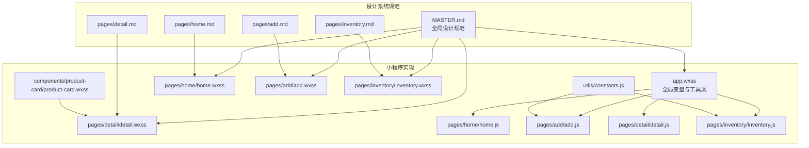
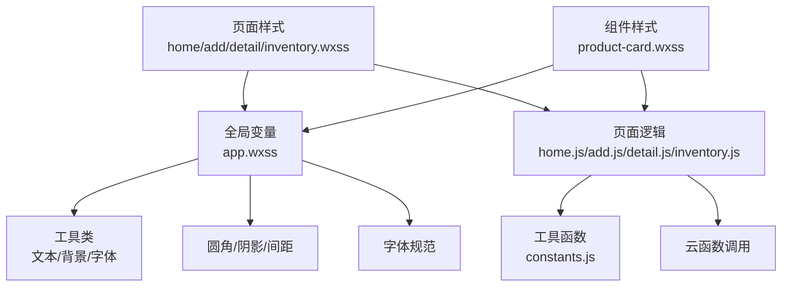
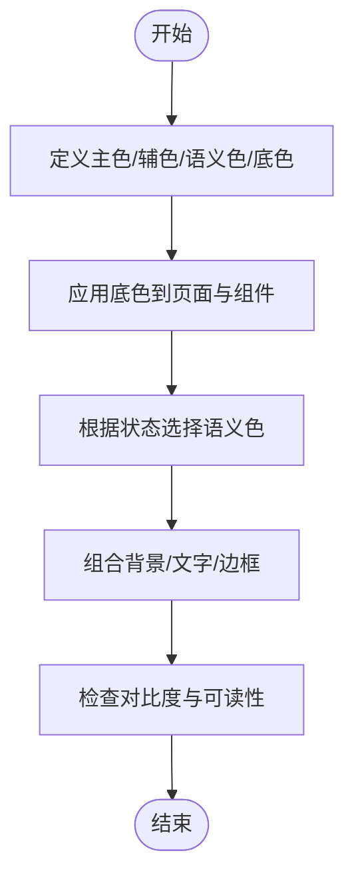
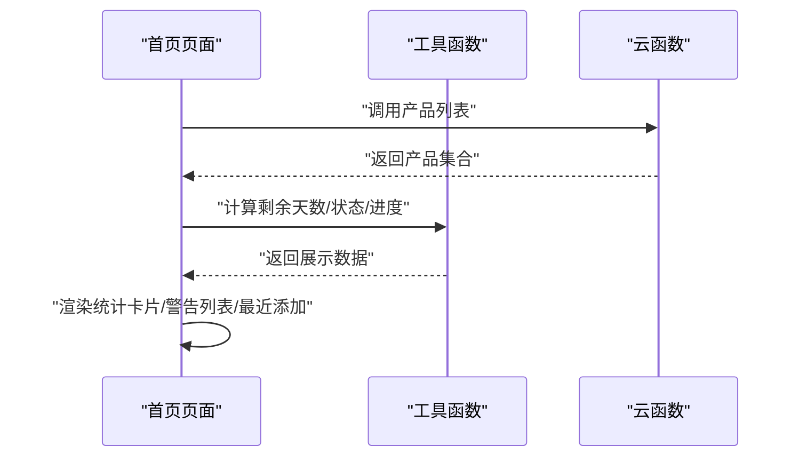
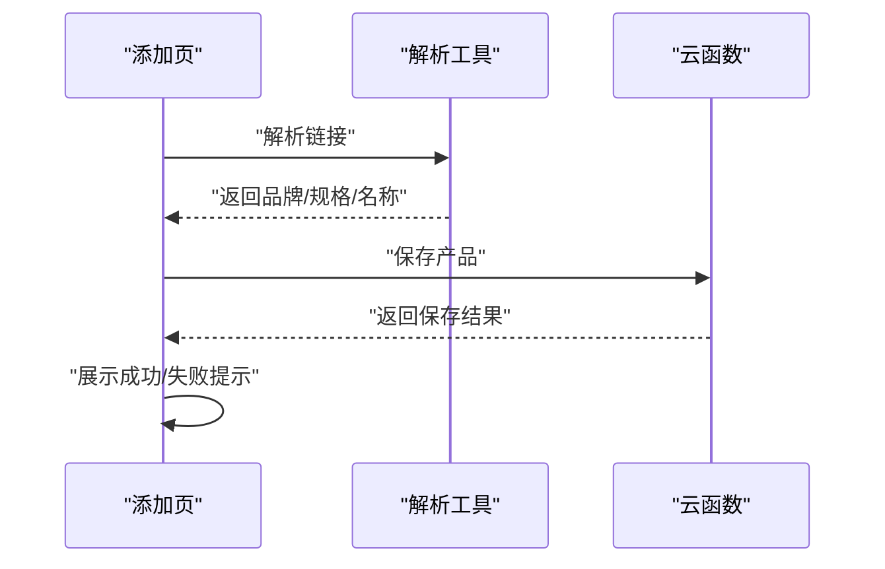
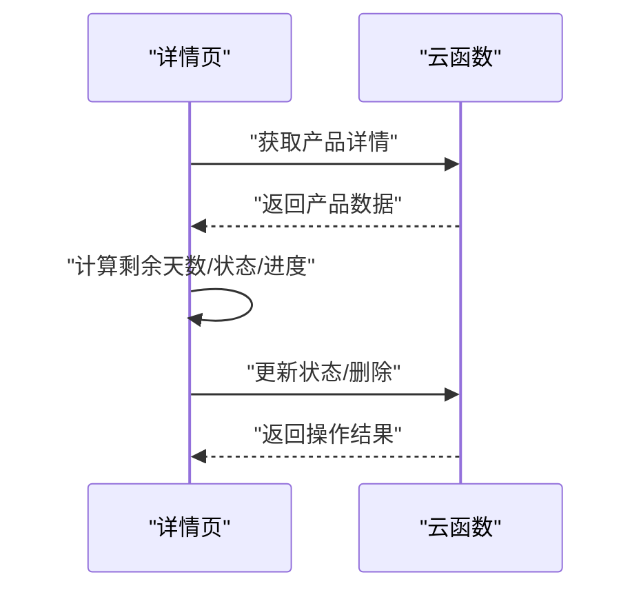
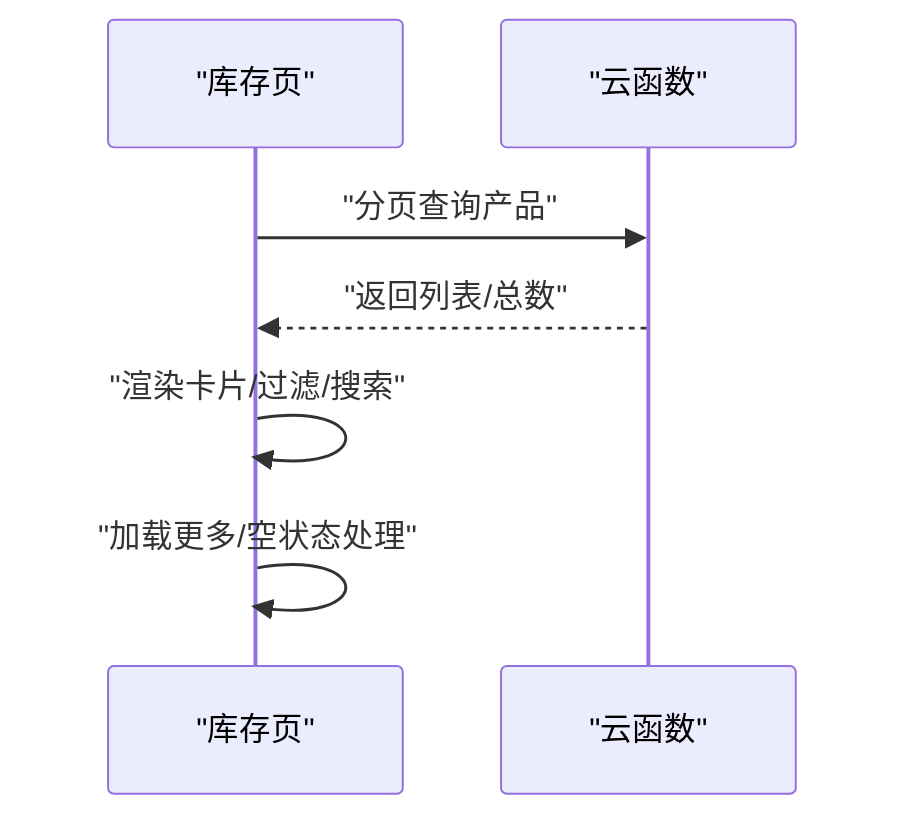
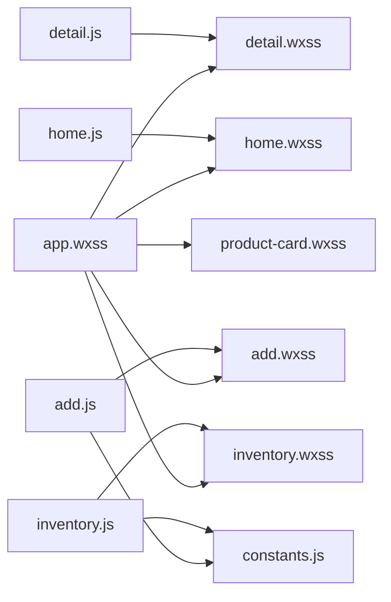

# 设计系统

<cite>
**本文引用的文件**
- [design-system/MASTER.md](file://design-system/MASTER.md)
- [design-system/pages/add.md](file://design-system/pages/add.md)
- [design-system/pages/detail.md](file://design-system/pages/detail.md)
- [design-system/pages/home.md](file://design-system/pages/home.md)
- [design-system/pages/inventory.md](file://design-system/pages/inventory.md)
- [miniprogram/app.wxss](file://miniprogram/app.wxss)
- [miniprogram/components/product-card/product-card.wxss](file://miniprogram/components/product-card/product-card.wxss)
- [miniprogram/pages/home/home.wxss](file://miniprogram/pages/home/home.wxss)
- [miniprogram/pages/add/add.wxss](file://miniprogram/pages/add/add.wxss)
- [miniprogram/pages/detail/detail.wxss](file://miniprogram/pages/detail/detail.wxss)
- [miniprogram/pages/inventory/inventory.wxss](file://miniprogram/pages/inventory/inventory.wxss)
- [miniprogram/pages/home/home.js](file://miniprogram/pages/home/home.js)
- [miniprogram/pages/add/add.js](file://miniprogram/pages/add/add.js)
- [miniprogram/pages/detail/detail.js](file://miniprogram/pages/detail/detail.js)
- [miniprogram/pages/inventory/inventory.js](file://miniprogram/pages/inventory/inventory.js)
- [miniprogram/utils/constants.js](file://miniprogram/utils/constants.js)
</cite>

## 目录
1. [简介](#简介)
2. [项目结构](#项目结构)
3. [核心组件](#核心组件)
4. [架构总览](#架构总览)
5. [详细组件分析](#详细组件分析)
6. [依赖分析](#依赖分析)
7. [性能考虑](#性能考虑)
8. [故障排查指南](#故障排查指南)
9. [结论](#结论)
10. [附录](#附录)

## 简介
本设计系统面向微信小程序“CosmeticBox”，围绕三大理念构建统一的视觉与交互语言：极简几何、激励反馈、清新柔和。系统通过全局 CSS 变量与页面级覆盖规范，确保主色调、辅助色、语义色、字体、圆角、阴影、间距、图标、动画与游戏化元素的一致性；并通过页面设计规范指导添加页、详情页、首页与库存页的具体落地。

## 项目结构
设计系统由“全局设计规范 + 页面级覆盖”构成，配合小程序样式与页面逻辑共同实现：

- 全局规范：位于 design-system/MASTER.md，定义色彩、字体、圆角、阴影、间距、图标、动画与游戏化元素
- 页面覆盖：各页面在 design-system/pages/*.md 中继承并细化规范
- 样式实现：miniprogram/app.wxss 定义全局 CSS 变量与通用工具类；各页面 wxss 实现布局与组件样式
- 业务逻辑：各页面 js 调用云函数与工具函数，驱动数据与状态更新

图表来源
- [design-system/MASTER.md:1-190](file://design-system/MASTER.md#L1-L190)
- [miniprogram/app.wxss:1-201](file://miniprogram/app.wxss#L1-L201)
- [miniprogram/pages/home/home.wxss:1-324](file://miniprogram/pages/home/home.wxss#L1-L324)
- [miniprogram/pages/add/add.wxss:1-201](file://miniprogram/pages/add/add.wxss#L1-L201)
- [miniprogram/pages/detail/detail.wxss:1-269](file://miniprogram/pages/detail/detail.wxss#L1-L269)
- [miniprogram/pages/inventory/inventory.wxss:1-167](file://miniprogram/pages/inventory/inventory.wxss#L1-L167)
- [miniprogram/pages/home/home.js:1-119](file://miniprogram/pages/home/home.js#L1-L119)
- [miniprogram/pages/add/add.js:1-260](file://miniprogram/pages/add/add.js#L1-L260)
- [miniprogram/pages/detail/detail.js:1-122](file://miniprogram/pages/detail/detail.js#L1-L122)
- [miniprogram/pages/inventory/inventory.js:1-117](file://miniprogram/pages/inventory/inventory.js#L1-L117)
- [miniprogram/utils/constants.js:1-100](file://miniprogram/utils/constants.js#L1-L100)

章节来源
- [design-system/MASTER.md:1-190](file://design-system/MASTER.md#L1-L190)
- [miniprogram/app.wxss:1-201](file://miniprogram/app.wxss#L1-L201)

## 核心组件
- 色彩系统：主色（珊瑚粉）、辅色（薰衣草紫）、语义色（安全/警告/危险/信息）、底色（页面背景、表面、文本、边框）
- 字体系统：基于系统字体栈，通过字号、字重与行高建立视觉层级
- 圆角系统：卡片、按钮、图标容器、输入框、标签、进度条与圆形元素的统一圆角
- 阴影系统：卡片默认与悬停、浮层、按钮按下态的阴影规范
- 间距系统：基于 8px 网格的 xs/sm/md/lg/xl/2xl 标准间距
- 图标规范：SVG 矢量图标、容器尺寸与线宽、风格一致性
- 动画规范：时长与缓动函数、列表入场延迟、进度条动画策略
- 游戏化元素：统计卡片、保质期进度条、状态标签

章节来源
- [design-system/MASTER.md:13-190](file://design-system/MASTER.md#L13-L190)
- [miniprogram/app.wxss:7-201](file://miniprogram/app.wxss#L7-L201)

## 架构总览
设计系统通过“全局变量 + 页面覆盖 + 组件样式 + 页面逻辑”的方式实现一致性与可扩展性。全局变量集中于 app.wxss，页面样式继承并局部增强，组件样式独立封装，页面逻辑通过云函数与工具函数驱动数据与状态。

图表来源
- [miniprogram/app.wxss:7-201](file://miniprogram/app.wxss#L7-L201)
- [miniprogram/pages/home/home.wxss:1-324](file://miniprogram/pages/home/home.wxss#L1-L324)
- [miniprogram/pages/add/add.wxss:1-201](file://miniprogram/pages/add/add.wxss#L1-L201)
- [miniprogram/pages/detail/detail.wxss:1-269](file://miniprogram/pages/detail/detail.wxss#L1-L269)
- [miniprogram/pages/inventory/inventory.wxss:1-167](file://miniprogram/pages/inventory/inventory.wxss#L1-L167)
- [miniprogram/components/product-card/product-card.wxss:1-122](file://miniprogram/components/product-card/product-card.wxss#L1-L122)
- [miniprogram/pages/home/home.js:1-119](file://miniprogram/pages/home/home.js#L1-L119)
- [miniprogram/pages/add/add.js:1-260](file://miniprogram/pages/add/add.js#L1-L260)
- [miniprogram/pages/detail/detail.js:1-122](file://miniprogram/pages/detail/detail.js#L1-L122)
- [miniprogram/pages/inventory/inventory.js:1-117](file://miniprogram/pages/inventory/inventory.js#L1-L117)
- [miniprogram/utils/constants.js:1-100](file://miniprogram/utils/constants.js#L1-L100)

## 详细组件分析

### 色彩系统与语义化应用
- 主色用于品牌强调、主按钮、导航高亮与关键操作
- 辅色用于辅助操作、徽章与装饰元素
- 语义色用于状态表达：安全/警告/危险/信息，配套背景色与文字色
- 底色用于页面背景、卡片与输入框背景，以及主/次/三级文字与边框

图表来源
- [design-system/MASTER.md:13-60](file://design-system/MASTER.md#L13-L60)
- [miniprogram/app.wxss:7-37](file://miniprogram/app.wxss#L7-L37)

章节来源
- [design-system/MASTER.md:13-60](file://design-system/MASTER.md#L13-L60)
- [miniprogram/app.wxss:7-37](file://miniprogram/app.wxss#L7-L37)

### 字体系统与视觉层级
- 字体族采用系统字体栈，确保跨设备一致性
- 通过字号、字重与行高建立 H1/H2/H3/正文/说明/统计等层级
- 统一的字体工具类便于在组件与页面间复用

章节来源
- [design-system/MASTER.md:61-79](file://design-system/MASTER.md#L61-L79)
- [miniprogram/app.wxss:60-128](file://miniprogram/app.wxss#L60-L128)

### 圆角、阴影与间距体系
- 圆角：卡片、按钮、图标容器、输入框、标签、进度条与圆形元素统一数值
- 阴影：卡片默认/悬停、浮层、按钮按下态
- 间距：基于 8px 网格的 xs/sm/md/lg/xl/2xl

章节来源
- [design-system/MASTER.md:80-115](file://design-system/MASTER.md#L80-L115)
- [miniprogram/app.wxss:38-59](file://miniprogram/app.wxss#L38-L59)

### 图标规范与几何装饰语言
- SVG 矢量图标，统一线宽与容器尺寸，风格保持 Outline
- 几何装饰：圆形、矩形、三角形，半透明叠加，不遮挡内容

章节来源
- [design-system/MASTER.md:116-176](file://design-system/MASTER.md#L116-L176)
- [miniprogram/pages/home/home.wxss:30-71](file://miniprogram/pages/home/home.wxss#L30-L71)

### 动画规范与交互反馈
- 时长：快速/常规/缓慢/进度条动画
- 缓动：进入/退出/弹出层专用缓动
- 规则：退出时长比例、列表延迟、尊重减少动效设置、进度条动画策略

章节来源
- [design-system/MASTER.md:125-142](file://design-system/MASTER.md#L125-L142)
- [miniprogram/app.wxss:176-201](file://miniprogram/app.wxss#L176-L201)

### 游戏化元素
- 统计卡片：大号数字 + 渐变背景 + SVG 图标
- 保质期进度条：高度、圆角、状态渐变色、进度计算
- 状态标签：圆角、内边距、语义色背景与文字色

章节来源
- [design-system/MASTER.md:143-166](file://design-system/MASTER.md#L143-L166)
- [miniprogram/components/product-card/product-card.wxss:101-122](file://miniprogram/components/product-card/product-card.wxss#L101-L122)

### 页面设计规范

#### 首页（Home）
- 职责：概览仪表盘、即将过期警告、最近添加
- 顶部渐变背景 + 几何装饰 + 统计卡片行
- 警告区：按状态使用语义色边框，展示剩余天数与进度条
- 最近添加：紧凑卡片样式，支持“查看全部”

图表来源
- [miniprogram/pages/home/home.js:24-101](file://miniprogram/pages/home/home.js#L24-L101)
- [miniprogram/pages/home/home.wxss:11-324](file://miniprogram/pages/home/home.wxss#L11-L324)

章节来源
- [design-system/pages/home.md:1-52](file://design-system/pages/home.md#L1-L52)
- [miniprogram/pages/home/home.js:1-119](file://miniprogram/pages/home/home.js#L1-L119)
- [miniprogram/pages/home/home.wxss:1-324](file://miniprogram/pages/home/home.wxss#L1-L324)

#### 添加页（Add）
- 职责：淘宝链接解析 + 手动表单录入
- 模式切换：胶囊样式，选中态主色填充
- 链接导入：解析中/成功/失败状态提示
- 表单区域：可见标签、输入框高度、分类标签组、日期选择器、过期时间预览
- 保存按钮：全宽、主色背景、禁用与加载状态、成功后激励反馈

图表来源
- [miniprogram/pages/add/add.js:50-108](file://miniprogram/pages/add/add.js#L50-L108)
- [miniprogram/pages/add/add.wxss:13-201](file://miniprogram/pages/add/add.wxss#L13-L201)

章节来源
- [design-system/pages/add.md:1-59](file://design-system/pages/add.md#L1-L59)
- [miniprogram/pages/add/add.js:1-260](file://miniprogram/pages/add/add.js#L1-L260)
- [miniprogram/pages/add/add.wxss:1-201](file://miniprogram/pages/add/add.wxss#L1-L201)

#### 详情页（Detail）
- 职责：查看完整信息、标记用完/丢弃、删除
- 头部卡片：大图标容器、品牌/产品名、分类标签、规格
- 保质期状态：剩余天数大字、语义色卡片、进度条放大
- 操作按钮：标记用完/丢弃（次强调）、删除（危险色）、确认弹窗

图表来源
- [miniprogram/pages/detail/detail.js:30-99](file://miniprogram/pages/detail/detail.js#L30-L99)
- [miniprogram/pages/detail/detail.wxss:13-269](file://miniprogram/pages/detail/detail.wxss#L13-L269)

章节来源
- [design-system/pages/detail.md:1-52](file://design-system/pages/detail.md#L1-L52)
- [miniprogram/pages/detail/detail.js:1-122](file://miniprogram/pages/detail/detail.js#L1-L122)
- [miniprogram/pages/detail/detail.wxss:1-269](file://miniprogram/pages/detail/detail.wxss#L1-L269)

#### 库存页（Inventory）
- 职责：全部产品清单、分类筛选、搜索、状态过滤
- 搜索栏：圆角输入框、左侧 SVG 图标、阴影
- 分类标签行：横向滚动、胶囊样式、数量显示
- 状态过滤：小号胶囊、互斥或多选
- 产品卡片：图标容器、名称/分类/规格、状态文字与进度条
- 列表性能：超过阈值使用虚拟列表

图表来源
- [miniprogram/pages/inventory/inventory.js:65-110](file://miniprogram/pages/inventory/inventory.js#L65-L110)
- [miniprogram/pages/inventory/inventory.wxss:13-167](file://miniprogram/pages/inventory/inventory.wxss#L13-L167)

章节来源
- [design-system/pages/inventory.md:1-62](file://design-system/pages/inventory.md#L1-L62)
- [miniprogram/pages/inventory/inventory.js:1-117](file://miniprogram/pages/inventory/inventory.js#L1-L117)
- [miniprogram/pages/inventory/inventory.wxss:1-167](file://miniprogram/pages/inventory/inventory.wxss#L1-L167)

### 组件规范
- 产品卡片：图标容器（44x44）、名称/H3、分类/Caption、状态标签、进度条
- 标签：圆角 8px、内边距、字号 11px、语义色背景与文字色
- 进度条：高度 6px、圆角 3px、状态色渐变、宽度过渡动画

章节来源
- [miniprogram/components/product-card/product-card.wxss:1-122](file://miniprogram/components/product-card/product-card.wxss#L1-L122)
- [miniprogram/app.wxss:176-201](file://miniprogram/app.wxss#L176-L201)

## 依赖分析
- 页面样式依赖全局变量与工具类，保证一致性
- 页面逻辑依赖工具函数与云函数，驱动数据与状态
- 组件样式独立封装，避免页面样式耦合

图表来源
- [miniprogram/app.wxss:7-201](file://miniprogram/app.wxss#L7-L201)
- [miniprogram/pages/home/home.wxss:1-324](file://miniprogram/pages/home/home.wxss#L1-L324)
- [miniprogram/pages/add/add.wxss:1-201](file://miniprogram/pages/add/add.wxss#L1-L201)
- [miniprogram/pages/detail/detail.wxss:1-269](file://miniprogram/pages/detail/detail.wxss#L1-L269)
- [miniprogram/pages/inventory/inventory.wxss:1-167](file://miniprogram/pages/inventory/inventory.wxss#L1-L167)
- [miniprogram/components/product-card/product-card.wxss:1-122](file://miniprogram/components/product-card/product-card.wxss#L1-L122)
- [miniprogram/pages/home/home.js:1-119](file://miniprogram/pages/home/home.js#L1-L119)
- [miniprogram/pages/add/add.js:1-260](file://miniprogram/pages/add/add.js#L1-L260)
- [miniprogram/pages/detail/detail.js:1-122](file://miniprogram/pages/detail/detail.js#L1-L122)
- [miniprogram/pages/inventory/inventory.js:1-117](file://miniprogram/pages/inventory/inventory.js#L1-L117)
- [miniprogram/utils/constants.js:1-100](file://miniprogram/utils/constants.js#L1-L100)

## 性能考虑
- 列表性能：库存页在产品数量较多时采用虚拟列表策略，减少渲染开销
- 动画性能：使用 CSS 过渡与缓动，避免 JavaScript 驱动的高频动画
- 网络请求：页面按需加载，分页与搜索减少一次性数据传输

章节来源
- [design-system/pages/inventory.md:59-62](file://design-system/pages/inventory.md#L59-L62)
- [miniprogram/pages/inventory/inventory.js:65-110](file://miniprogram/pages/inventory/inventory.js#L65-L110)

## 故障排查指南
- 云开发未配置：添加页保存失败时弹出配置指引，检查云环境 ID 与云函数部署
- 保存超时：提示检查云函数部署、网络与数据库权限
- 加载失败：Toast 提示错误信息，确认云函数可用性

章节来源
- [miniprogram/pages/add/add.js:212-234](file://miniprogram/pages/add/add.js#L212-L234)
- [miniprogram/pages/home/home.js:36-100](file://miniprogram/pages/home/home.js#L36-L100)
- [miniprogram/pages/detail/detail.js:30-52](file://miniprogram/pages/detail/detail.js#L30-L52)
- [miniprogram/pages/inventory/inventory.js:80-102](file://miniprogram/pages/inventory/inventory.js#L80-L102)

## 结论
本设计系统以统一的变量体系与页面覆盖规范为基础，结合明确的组件与页面设计准则，形成可维护、可扩展且富有游戏化体验的小程序视觉语言。通过全局变量与工具类的复用、页面逻辑与云函数的解耦，以及性能优化策略，确保在不同页面与场景下保持一致的用户体验。

## 附录
- 设计资源：主色/辅色/语义色、字体、圆角、阴影、间距、图标与动画参数均来自全局规范
- 组件库：产品卡片、标签、进度条等组件样式独立，可在页面中直接复用
- 设计工具：推荐使用支持 CSS 变量与主题切换的设计工具，确保与小程序实现一致