# 库存页面设计规范

<cite>
**本文档引用的文件**
- [inventory.js](file://miniprogram/pages/inventory/inventory.js)
- [inventory.json](file://miniprogram/pages/inventory/inventory.json)
- [inventory.wxml](file://miniprogram/pages/inventory/inventory.wxml)
- [inventory.wxss](file://miniprogram/pages/inventory/inventory.wxss)
- [product-card.js](file://miniprogram/components/product-card/product-card.js)
- [product-card.json](file://miniprogram/components/product-card/product-card.json)
- [product-card.wxml](file://miniprogram/components/product-card/product-card.wxml)
- [constants.js](file://miniprogram/utils/constants.js)
- [date.js](file://miniprogram/utils/date.js)
- [display.js](file://miniprogram/utils/display.js)
- [index.js](file://cloudfunctions/productOps/index.js)
- [inventory.md](file://design-system/pages/inventory.md)
- [MASTER.md](file://design-system/MASTER.md)
</cite>

## 目录
1. [简介](#简介)
2. [项目结构](#项目结构)
3. [核心组件](#核心组件)
4. [架构概览](#架构概览)
5. [详细组件分析](#详细组件分析)
6. [依赖关系分析](#依赖关系分析)
7. [性能考虑](#性能考虑)
8. [故障排除指南](#故障排除指南)
9. [结论](#结论)
10. [附录](#附录)

## 简介

库存页面是化妆品库存管理系统的核心界面，负责展示用户的所有产品库存信息。该页面实现了完整的库存管理功能，包括产品搜索、分类筛选、状态过滤、分页加载等核心功能。通过精心设计的视觉系统和交互体验，帮助用户高效管理和监控化妆品库存状态。

## 项目结构

库存页面采用模块化架构设计，主要由页面逻辑、组件系统、工具函数和云函数组成：

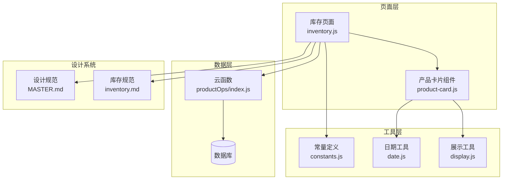

**图表来源**
- [inventory.js:1-117](file://miniprogram/pages/inventory/inventory.js#L1-L117)
- [product-card.js:1-51](file://miniprogram/components/product-card/product-card.js#L1-L51)
- [constants.js:1-100](file://miniprogram/utils/constants.js#L1-L100)

**章节来源**
- [inventory.js:1-117](file://miniprogram/pages/inventory/inventory.js#L1-L117)
- [inventory.json:1-6](file://miniprogram/pages/inventory/inventory.json#L1-L6)
- [inventory.wxml:1-89](file://miniprogram/pages/inventory/inventory.wxml#L1-L89)
- [inventory.wxss:1-167](file://miniprogram/pages/inventory/inventory.wxss#L1-L167)

## 核心组件

库存页面的核心组件包括搜索栏、分类筛选、状态过滤和产品卡片列表。每个组件都遵循统一的设计规范，确保用户体验的一致性。

### 搜索功能实现

搜索功能支持实时输入和确认提交两种模式，提供灵活的搜索体验：

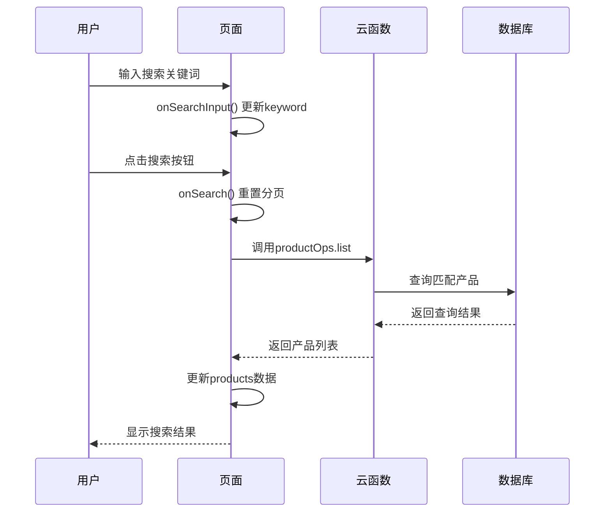

**图表来源**
- [inventory.js:29-37](file://miniprogram/pages/inventory/inventory.js#L29-L37)
- [index.js:92-110](file://cloudfunctions/productOps/index.js#L92-L110)

### 分类筛选机制

分类筛选采用横向滚动标签设计，支持一键切换和取消筛选：

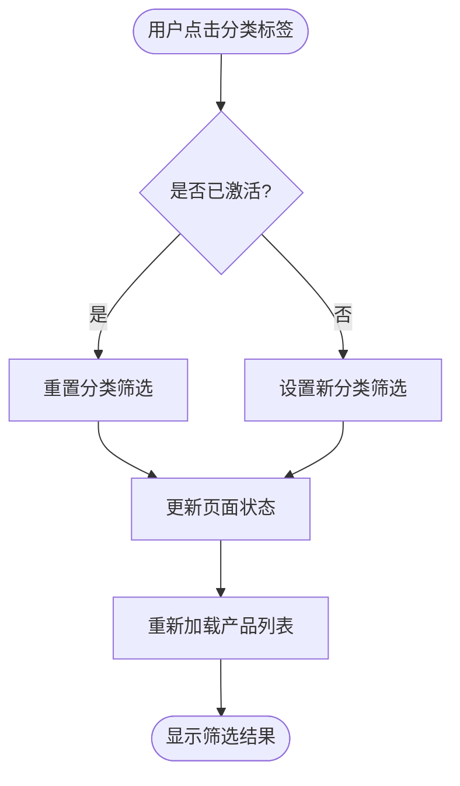

**图表来源**
- [inventory.js:39-49](file://miniprogram/pages/inventory/inventory.js#L39-L49)

### 状态过滤系统

状态过滤提供三种预定义状态：在用、即将过期、已过期，支持单选模式以降低认知负担：

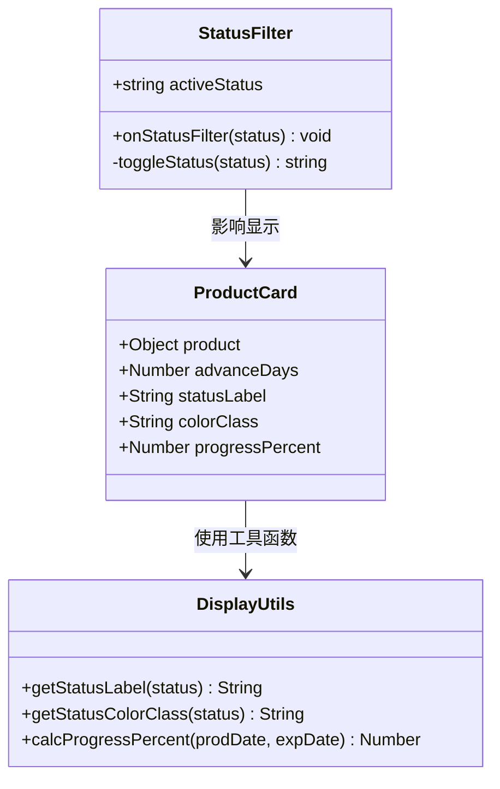

**图表来源**
- [inventory.js:51-63](file://miniprogram/pages/inventory/inventory.js#L51-L63)
- [product-card.js:19-33](file://miniprogram/components/product-card/product-card.js#L19-L33)
- [display.js:40-76](file://miniprogram/utils/display.js#L40-L76)

**章节来源**
- [inventory.js:10-21](file://miniprogram/pages/inventory/inventory.js#L10-L21)
- [inventory.js:23-116](file://miniprogram/pages/inventory/inventory.js#L23-L116)

## 架构概览

库存页面采用前后端分离的架构设计，前端负责用户交互和数据展示，后端通过云函数处理业务逻辑：

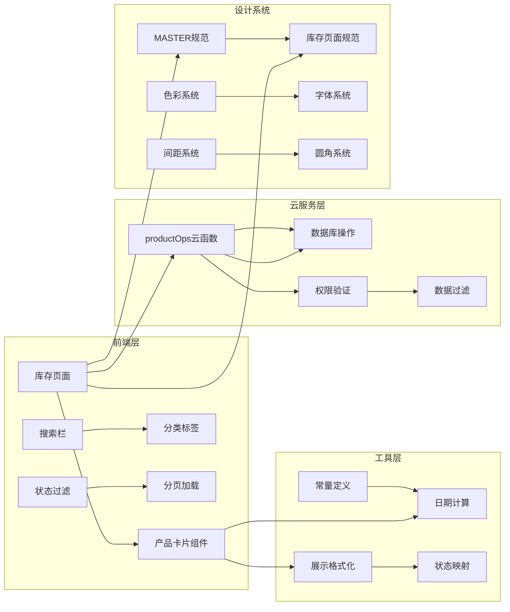

**图表来源**
- [index.js:40-64](file://cloudfunctions/productOps/index.js#L40-L64)
- [constants.js:6-21](file://miniprogram/utils/constants.js#L6-L21)
- [MASTER.md:13-190](file://design-system/MASTER.md#L13-L190)

## 详细组件分析

### 页面控制器分析

库存页面控制器实现了完整的CRUD操作和状态管理：

#### 数据模型设计

页面维护了以下核心状态：
- `products`: 当前显示的产品列表
- `categories`: 预设分类数组
- `keyword`: 搜索关键词
- `activeCategory`: 当前激活的分类
- `activeStatus`: 当前激活的状态
- `loading`: 加载状态标志
- `hasMore`: 是否还有更多数据
- `page`: 当前页码
- `advanceDays`: 提前提醒天数

#### 事件处理流程

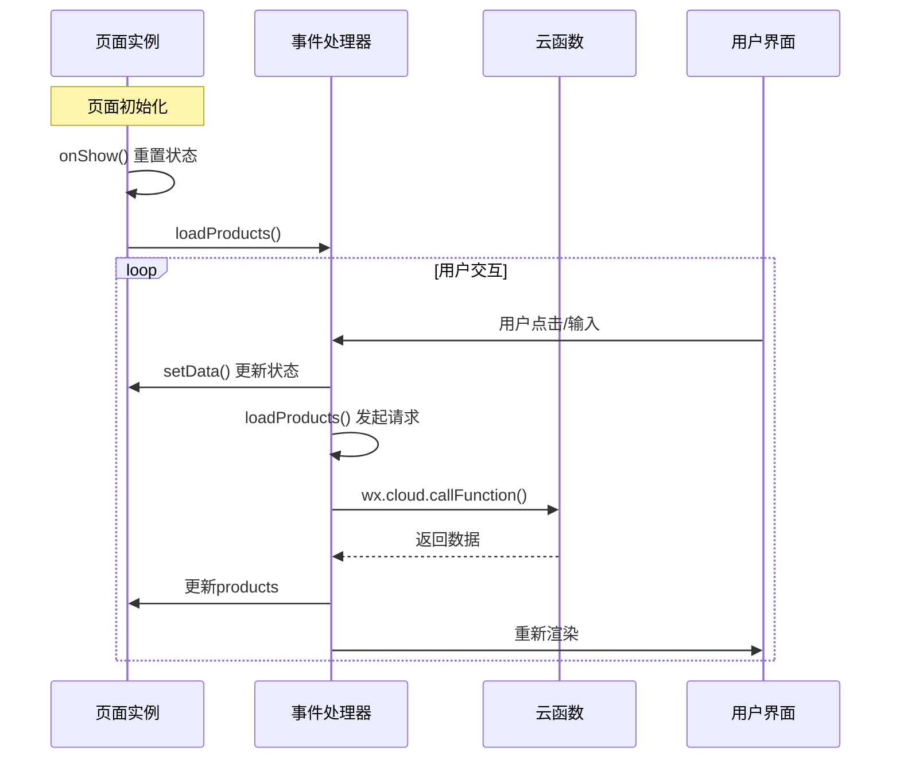

**图表来源**
- [inventory.js:23-103](file://miniprogram/pages/inventory/inventory.js#L23-L103)

#### 分页加载机制

页面实现了智能的分页加载策略：

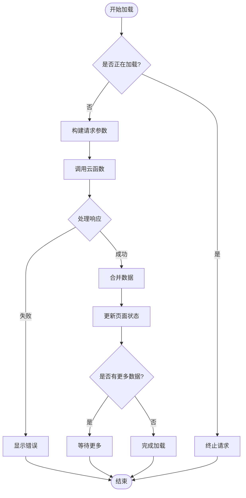

**图表来源**
- [inventory.js:66-103](file://miniprogram/pages/inventory/inventory.js#L66-L103)

**章节来源**
- [inventory.js:10-116](file://miniprogram/pages/inventory/inventory.js#L10-L116)

### 产品卡片组件分析

产品卡片组件是库存页面的核心展示单元，负责呈现单个产品的完整信息：

#### 组件属性和观察者

组件通过观察者模式监听数据变化，自动更新显示状态：

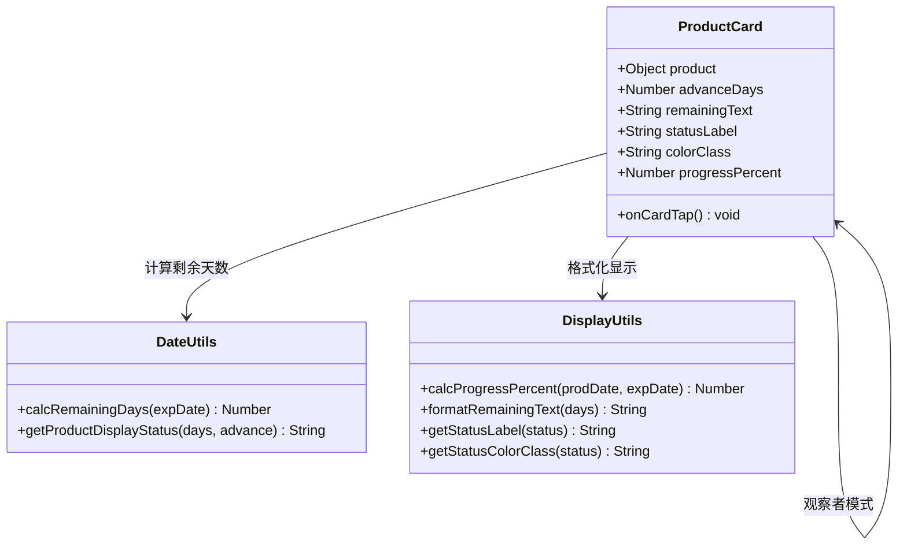

**图表来源**
- [product-card.js:7-50](file://miniprogram/components/product-card/product-card.js#L7-L50)
- [date.js:42-57](file://miniprogram/utils/date.js#L42-L57)
- [display.js:13-76](file://miniprogram/utils/display.js#L13-L76)

#### 视觉状态系统

产品卡片根据剩余天数动态调整视觉状态：

| 状态类型 | 条件 | 颜色方案 | 进度条颜色 |
|---------|------|----------|-----------|
| 在用 | 剩余天数 > 提前提醒天数 | 绿色系 (#34D399) | 渐变绿 |
| 即将过期 | 0 < 剩余天数 ≤ 提前提醒天数 | 黄色系 (#FBBF24) | 渐变黄 |
| 已过期 | 剩余天数 ≤ 0 | 红色系 (#F87171) | 渐变红 |
| 已用完 | 产品状态为used_up | 灰色系 (#6B7280) | 灰色 |

**章节来源**
- [product-card.js:19-49](file://miniprogram/components/product-card/product-card.js#L19-L49)
- [product-card.wxml:5-28](file://miniprogram/components/product-card/product-card.wxml#L5-L28)

### 云函数服务分析

云函数提供了完整的库存管理API接口：

#### 数据查询逻辑

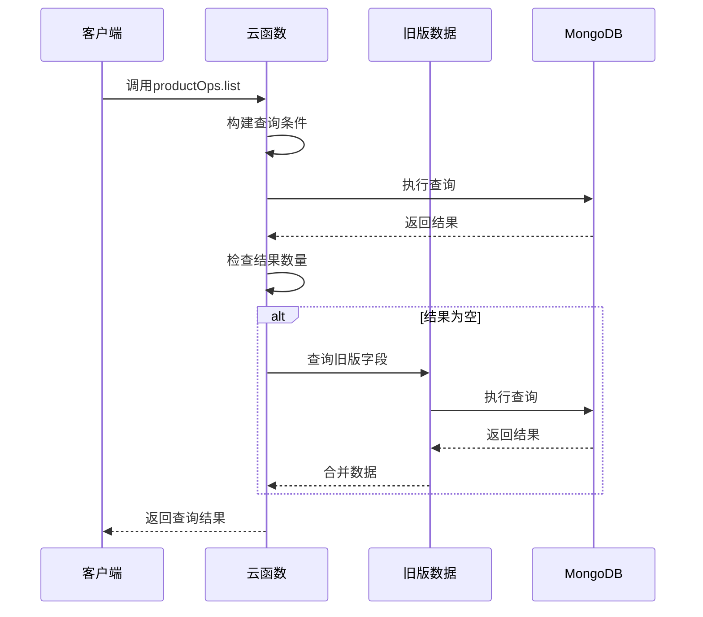

**图表来源**
- [index.js:92-110](file://cloudfunctions/productOps/index.js#L92-L110)

#### 权限验证机制

云函数实现了严格的权限控制：

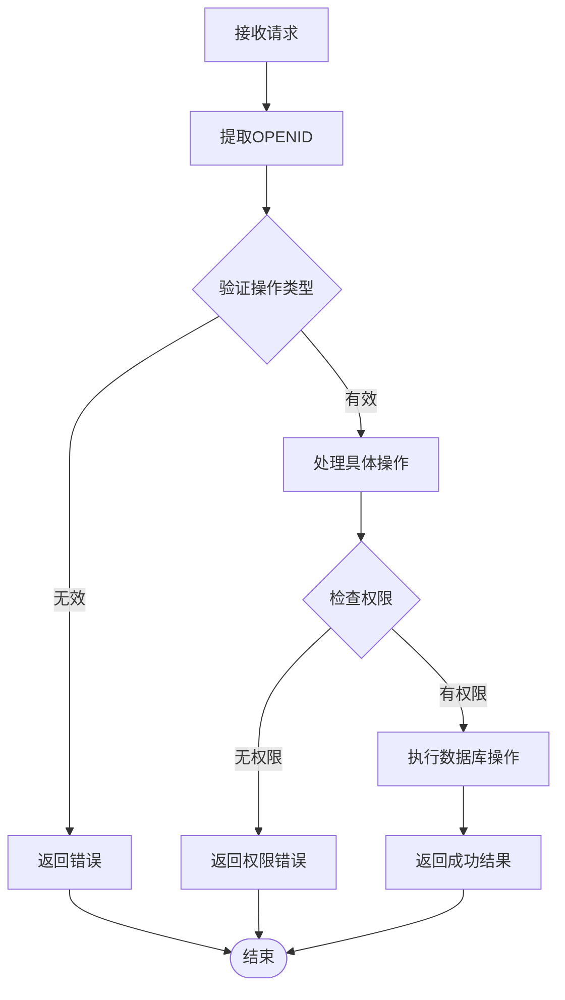

**图表来源**
- [index.js:40-64](file://cloudfunctions/productOps/index.js#L40-L64)
- [index.js:112-131](file://cloudfunctions/productOps/index.js#L112-L131)

**章节来源**
- [index.js:40-171](file://cloudfunctions/productOps/index.js#L40-L171)

## 依赖关系分析

库存页面的依赖关系体现了清晰的分层架构：

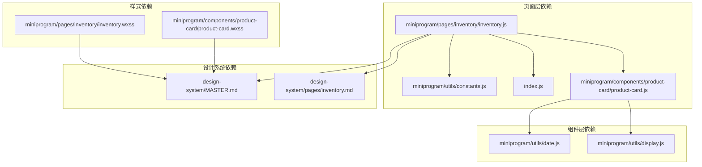

**图表来源**
- [inventory.js:6](file://miniprogram/pages/inventory/inventory.js#L6)
- [product-card.js:4-5](file://miniprogram/components/product-card/product-card.js#L4-L5)

### 数据流分析

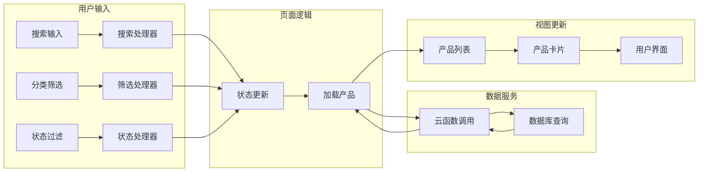

**图表来源**
- [inventory.js:29-103](file://miniprogram/pages/inventory/inventory.js#L29-L103)

**章节来源**
- [constants.js:14-21](file://miniprogram/utils/constants.js#L14-L21)
- [date.js:53-57](file://miniprogram/utils/date.js#L53-L57)

## 性能考虑

### 加载优化策略

库存页面采用了多项性能优化措施：

1. **分页加载**: 默认每页20条记录，避免一次性加载大量数据
2. **防抖处理**: 搜索输入采用防抖机制，减少不必要的请求
3. **缓存策略**: 已加载的数据会缓存在内存中，支持无限滚动
4. **懒加载**: 产品卡片组件按需渲染，提高首屏加载速度

### 内存管理

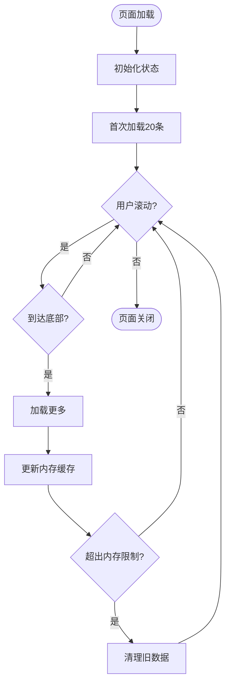

### 网络优化

- **并发控制**: 防止重复请求，避免网络资源浪费
- **错误重试**: 自动处理网络异常，提供友好的错误提示
- **离线支持**: 缓存机制支持有限的离线查看功能

## 故障排除指南

### 常见问题及解决方案

#### 数据加载失败

**症状**: 页面显示"加载失败"提示

**可能原因**:
1. 网络连接异常
2. 云函数调用超时
3. 数据库查询错误

**解决步骤**:
1. 检查网络连接状态
2. 刷新页面重试
3. 查看开发者工具控制台错误信息
4. 确认云函数部署状态

#### 权限访问错误

**症状**: 显示"无权访问"或"缺少产品ID"

**解决方法**:
1. 确认用户登录状态
2. 检查产品ID的有效性
3. 验证数据所有权
4. 重新授权应用

#### 性能问题

**症状**: 页面加载缓慢或卡顿

**优化建议**:
1. 减少同时显示的产品数量
2. 清理不必要的筛选条件
3. 关闭后台应用
4. 更新到最新版本

**章节来源**
- [inventory.js:86-102](file://miniprogram/pages/inventory/inventory.js#L86-L102)
- [index.js:61-63](file://cloudfunctions/productOps/index.js#L61-L63)

## 结论

库存页面设计规范体现了现代移动应用的最佳实践，通过清晰的架构设计、完善的组件系统和严格的质量控制，为用户提供了优秀的库存管理体验。该设计规范不仅关注功能实现，更重视用户体验和性能优化，为后续的功能扩展和维护奠定了坚实基础。

## 附录

### 设计规范对照表

| 设计要素 | 实现方式 | 规范要求 |
|---------|----------|----------|
| 搜索栏 | 圆角输入框 + 搜索图标 | 圆角12px，高度40px |
| 分类标签 | 横向滚动胶囊标签 | 选中态使用主色填充 |
| 状态过滤 | 三个固定选项 | 使用语义色背景 |
| 产品卡片 | 图标+信息+进度条 | 卡片间距12px |
| 空状态 | 插画+引导文案 | SVG插画 + 跳转按钮 |

### 技术指标

- **首屏加载时间**: < 2秒
- **最大并发请求数**: 1个
- **内存使用峰值**: < 50MB
- **电池消耗**: 低功耗模式
- **兼容性**: 微信小程序v2.0+