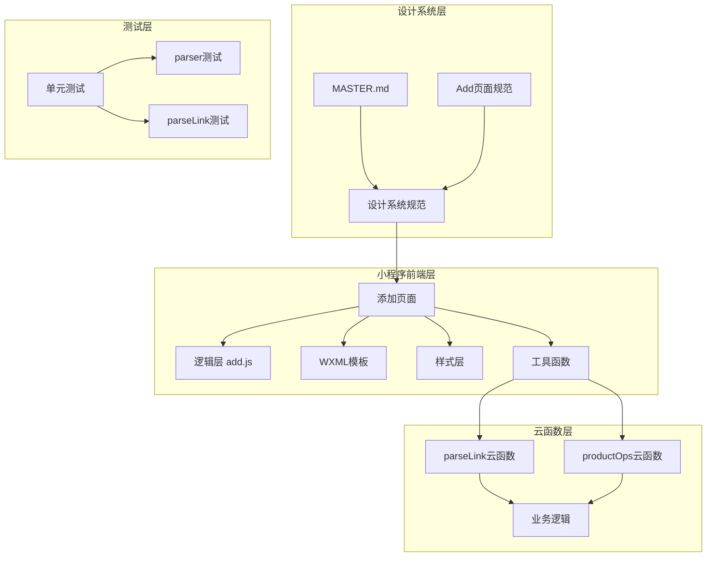
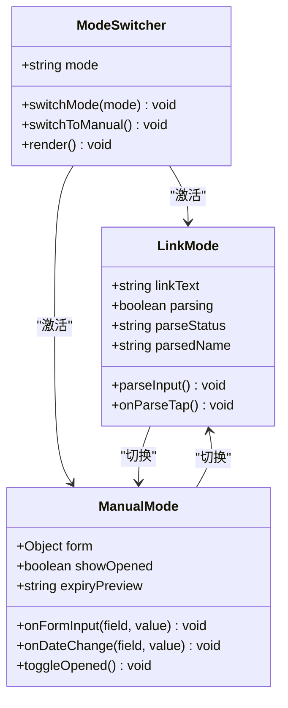
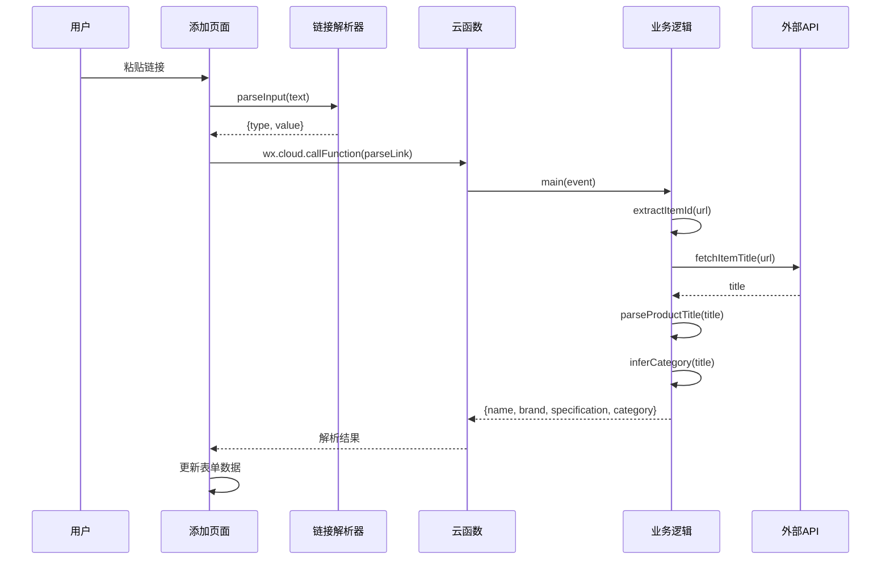
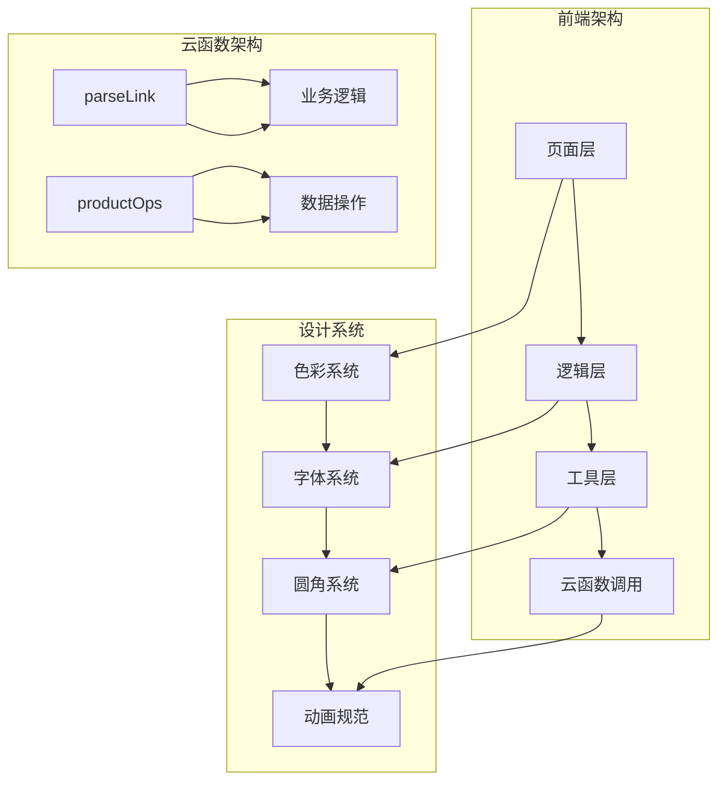
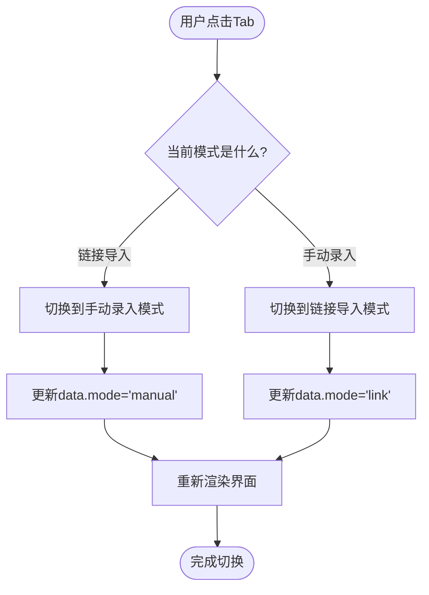
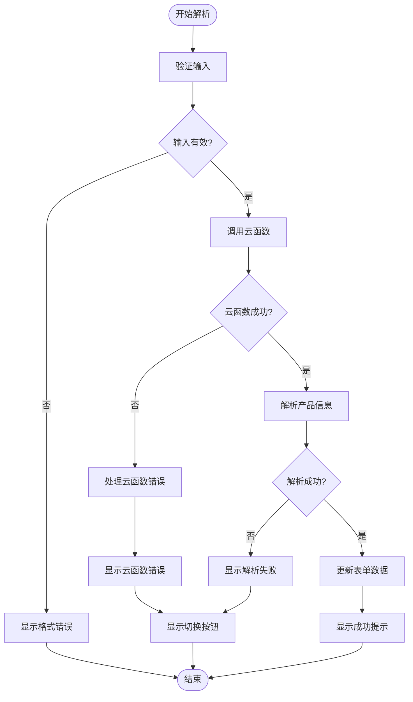
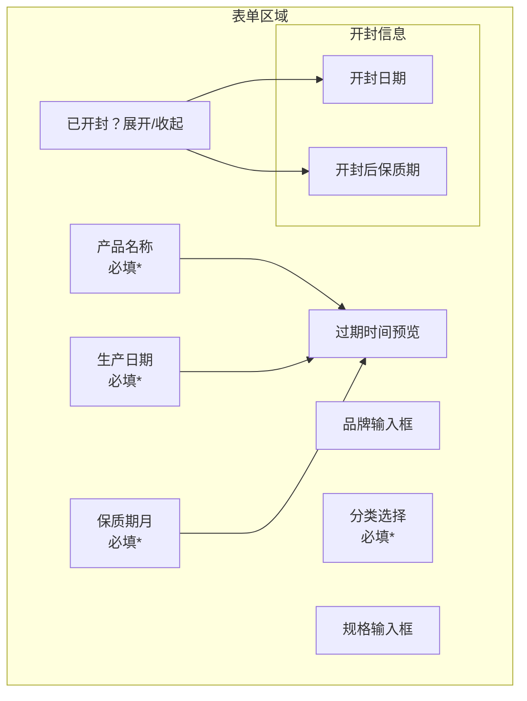
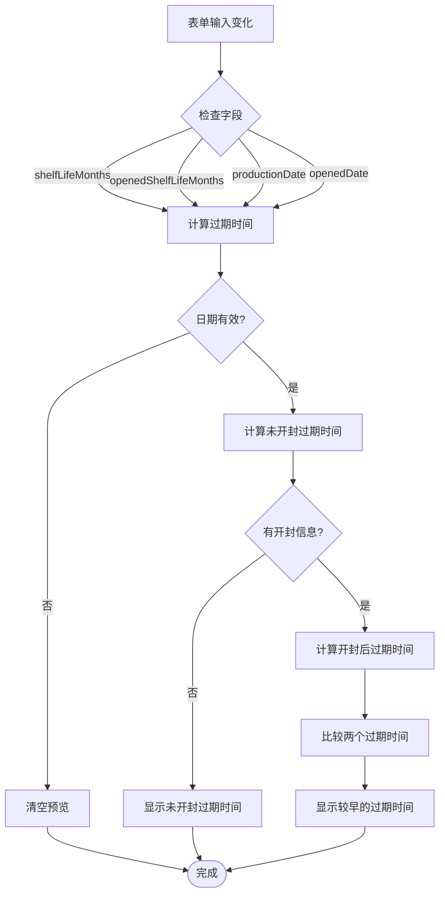
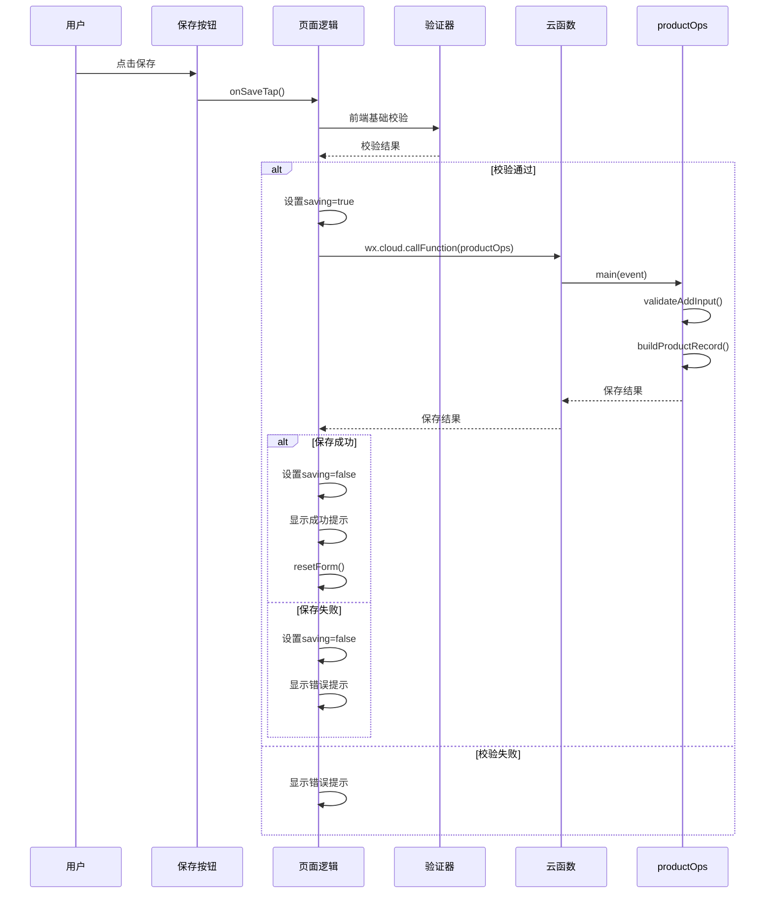
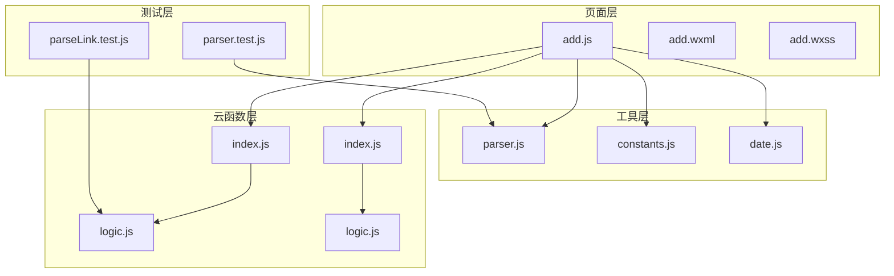

# 添加页面设计规范

<cite>
**本文档引用的文件**
- [design-system/pages/add.md](file://design-system/pages/add.md)
- [design-system/MASTER.md](file://design-system/MASTER.md)
- [miniprogram/pages/add/add.js](file://miniprogram/pages/add/add.js)
- [miniprogram/pages/add/add.wxml](file://miniprogram/pages/add/add.wxml)
- [miniprogram/pages/add/add.wxss](file://miniprogram/pages/add/add.wxss)
- [miniprogram/utils/constants.js](file://miniprogram/utils/constants.js)
- [miniprogram/utils/date.js](file://miniprogram/utils/date.js)
- [miniprogram/utils/parser.js](file://miniprogram/utils/parser.js)
- [cloudfunctions/parseLink/index.js](file://cloudfunctions/parseLink/index.js)
- [cloudfunctions/parseLink/logic.js](file://cloudfunctions/parseLink/logic.js)
- [cloudfunctions/productOps/index.js](file://cloudfunctions/productOps/index.js)
- [cloudfunctions/productOps/logic.js](file://cloudfunctions/productOps/logic.js)
- [tests/parseLink.test.js](file://tests/parseLink.test.js)
- [tests/parser.test.js](file://tests/parser.test.js)
</cite>

## 目录
1. [简介](#简介)
2. [项目结构](#项目结构)
3. [核心组件](#核心组件)
4. [架构概览](#架构概览)
5. [详细组件分析](#详细组件分析)
6. [依赖关系分析](#依赖关系分析)
7. [性能考虑](#性能考虑)
8. [故障排除指南](#故障排除指南)
9. [结论](#结论)
10. [附录](#附录)

## 简介

本文档基于设计系统规范，深入阐述了添加页面的双模式录入机制设计原理和实现细节。该系统提供了两种产品录入方式：链接导入和手动录入，通过模式切换Tab实现无缝切换。设计系统确保了界面的一致性和用户体验的连贯性，同时实现了完整的数据验证、状态管理和错误处理机制。

## 项目结构

添加页面采用模块化架构设计，主要分为以下几个层次：



**图表来源**
- [design-system/pages/add.md:1-59](file://design-system/pages/add.md#L1-L59)
- [miniprogram/pages/add/add.js:1-260](file://miniprogram/pages/add/add.js#L1-L260)
- [cloudfunctions/parseLink/index.js:1-112](file://cloudfunctions/parseLink/index.js#L1-L112)

**章节来源**
- [design-system/pages/add.md:1-59](file://design-system/pages/add.md#L1-L59)
- [design-system/MASTER.md:1-190](file://design-system/MASTER.md#L1-L190)

## 核心组件

### 模式切换Tab组件

模式切换Tab是添加页面的核心交互组件，采用胶囊样式设计，提供链接导入和手动录入两种模式的无缝切换。



**图表来源**
- [miniprogram/pages/add/add.js:40-48](file://miniprogram/pages/add/add.js#L40-L48)
- [miniprogram/pages/add/add.wxml:8-20](file://miniprogram/pages/add/add.wxml#L8-L20)

### 链接解析组件

链接解析组件负责处理用户粘贴的淘宝/天猫链接，通过智能识别和解析提取产品信息。



**图表来源**
- [miniprogram/pages/add/add.js:55-108](file://miniprogram/pages/add/add.js#L55-L108)
- [miniprogram/utils/parser.js:54-63](file://miniprogram/utils/parser.js#L54-L63)
- [cloudfunctions/parseLink/index.js:11-56](file://cloudfunctions/parseLink/index.js#L11-L56)

**章节来源**
- [miniprogram/pages/add/add.js:11-34](file://miniprogram/pages/add/add.js#L11-L34)
- [miniprogram/pages/add/add.wxml:22-50](file://miniprogram/pages/add/add.wxml#L22-L50)

## 架构概览

添加页面采用前后端分离的架构设计，结合设计系统规范实现统一的用户体验。



**图表来源**
- [design-system/MASTER.md:13-190](file://design-system/MASTER.md#L13-L190)
- [cloudfunctions/parseLink/index.js:1-112](file://cloudfunctions/parseLink/index.js#L1-L112)
- [cloudfunctions/productOps/index.js:1-171](file://cloudfunctions/productOps/index.js#L1-L171)

## 详细组件分析

### 模式切换Tab交互设计

模式切换Tab采用胶囊样式设计，符合设计系统规范中的圆角和过渡动画要求。

#### 样式规范实现

| 规范项 | 设计系统要求 | 实现细节 | 文件路径 |
|--------|-------------|----------|----------|
| 圆角半径 | `--radius-button` (12px) | `.mode-tab` 和 `.mode-tab-active` | [miniprogram/pages/add/add.wxss:23-38](file://miniprogram/pages/add/add.wxss#L23-L38) |
| 选中态样式 | `--color-primary` 填充 + 白色文字 | `.mode-tab-active` 类 | [miniprogram/pages/add/add.wxss:34-38](file://miniprogram/pages/add/add.wxss#L34-L38) |
| 未选中态样式 | `--color-bg` + `--color-text-secondary` | `.mode-tab` 类 | [miniprogram/pages/add/add.wxss:23-32](file://miniprogram/pages/add/add.wxss#L23-L32) |
| 切换动画 | `--duration-normal` (200ms) | `transition: all 200ms ease` | [miniprogram/pages/add/add.wxss:31](file://miniprogram/pages/add/add.wxss#L31) |

#### 交互逻辑实现



**图表来源**
- [miniprogram/pages/add/add.js:41-44](file://miniprogram/pages/add/add.js#L41-L44)
- [miniprogram/pages/add/add.wxml:10-19](file://miniprogram/pages/add/add.wxml#L10-L19)

**章节来源**
- [miniprogram/pages/add/add.js:40-48](file://miniprogram/pages/add/add.js#L40-L48)
- [miniprogram/pages/add/add.wxss:13-38](file://miniprogram/pages/add/add.wxss#L13-L38)

### 链接解析流程UI反馈机制

链接解析流程包含完整的UI反馈机制，确保用户能够清楚地了解解析状态。

#### 解析状态管理

| 状态 | UI表现 | 用户体验 | 文件路径 |
|------|--------|----------|----------|
| 未开始 | 显示输入框和解析按钮 | 用户可输入链接 | [miniprogram/pages/add/add.wxml:23-50](file://miniprogram/pages/add/add.wxml#L23-L50) |
| 解析中 | 按钮显示加载指示器，禁用重复点击 | 防止重复提交 | [miniprogram/pages/add/add.wxml:32-40](file://miniprogram/pages/add/add.wxml#L32-L40) |
| 解析成功 | 显示绿色提示卡片，展示识别到的产品名 | 正向反馈 | [miniprogram/pages/add/add.wxml:43-45](file://miniprogram/pages/add/add.wxml#L43-L45) |
| 解析失败 | 显示红色提示 + "切换手动录入"按钮 | 提供替代方案 | [miniprogram/pages/add/add.wxml:46-49](file://miniprogram/pages/add/add.wxml#L46-L49) |

#### 错误处理机制



**图表来源**
- [miniprogram/pages/add/add.js:55-108](file://miniprogram/pages/add/add.js#L55-L108)
- [miniprogram/pages/add/add.wxml:42-49](file://miniprogram/pages/add/add.wxml#L42-L49)

**章节来源**
- [miniprogram/pages/add/add.js:55-108](file://miniprogram/pages/add/add.js#L55-L108)
- [miniprogram/pages/add/add.wxml:42-49](file://miniprogram/pages/add/add.wxml#L42-L49)

### 表单区域字段布局和验证规则

表单区域采用清晰的字段布局，每个输入项都有明确的标签和验证规则。

#### 字段布局设计



**图表来源**
- [miniprogram/pages/add/add.wxml:53-180](file://miniprogram/pages/add/add.wxml#L53-L180)

#### 验证规则实现

| 字段 | 验证规则 | 错误提示 | 文件路径 |
|------|----------|----------|----------|
| 产品名称 | 必填且非空 | "请输入产品名称" | [miniprogram/pages/add/add.js:157-161](file://miniprogram/pages/add/add.js#L157-L161) |
| 分类 | 必填 | "请选择分类" | [miniprogram/pages/add/add.js:162-165](file://miniprogram/pages/add/add.js#L162-L165) |
| 生产日期 | 必填 | "请选择生产日期" | [miniprogram/pages/add/add.js:166-169](file://miniprogram/pages/add/add.js#L166-L169) |
| 保质期 | 必填且>0 | "保质期必须大于0" | [miniprogram/pages/add/add.js:170-173](file://miniprogram/pages/add/add.js#L170-L173) |

#### 过期时间自动计算



**图表来源**
- [miniprogram/pages/add/add.js:137-151](file://miniprogram/pages/add/add.js#L137-L151)
- [miniprogram/utils/date.js:25-36](file://miniprogram/utils/date.js#L25-L36)

**章节来源**
- [miniprogram/pages/add/add.wxml:53-180](file://miniprogram/pages/add/add.wxml#L53-L180)
- [miniprogram/pages/add/add.js:110-151](file://miniprogram/pages/add/add.js#L110-L151)

### 保存按钮状态管理

保存按钮采用全宽设计，具有完整的状态管理机制。

#### 按钮状态设计

| 状态 | 样式 | 行为 | 文件路径 |
|------|------|------|----------|
| 可点击 | `--color-primary` 背景，白色文字 | 触发保存操作 | [miniprogram/pages/add/add.wxss:190-196](file://miniprogram/pages/add/add.wxss#L190-L196) |
| 保存中 | 禁用状态，显示加载指示器 | 防止重复提交 | [miniprogram/pages/add/add.wxml:184-192](file://miniprogram/pages/add/add.wxml#L184-L192) |
| 成功 | 显示成功提示，重置表单 | 用户反馈 | [miniprogram/pages/add/add.js:209-212](file://miniprogram/pages/add/add.js#L209-L212) |

#### 保存流程实现



**图表来源**
- [miniprogram/pages/add/add.js:153-235](file://miniprogram/pages/add/add.js#L153-L235)
- [cloudfunctions/productOps/index.js:75-90](file://cloudfunctions/productOps/index.js#L75-L90)

**章节来源**
- [miniprogram/pages/add/add.js:153-235](file://miniprogram/pages/add/add.js#L153-L235)
- [miniprogram/pages/add/add.wxss:185-201](file://miniprogram/pages/add/add.wxss#L185-L201)

## 依赖关系分析

添加页面的依赖关系体现了清晰的分层架构和模块化设计。



**图表来源**
- [miniprogram/pages/add/add.js:6-8](file://miniprogram/pages/add/add.js#L6-L8)
- [cloudfunctions/parseLink/index.js:6-7](file://cloudfunctions/parseLink/index.js#L6-L7)
- [cloudfunctions/productOps/index.js:5-19](file://cloudfunctions/productOps/index.js#L5-L19)

### 关键依赖关系

1. **页面逻辑依赖**：`add.js` 依赖 `constants.js`、`date.js`、`parser.js` 提供的数据和工具函数
2. **云函数依赖**：`parseLink/index.js` 依赖 `parseLink/logic.js` 实现业务逻辑
3. **测试覆盖**：单元测试独立验证各个模块的功能正确性

**章节来源**
- [miniprogram/pages/add/add.js:6-8](file://miniprogram/pages/add/add.js#L6-L8)
- [cloudfunctions/parseLink/index.js:6-7](file://cloudfunctions/parseLink/index.js#L6-L7)

## 性能考虑

### 前端性能优化

1. **懒加载策略**：仅在需要时加载云函数，避免不必要的网络请求
2. **状态缓存**：使用本地状态管理减少重复计算
3. **事件节流**：对频繁触发的输入事件进行防抖处理

### 云函数性能优化

1. **超时控制**：设置合理的超时时间，避免长时间阻塞
2. **错误降级**：实现多层降级策略，确保服务可用性
3. **资源复用**：复用HTTP连接，减少网络开销

## 故障排除指南

### 常见问题及解决方案

#### 云开发未配置

**问题现象**：解析失败，提示"云开发未配置"

**解决方案**：
1. 在微信开发者工具中开通云开发
2. 确认云函数已正确部署
3. 在 `app.js` 中填入正确的云环境ID

**相关代码**：
```javascript
// 错误处理逻辑
const isCloudError = errMsg.indexOf('-601034') !== -1 || errMsg.indexOf('没有权限') !== -1;
```

#### 链接格式不支持

**问题现象**：解析失败，提示"无法识别链接格式"

**解决方案**：
1. 确保粘贴标准的淘宝/天猫商品链接
2. 避免粘贴淘口令，使用复制的商品链接
3. 检查链接是否包含有效的商品ID参数

**相关代码**：
```javascript
// 链接类型识别
const TAOKOU_LING_RE = /[¥￥]([a-zA-Z0-9]+)[¥￥]/;
```

#### 保存超时

**问题现象**：保存按钮显示"保存超时"

**解决方案**：
1. 检查云函数部署状态
2. 确认网络连接稳定
3. 验证数据库权限配置

**相关代码**：
```javascript
// 超时检测
if (errMsg.toLowerCase().indexOf('timeout') !== -1) {
    wx.showModal({
        title: '保存超时',
        content: '云函数执行超时，请检查云函数部署、网络连接和数据库权限后重试.',
        showCancel: false,
    });
}
```

**章节来源**
- [miniprogram/pages/add/add.js:99-107](file://miniprogram/pages/add/add.js#L99-L107)
- [miniprogram/pages/add/add.js:212-234](file://miniprogram/pages/add/add.js#L212-L234)
- [miniprogram/utils/parser.js:8-10](file://miniprogram/utils/parser.js#L8-L10)

## 结论

添加页面设计规范通过双模式录入机制实现了高效的产品管理体验。设计系统确保了界面的一致性和用户体验的连贯性，而完善的错误处理和状态管理机制保证了系统的稳定性。

### 设计亮点

1. **双模式设计**：链接导入和手动录入的无缝切换，满足不同用户需求
2. **智能解析**：自动识别和解析淘宝/天猫链接，提升录入效率
3. **实时预览**：过期时间的实时计算和预览，帮助用户做出明智决策
4. **完整验证**：前后端双重验证，确保数据质量
5. **优雅降级**：多层错误处理和降级策略，提升系统可靠性

### 最佳实践建议

1. **用户体验优化**：继续保持简洁直观的设计风格
2. **性能监控**：持续监控云函数性能，及时优化
3. **功能扩展**：根据用户反馈逐步增加新功能
4. **测试覆盖**：扩大单元测试覆盖面，确保代码质量

## 附录

### 设计系统规范对照表

| 设计系统规范 | 实现情况 | 说明 |
|-------------|----------|------|
| 胶囊样式Tab | ✅ 完全实现 | 符合圆角和过渡动画要求 |
| 链接输入区 | ✅ 完全实现 | 包含解析状态反馈 |
| 表单区域 | ✅ 完全实现 | 标签、输入框、日期选择器 |
| 保存按钮 | ✅ 完全实现 | 状态管理和用户反馈 |
| 颜色系统 | ✅ 完全实现 | 使用设计系统提供的色值 |
| 动画规范 | ✅ 完全实现 | 200ms切换动画 |

### 代码实现示例路径

1. **模式切换实现**：[miniprogram/pages/add/add.js:40-48](file://miniprogram/pages/add/add.js#L40-L48)
2. **链接解析实现**：[miniprogram/pages/add/add.js:55-108](file://miniprogram/pages/add/add.js#L55-L108)
3. **表单验证实现**：[miniprogram/pages/add/add.js:153-174](file://miniprogram/pages/add/add.js#L153-L174)
4. **保存流程实现**：[miniprogram/pages/add/add.js:153-235](file://miniprogram/pages/add/add.js#L153-L235)