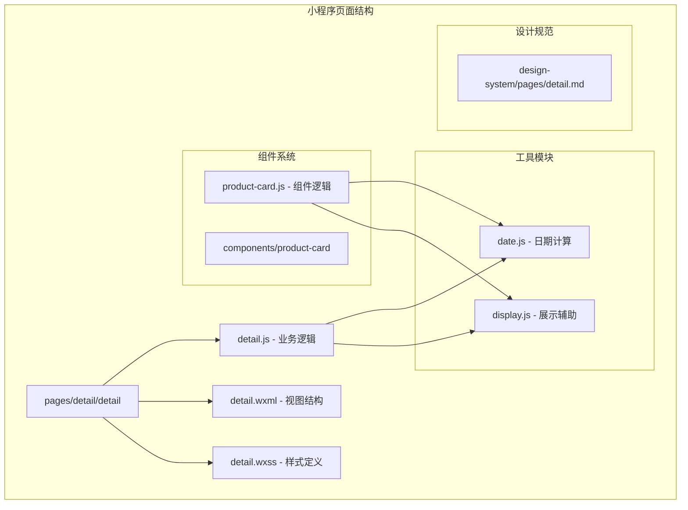
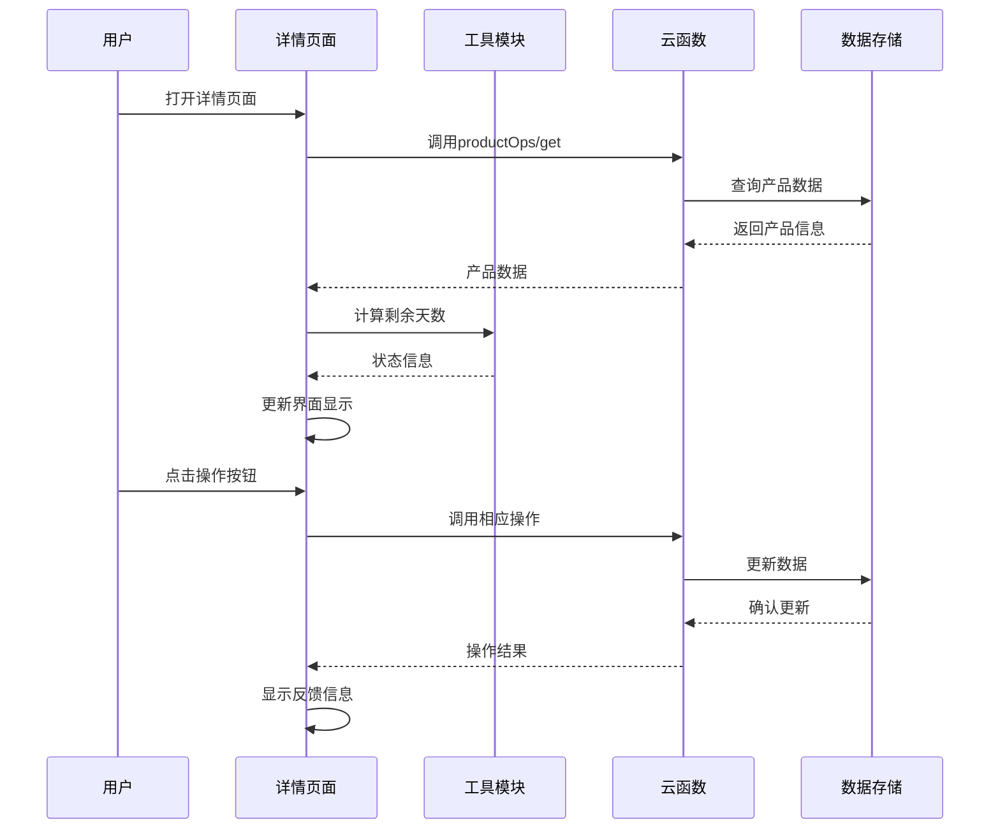
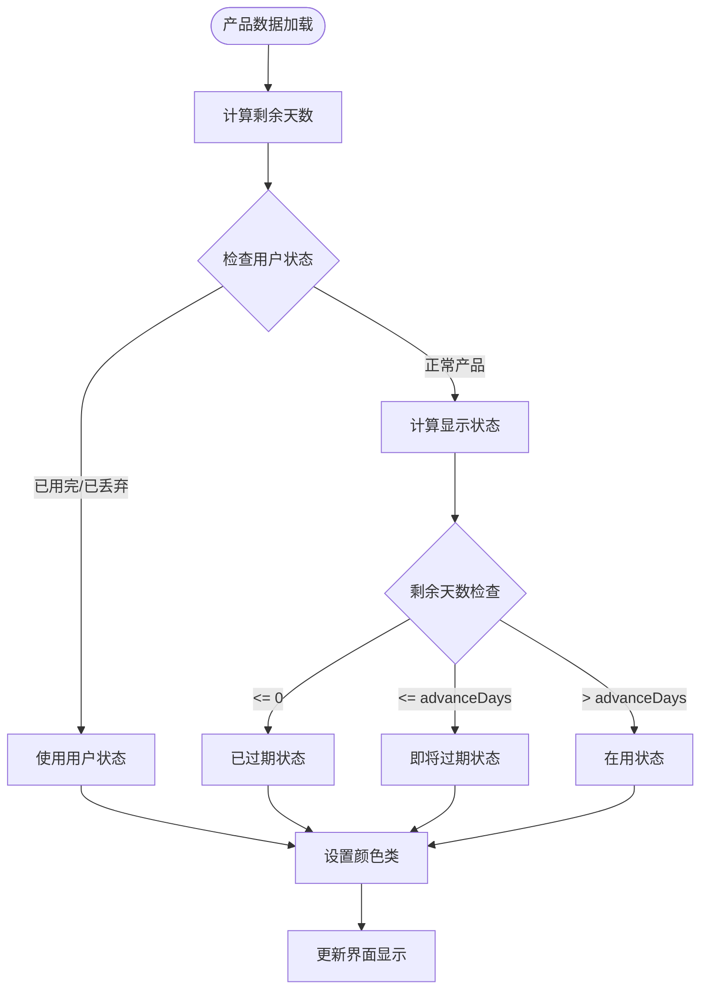
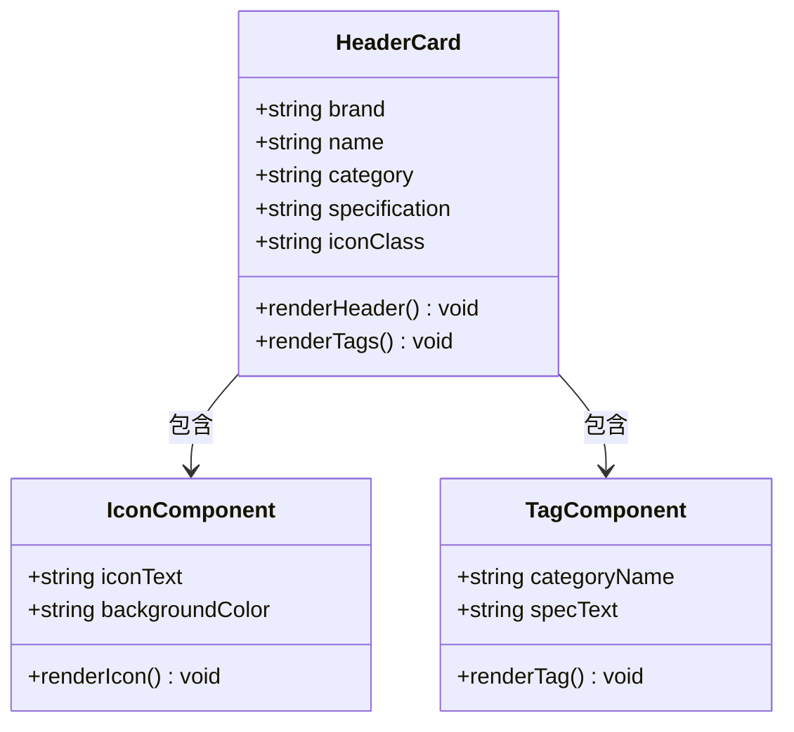
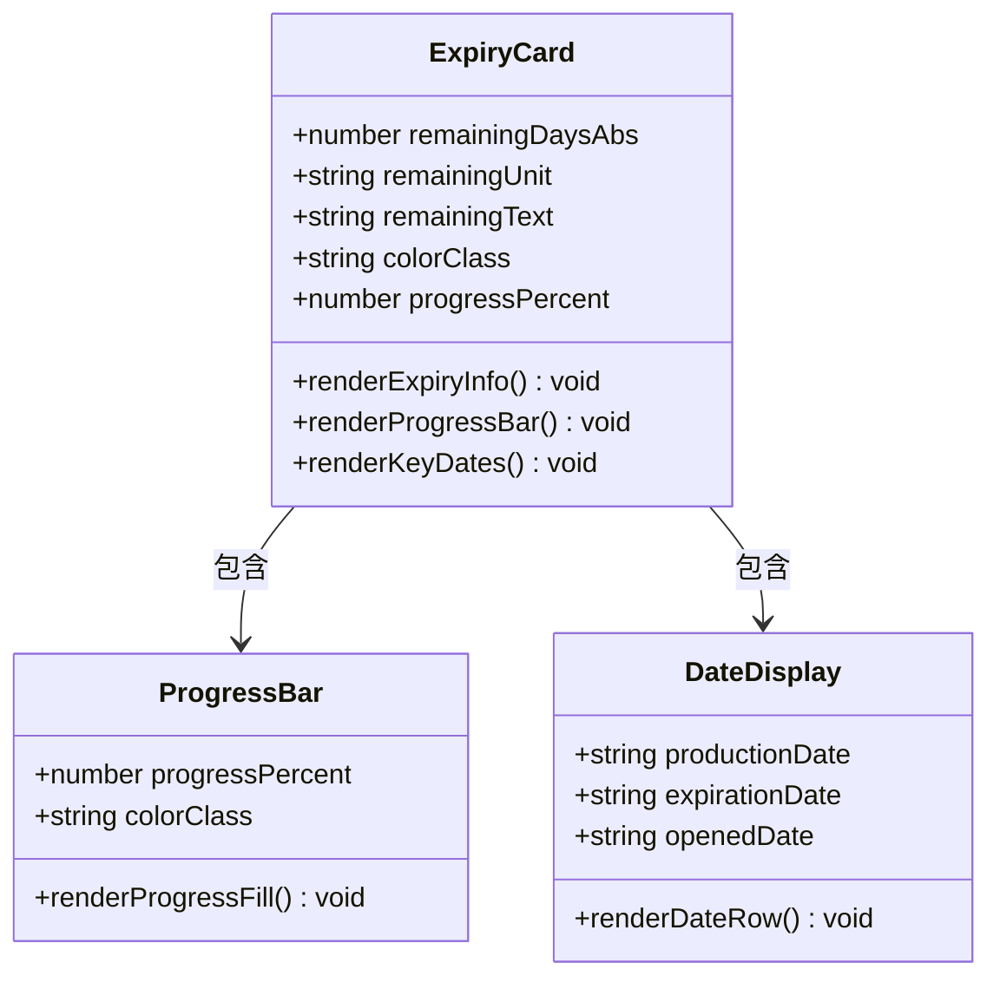
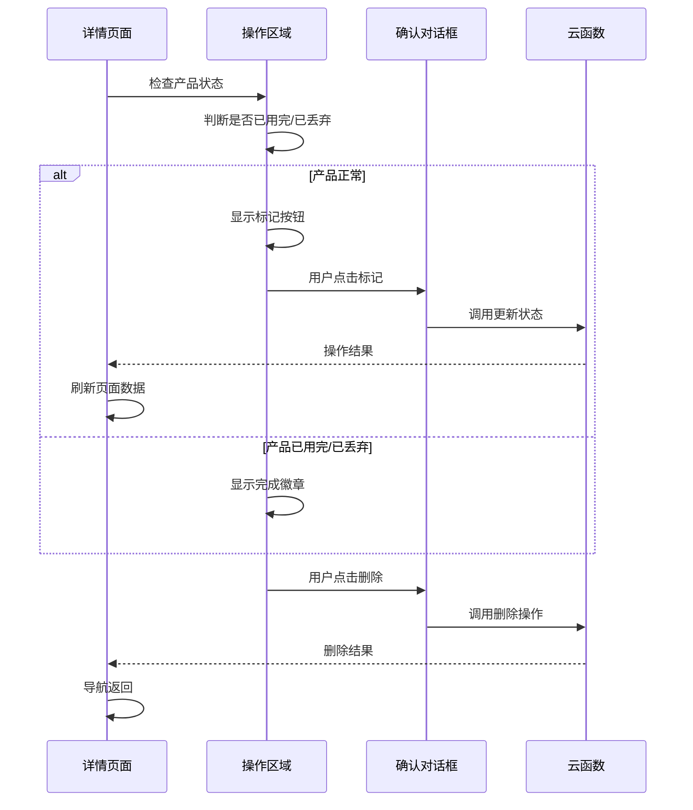
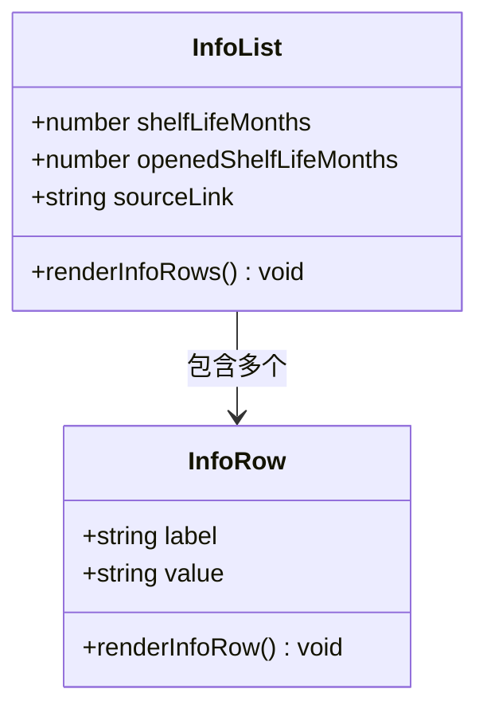
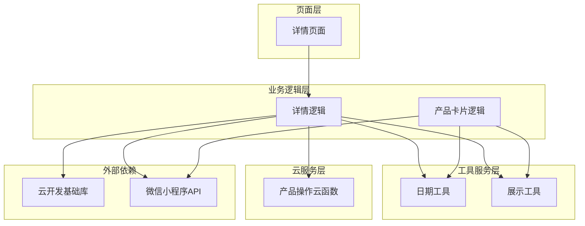
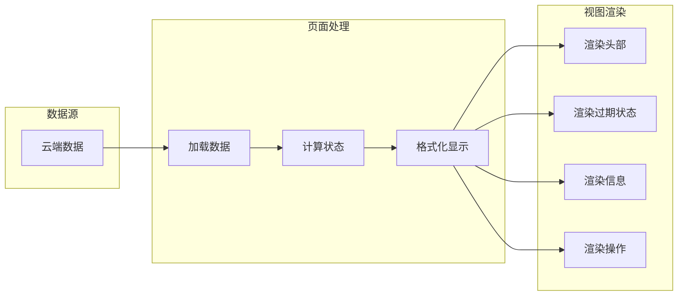

# 详情页面设计规范

<cite>
**本文档引用的文件**
- [miniprogram/pages/detail/detail.js](file://miniprogram/pages/detail/detail.js)
- [miniprogram/pages/detail/detail.wxml](file://miniprogram/pages/detail/detail.wxml)
- [miniprogram/pages/detail/detail.wxss](file://miniprogram/pages/detail/detail.wxss)
- [design-system/pages/detail.md](file://design-system/pages/detail.md)
- [miniprogram/utils/date.js](file://miniprogram/utils/date.js)
- [miniprogram/utils/display.js](file://miniprogram/utils/display.js)
- [miniprogram/components/product-card/product-card.js](file://miniprogram/components/product-card/product-card.js)
- [miniprogram/app.json](file://miniprogram/app.json)
- [tests/display.test.js](file://tests/display.test.js)
</cite>

## 目录
1. [简介](#简介)
2. [项目结构](#项目结构)
3. [核心组件](#核心组件)
4. [架构概览](#架构概览)
5. [详细组件分析](#详细组件分析)
6. [依赖关系分析](#依赖关系分析)
7. [性能考虑](#性能考虑)
8. [故障排除指南](#故障排除指南)
9. [结论](#结论)
10. [附录](#附录)

## 简介

本文档为产品详情页面设计规范提供了全面的技术文档。该页面负责展示产品的完整信息、管理使用状态、设置过期提醒以及提供编辑功能入口。详情页面采用清晰的视觉层次结构，通过产品卡片组件、状态标签组件和操作按钮的有机结合，为用户提供直观的产品信息浏览体验。

详情页面的核心设计理念是通过颜色编码系统（安全/警告/危险）和进度条可视化来传达产品的保质期状态，同时提供简洁明了的操作入口，确保用户能够快速了解产品状态并进行相应的管理操作。

## 项目结构

详情页面位于小程序的页面目录结构中，采用标准的微信小程序页面组织方式：

**图表来源**
- [miniprogram/pages/detail/detail.js:1-122](file://miniprogram/pages/detail/detail.js#L1-L122)
- [miniprogram/pages/detail/detail.wxml:1-92](file://miniprogram/pages/detail/detail.wxml#L1-L92)
- [miniprogram/pages/detail/detail.wxss:1-269](file://miniprogram/pages/detail/detail.wxss#L1-L269)

**章节来源**
- [miniprogram/pages/detail/detail.js:1-122](file://miniprogram/pages/detail/detail.js#L1-L122)
- [miniprogram/pages/detail/detail.wxml:1-92](file://miniprogram/pages/detail/detail.wxml#L1-L92)
- [miniprogram/pages/detail/detail.wxss:1-269](file://miniprogram/pages/detail/detail.wxss#L1-L269)

## 核心组件

详情页面由四个主要组件构成，每个组件都有明确的职责分工：

### 1. 产品头部卡片组件
负责展示产品的基础信息，包括品牌、名称、分类标签和规格等关键属性。

### 2. 保质期状态卡片组件  
实时显示产品的剩余保质期天数、状态颜色编码和进度条，提供直观的时间可视化。

### 3. 详细信息列表组件
展示产品的技术参数和相关信息，如生产日期、过期日期、保质期等。

### 4. 操作按钮区组件
提供状态管理和删除操作的交互入口，支持标记用完、标记丢弃和删除产品等功能。

**章节来源**
- [miniprogram/pages/detail/detail.wxml:8-61](file://miniprogram/pages/detail/detail.wxml#L8-L61)
- [miniprogram/pages/detail/detail.wxss:13-179](file://miniprogram/pages/detail/detail.wxss#L13-L179)

## 架构概览

详情页面采用MVVM架构模式，结合微信小程序的组件化开发理念：

**图表来源**
- [miniprogram/pages/detail/detail.js:31-52](file://miniprogram/pages/detail/detail.js#L31-L52)
- [miniprogram/pages/detail/detail.js:81-99](file://miniprogram/pages/detail/detail.js#L81-L99)

### 状态管理系统

详情页面实现了完整的状态管理机制，通过颜色编码系统传达产品的当前状态：

**图表来源**
- [miniprogram/utils/date.js:53-57](file://miniprogram/utils/date.js#L53-L57)
- [miniprogram/utils/display.js:55-68](file://miniprogram/utils/display.js#L55-L68)

**章节来源**
- [miniprogram/utils/date.js:53-57](file://miniprogram/utils/date.js#L53-L57)
- [miniprogram/utils/display.js:55-68](file://miniprogram/utils/display.js#L55-L68)

## 详细组件分析

### 产品头部卡片组件

产品头部卡片采用垂直布局设计，突出显示品牌和产品名称，同时提供分类标签和规格信息：

**图表来源**
- [miniprogram/pages/detail/detail.wxml:9-19](file://miniprogram/pages/detail/detail.wxml#L9-L19)
- [miniprogram/pages/detail/detail.wxss:22-76](file://miniprogram/pages/detail/detail.wxss#L22-L76)

### 保质期状态卡片组件

保质期状态卡片是详情页面的核心视觉元素，通过多种设计元素传达产品的时效性信息：

**图表来源**
- [miniprogram/pages/detail/detail.wxml:21-45](file://miniprogram/pages/detail/detail.wxml#L21-L45)
- [miniprogram/pages/detail/detail.wxss:78-147](file://miniprogram/pages/detail/detail.wxss#L78-L147)

### 操作按钮区组件

操作按钮区根据产品的当前状态动态显示不同的操作选项：

**图表来源**
- [miniprogram/pages/detail/detail.wxml:63-79](file://miniprogram/pages/detail/detail.wxml#L63-L79)
- [miniprogram/pages/detail/detail.js:71-120](file://miniprogram/pages/detail/detail.js#L71-L120)

**章节来源**
- [miniprogram/pages/detail/detail.wxml:63-79](file://miniprogram/pages/detail/detail.wxml#L63-L79)
- [miniprogram/pages/detail/detail.js:71-120](file://miniprogram/pages/detail/detail.js#L71-L120)

### 详细信息列表组件

详细信息列表提供产品的技术参数和相关信息展示：

**图表来源**
- [miniprogram/pages/detail/detail.wxml:47-61](file://miniprogram/pages/detail/detail.wxml#L47-L61)
- [miniprogram/pages/detail/detail.wxss:149-179](file://miniprogram/pages/detail/detail.wxss#L149-L179)

**章节来源**
- [miniprogram/pages/detail/detail.wxml:47-61](file://miniprogram/pages/detail/detail.wxml#L47-L61)
- [miniprogram/pages/detail/detail.wxss:149-179](file://miniprogram/pages/detail/detail.wxss#L149-L179)

## 依赖关系分析

详情页面的依赖关系体现了清晰的分层架构：

**图表来源**
- [miniprogram/pages/detail/detail.js:6-7](file://miniprogram/pages/detail/detail.js#L6-L7)
- [miniprogram/components/product-card/product-card.js:4-5](file://miniprogram/components/product-card/product-card.js#L4-L5)

### 数据流分析

详情页面的数据流遵循单向数据绑定原则：

**图表来源**
- [miniprogram/pages/detail/detail.js:31-69](file://miniprogram/pages/detail/detail.js#L31-L69)

**章节来源**
- [miniprogram/pages/detail/detail.js:31-69](file://miniprogram/pages/detail/detail.js#L31-L69)

## 性能考虑

详情页面在性能优化方面采用了多项策略：

### 1. 懒加载与条件渲染
- 使用条件渲染避免不必要的DOM节点创建
- 仅在需要时渲染特定信息（如开封日期）

### 2. 状态缓存机制
- 计算结果缓存在data对象中，避免重复计算
- 使用observers监听数据变化，按需更新界面

### 3. 动画性能优化
- 进度条动画使用CSS过渡效果
- 颜色切换使用类名切换，避免JavaScript动画

### 4. 网络请求优化
- 一次性加载完整产品信息
- 错误处理确保网络异常时的用户体验

**章节来源**
- [miniprogram/pages/detail/detail.wxml:40-43](file://miniprogram/pages/detail/detail.wxml#L40-L43)
- [miniprogram/pages/detail/detail.wxss:125-126](file://miniprogram/pages/detail/detail.wxss#L125-L126)

## 故障排除指南

### 常见问题及解决方案

#### 1. 产品数据加载失败
**症状**: 页面显示"加载失败"提示
**原因**: 网络请求超时或产品不存在
**解决方案**: 
- 检查云函数调用是否成功
- 验证产品ID参数传递
- 实现重试机制

#### 2. 状态显示异常
**症状**: 保质期状态颜色与预期不符
**原因**: 日期计算错误或状态判断逻辑问题
**解决方案**:
- 验证日期格式和时区设置
- 检查advanceDays参数配置
- 确认状态映射表完整性

#### 3. 操作按钮无响应
**症状**: 点击操作按钮无任何反应
**原因**: 事件绑定错误或权限问题
**解决方案**:
- 检查bindtap事件绑定
- 验证云函数权限配置
- 确认用户登录状态

**章节来源**
- [miniprogram/pages/detail/detail.js:25-27](file://miniprogram/pages/detail/detail.js#L25-L27)
- [miniprogram/pages/detail/detail.js:49-51](file://miniprogram/pages/detail/detail.js#L49-L51)

## 结论

详情页面设计规范通过清晰的视觉层次、直观的状态标识和流畅的交互流程，为用户提供了优秀的移动端产品信息浏览体验。页面采用模块化的组件设计，确保了代码的可维护性和扩展性。

设计规范的核心优势在于：
- **直观的状态传达**: 通过颜色编码和进度条有效传达产品时效性
- **简洁的操作流程**: 减少用户认知负担，提高操作效率
- **一致的视觉语言**: 统一的设计元素增强品牌识别度
- **完善的错误处理**: 提供友好的错误提示和恢复机制

未来可以考虑的功能增强包括：
- 编辑功能的实现（P2需求）
- 更丰富的通知提醒机制
- 个性化设置选项
- 数据导出功能

## 附录

### 设计规范对照表

| 设计要素 | 实现状态 | 规范要求 | 实现方式 |
|---------|----------|----------|----------|
| 产品头部 | ✅ 完成 | 大图标+品牌名+产品名 | 64x64图标容器，品牌名Caption，产品名H2 |
| 保质期状态 | ✅ 完成 | 进度条+关键日期 | 8px高进度条，生产/过期/开封日期 |
| 操作按钮 | ✅ 完成 | 标记用完/丢弃/删除 | 44px高度，圆角设计，颜色分离 |
| 状态颜色 | ✅ 完成 | 安全/警告/危险 | 绿/黄/红渐变背景 |

### 技术实现要点

- **响应式设计**: 使用相对单位和flex布局适应不同屏幕尺寸
- **性能优化**: 条件渲染、状态缓存、动画优化
- **错误处理**: 完善的加载状态和错误提示机制
- **可访问性**: 足够的颜色对比度和字体大小

**章节来源**
- [design-system/pages/detail.md:30-52](file://design-system/pages/detail.md#L30-L52)
- [miniprogram/app.json:1-52](file://miniprogram/app.json#L1-L52)