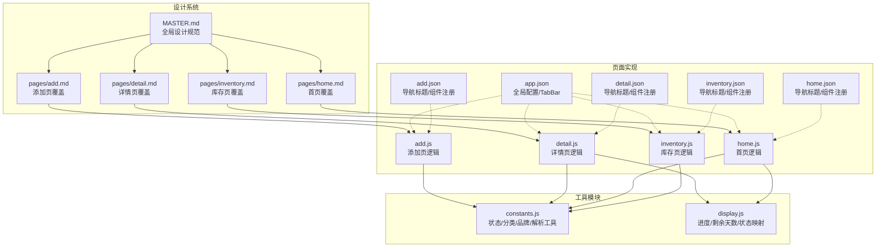
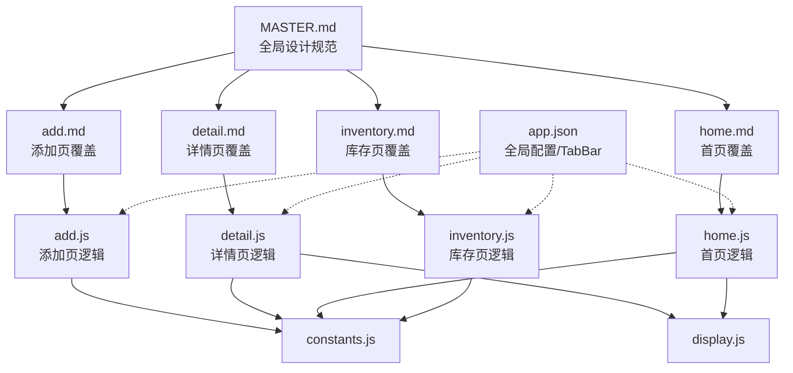
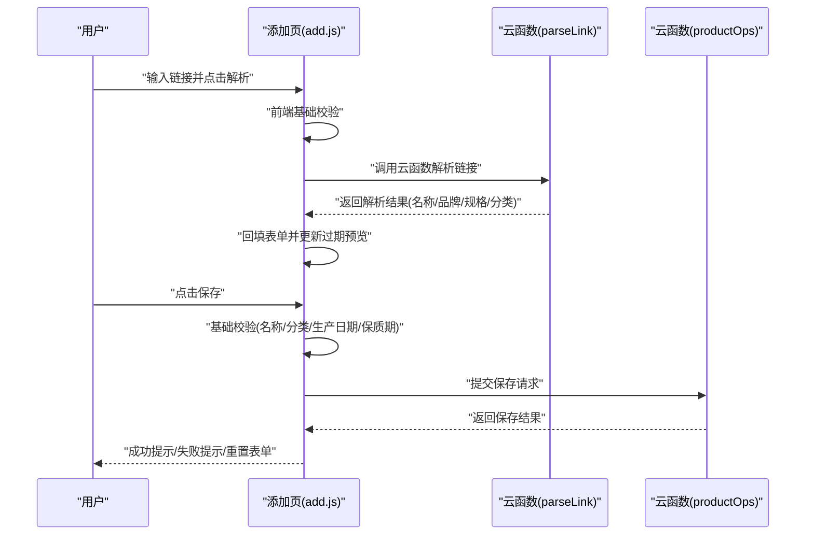
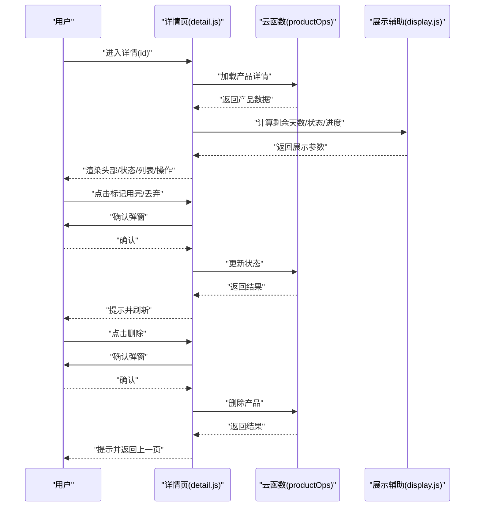
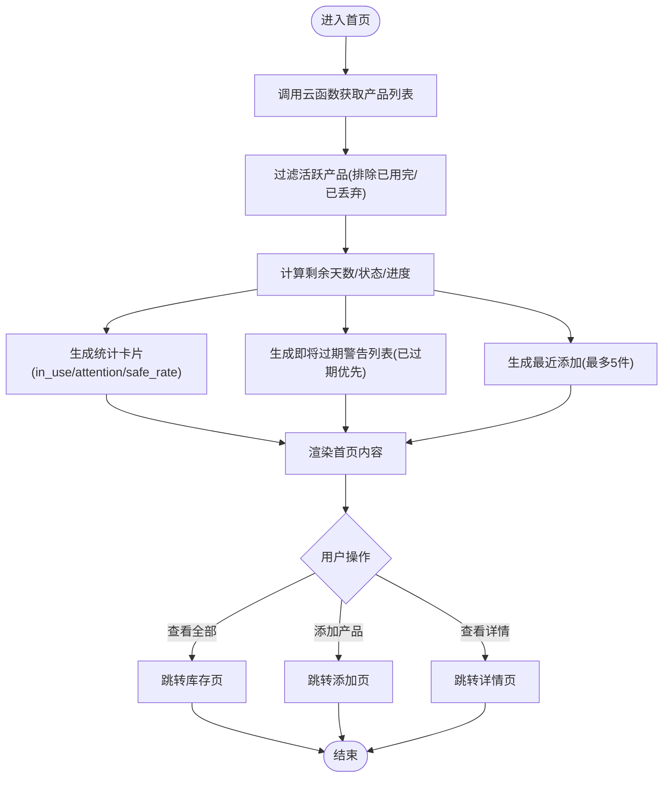
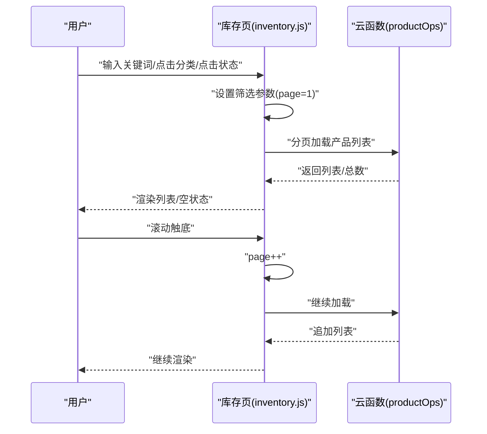
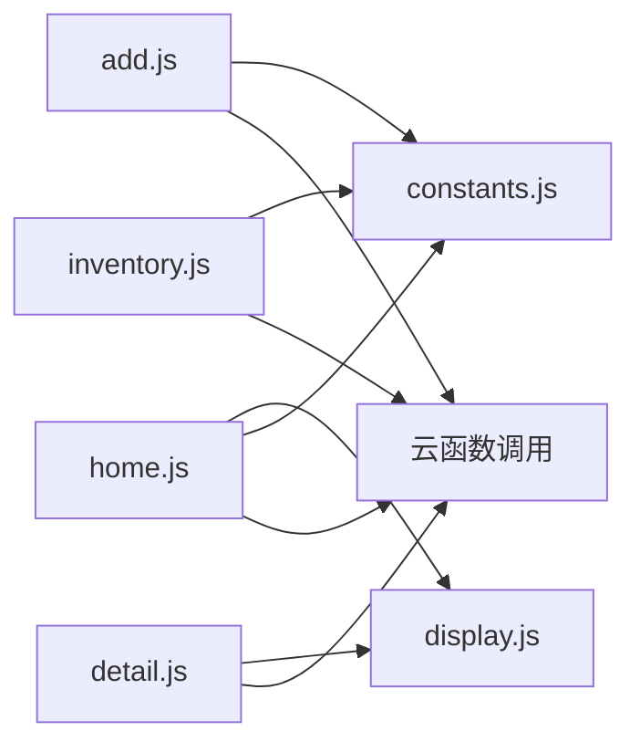

# 页面设计规范

<cite>
**本文引用的文件**
- [design-system/MASTER.md](file://design-system/MASTER.md)
- [design-system/pages/add.md](file://design-system/pages/add.md)
- [design-system/pages/detail.md](file://design-system/pages/detail.md)
- [design-system/pages/home.md](file://design-system/pages/home.md)
- [design-system/pages/inventory.md](file://design-system/pages/inventory.md)
- [miniprogram/app.json](file://miniprogram/app.json)
- [miniprogram/pages/add/add.json](file://miniprogram/pages/add/add.json)
- [miniprogram/pages/detail/detail.json](file://miniprogram/pages/detail/detail.json)
- [miniprogram/pages/home/home.json](file://miniprogram/pages/home/home.json)
- [miniprogram/pages/inventory/inventory.json](file://miniprogram/pages/inventory/inventory.json)
- [miniprogram/pages/add/add.js](file://miniprogram/pages/add/add.js)
- [miniprogram/pages/detail/detail.js](file://miniprogram/pages/detail/detail.js)
- [miniprogram/pages/home/home.js](file://miniprogram/pages/home/home.js)
- [miniprogram/pages/inventory/inventory.js](file://miniprogram/pages/inventory/inventory.js)
- [miniprogram/utils/constants.js](file://miniprogram/utils/constants.js)
- [miniprogram/utils/display.js](file://miniprogram/utils/display.js)
</cite>

## 目录
1. [引言](#引言)
2. [项目结构](#项目结构)
3. [核心组件](#核心组件)
4. [架构总览](#架构总览)
5. [详细组件分析](#详细组件分析)
6. [依赖分析](#依赖分析)
7. [性能考虑](#性能考虑)
8. [故障排查指南](#故障排查指南)
9. [结论](#结论)
10. [附录](#附录)

## 引言
本文件面向“CosmeticBox”微信小程序的页面级设计规范，基于统一的设计系统（Master）与各页面覆盖规则，系统化梳理添加页、详情页、首页与库存页的设计准则、信息架构、交互流程与视觉呈现。文档同时阐明页面间导航关系、状态转换与一致性保障策略，并提供最佳实践、反模式规避与常见问题解决方案，帮助设计与开发团队在不同阶段高效协作，确保用户体验的一致性与可用性。

## 项目结构
- 设计系统位于 design-system 目录，包含全局 Master 规范与页面级覆盖文档。
- 页面实现位于 miniprogram/pages 下，采用按页面分目录的组织方式；页面 JSON 配置用于声明导航栏标题与自定义组件注册。
- 工具模块位于 miniprogram/utils，提供常量、展示辅助与日期相关逻辑，供页面逻辑复用。

图表来源
- [design-system/MASTER.md:1-190](file://design-system/MASTER.md#L1-L190)
- [design-system/pages/add.md:1-59](file://design-system/pages/add.md#L1-L59)
- [design-system/pages/detail.md:1-52](file://design-system/pages/detail.md#L1-L52)
- [design-system/pages/home.md:1-52](file://design-system/pages/home.md#L1-L52)
- [design-system/pages/inventory.md:1-62](file://design-system/pages/inventory.md#L1-L62)
- [miniprogram/app.json:1-52](file://miniprogram/app.json#L1-L52)
- [miniprogram/pages/add/add.json:1-3](file://miniprogram/pages/add/add.json#L1-L3)
- [miniprogram/pages/detail/detail.json:1-3](file://miniprogram/pages/detail/detail.json#L1-L3)
- [miniprogram/pages/home/home.json:1-6](file://miniprogram/pages/home/home.json#L1-L6)
- [miniprogram/pages/inventory/inventory.json:1-6](file://miniprogram/pages/inventory/inventory.json#L1-L6)
- [miniprogram/pages/add/add.js:1-260](file://miniprogram/pages/add/add.js#L1-L260)
- [miniprogram/pages/detail/detail.js:1-122](file://miniprogram/pages/detail/detail.js#L1-L122)
- [miniprogram/pages/home/home.js:1-119](file://miniprogram/pages/home/home.js#L1-L119)
- [miniprogram/pages/inventory/inventory.js:1-117](file://miniprogram/pages/inventory/inventory.js#L1-L117)
- [miniprogram/utils/constants.js:1-100](file://miniprogram/utils/constants.js#L1-L100)
- [miniprogram/utils/display.js:1-76](file://miniprogram/utils/display.js#L1-L76)

章节来源
- [design-system/MASTER.md:1-190](file://design-system/MASTER.md#L1-L190)
- [miniprogram/app.json:1-52](file://miniprogram/app.json#L1-L52)

## 核心组件
- 设计系统 Master：提供色彩、字体、圆角、阴影、间距、图标、动画与游戏化元素等全局规范，是页面覆盖规则的基线。
- 页面覆盖规则：在 Master 基础上，针对添加页、详情页、首页、库存页给出布局结构、特定规则与交互细节。
- 页面逻辑与配置：各页面 JS 负责数据加载、状态计算与交互处理；JSON 配置负责导航标题与组件注册。
- 工具模块：常量与展示辅助函数为页面提供状态枚举、预设分类、品牌词库、解析工具以及进度与剩余天数等展示逻辑。

章节来源
- [design-system/MASTER.md:1-190](file://design-system/MASTER.md#L1-L190)
- [design-system/pages/add.md:1-59](file://design-system/pages/add.md#L1-L59)
- [design-system/pages/detail.md:1-52](file://design-system/pages/detail.md#L1-L52)
- [design-system/pages/home.md:1-52](file://design-system/pages/home.md#L1-L52)
- [design-system/pages/inventory.md:1-62](file://design-system/pages/inventory.md#L1-L62)
- [miniprogram/pages/add/add.js:1-260](file://miniprogram/pages/add/add.js#L1-L260)
- [miniprogram/pages/detail/detail.js:1-122](file://miniprogram/pages/detail/detail.js#L1-L122)
- [miniprogram/pages/home/home.js:1-119](file://miniprogram/pages/home/home.js#L1-L119)
- [miniprogram/pages/inventory/inventory.js:1-117](file://miniprogram/pages/inventory/inventory.js#L1-L117)
- [miniprogram/utils/constants.js:1-100](file://miniprogram/utils/constants.js#L1-L100)
- [miniprogram/utils/display.js:1-76](file://miniprogram/utils/display.js#L1-L76)

## 架构总览
页面级设计规范与实现的关系如下：Master 提供统一的视觉与交互语言；页面覆盖规则细化各页面的布局与交互；页面逻辑通过云函数与工具模块实现数据驱动的状态计算与展示；全局配置统一导航与 TabBar 表现。

图表来源
- [design-system/MASTER.md:1-190](file://design-system/MASTER.md#L1-L190)
- [design-system/pages/add.md:1-59](file://design-system/pages/add.md#L1-L59)
- [design-system/pages/detail.md:1-52](file://design-system/pages/detail.md#L1-L52)
- [design-system/pages/home.md:1-52](file://design-system/pages/home.md#L1-L52)
- [design-system/pages/inventory.md:1-62](file://design-system/pages/inventory.md#L1-L62)
- [miniprogram/pages/add/add.js:1-260](file://miniprogram/pages/add/add.js#L1-L260)
- [miniprogram/pages/detail/detail.js:1-122](file://miniprogram/pages/detail/detail.js#L1-L122)
- [miniprogram/pages/home/home.js:1-119](file://miniprogram/pages/home/home.js#L1-L119)
- [miniprogram/pages/inventory/inventory.js:1-117](file://miniprogram/pages/inventory/inventory.js#L1-L117)
- [miniprogram/utils/constants.js:1-100](file://miniprogram/utils/constants.js#L1-L100)
- [miniprogram/utils/display.js:1-76](file://miniprogram/utils/display.js#L1-L76)
- [miniprogram/app.json:1-52](file://miniprogram/app.json#L1-L52)

## 详细组件分析

### 添加页（Add）
- 功能定位：支持“链接导入”与“手动录入”两种模式，自动解析淘宝链接并回填表单，提供过期时间预览与保存能力。
- 信息架构：模式切换区（胶囊样式）、链接输入区（输入+解析按钮+提示）、表单区（品牌/名称/分类/规格/生产日期/保质期/开封信息）、保存按钮。
- 交互流程：
  - 链接导入：输入链接后触发解析，解析中禁用重复点击，成功/失败分别展示提示与可选“切换手动录入”。
  - 手动录入：填写必填项与日期，实时计算过期预览；保存前进行基础校验，提交至云函数，成功后重置表单。
- 视觉呈现：遵循 Master 的圆角、阴影、间距与语义色；按钮与标签使用统一过渡时长与缓动曲线；保存成功后采用弹性弹窗动画。

图表来源
- [miniprogram/pages/add/add.js:50-108](file://miniprogram/pages/add/add.js#L50-L108)
- [miniprogram/pages/add/add.js:153-235](file://miniprogram/pages/add/add.js#L153-L235)
- [design-system/pages/add.md:32-58](file://design-system/pages/add.md#L32-L58)

章节来源
- [design-system/pages/add.md:1-59](file://design-system/pages/add.md#L1-L59)
- [miniprogram/pages/add/add.json:1-3](file://miniprogram/pages/add/add.json#L1-L3)
- [miniprogram/pages/add/add.js:1-260](file://miniprogram/pages/add/add.js#L1-L260)
- [miniprogram/utils/constants.js:1-100](file://miniprogram/utils/constants.js#L1-L100)

### 详情页（Detail）
- 功能定位：展示产品完整信息、实时计算保质期状态、提供“标记用完/丢弃/删除”操作入口。
- 信息架构：导航栏、产品头部卡片（图标+品牌+名称+分类+规格）、保质期状态卡片（进度条+关键日期）、详细信息列表、操作按钮区。
- 交互流程：
  - 加载产品：通过云函数获取产品详情，失败时提示错误。
  - 实时计算：根据过期日期计算剩余天数、展示状态与进度百分比。
  - 操作：标记用完/丢弃弹确认框；删除弹确认框并返回上一页。
- 视觉呈现：使用语义色区分状态（安全/警告/危险）；进度条放大突出剩余时间；操作按钮按重要性与风险分级。

图表来源
- [miniprogram/pages/detail/detail.js:21-52](file://miniprogram/pages/detail/detail.js#L21-L52)
- [miniprogram/pages/detail/detail.js:54-69](file://miniprogram/pages/detail/detail.js#L54-L69)
- [miniprogram/pages/detail/detail.js:71-99](file://miniprogram/pages/detail/detail.js#L71-L99)
- [miniprogram/pages/detail/detail.js:101-121](file://miniprogram/pages/detail/detail.js#L101-L121)
- [miniprogram/utils/display.js:1-76](file://miniprogram/utils/display.js#L1-L76)

章节来源
- [design-system/pages/detail.md:1-52](file://design-system/pages/detail.md#L1-L52)
- [miniprogram/pages/detail/detail.json:1-3](file://miniprogram/pages/detail/detail.json#L1-L3)
- [miniprogram/pages/detail/detail.js:1-122](file://miniprogram/pages/detail/detail.js#L1-L122)
- [miniprogram/utils/display.js:1-76](file://miniprogram/utils/display.js#L1-L76)

### 首页（Home）
- 功能定位：仪表盘概览，展示在用/注意/安全率统计、即将过期警告、最近添加产品，作为用户首屏体验。
- 信息架构：顶部渐变背景+几何装饰、统计卡片行、即将过期警告区、最近添加列表、底部 TabBar。
- 交互流程：
  - 加载：调用云函数获取产品列表，过滤活跃产品，实时计算剩余天数与状态，生成警告列表与最近添加列表。
  - 展示：按过期优先级排序警告项；最近添加最多 5 件。
  - 导航：点击“查看全部”跳转库存页；点击卡片跳转详情页；点击“添加”跳转添加页。
- 视觉呈现：使用 Master 的渐变背景与几何装饰；统计卡片采用大数字与语义色浅背景；警告卡片按状态使用语义色边框。

图表来源
- [miniprogram/pages/home/home.js:28-101](file://miniprogram/pages/home/home.js#L28-L101)
- [miniprogram/pages/home/home.js:103-117](file://miniprogram/pages/home/home.js#L103-L117)
- [design-system/pages/home.md:31-51](file://design-system/pages/home.md#L31-L51)

章节来源
- [design-system/pages/home.md:1-52](file://design-system/pages/home.md#L1-L52)
- [miniprogram/pages/home/home.json:1-6](file://miniprogram/pages/home/home.json#L1-L6)
- [miniprogram/pages/home/home.js:1-119](file://miniprogram/pages/home/home.js#L1-L119)
- [miniprogram/utils/display.js:1-76](file://miniprogram/utils/display.js#L1-L76)

### 库存页（Inventory）
- 功能定位：产品清单视图，支持搜索、分类筛选、状态过滤与分页加载。
- 信息架构：搜索栏、分类标签行（横向滚动）、状态过滤标签、产品卡片列表、底部 TabBar。
- 交互流程：
  - 搜索：输入关键词后触发查询，重置分页并加载。
  - 筛选：分类与状态互斥切换，支持取消筛选；每次筛选重置分页并加载。
  - 列表：分页加载，超过阈值使用虚拟列表优化性能；空状态展示插画与引导。
  - 导航：点击卡片跳转详情页；点击“添加”跳转添加页。
- 视觉呈现：使用胶囊标签与语义色背景；卡片包含图标容器、产品名、分类规格、状态文字与进度条；列表为空时提供激励文案与跳转按钮。

图表来源
- [miniprogram/pages/inventory/inventory.js:29-110](file://miniprogram/pages/inventory/inventory.js#L29-L110)
- [design-system/pages/inventory.md:32-61](file://design-system/pages/inventory.md#L32-L61)

章节来源
- [design-system/pages/inventory.md:1-62](file://design-system/pages/inventory.md#L1-L62)
- [miniprogram/pages/inventory/inventory.json:1-6](file://miniprogram/pages/inventory/inventory.json#L1-L6)
- [miniprogram/pages/inventory/inventory.js:1-117](file://miniprogram/pages/inventory/inventory.js#L1-L117)
- [miniprogram/utils/constants.js:1-100](file://miniprogram/utils/constants.js#L1-L100)

## 依赖分析
- 页面与工具模块：
  - 添加页依赖常量与日期工具进行解析与过期计算。
  - 详情页与首页依赖展示辅助模块进行状态与进度计算。
  - 库存页依赖常量进行分类与状态枚举。
- 页面与全局配置：
  - app.json 统一配置 TabBar 与导航栏样式，页面 JSON 仅声明导航标题与组件注册。
- 云函数集成：
  - 各页面通过云函数进行数据读写与业务处理，统一由页面逻辑封装调用与错误处理。

图表来源
- [miniprogram/pages/add/add.js:1-260](file://miniprogram/pages/add/add.js#L1-L260)
- [miniprogram/pages/detail/detail.js:1-122](file://miniprogram/pages/detail/detail.js#L1-L122)
- [miniprogram/pages/home/home.js:1-119](file://miniprogram/pages/home/home.js#L1-L119)
- [miniprogram/pages/inventory/inventory.js:1-117](file://miniprogram/pages/inventory/inventory.js#L1-L117)
- [miniprogram/utils/constants.js:1-100](file://miniprogram/utils/constants.js#L1-L100)
- [miniprogram/utils/display.js:1-76](file://miniprogram/utils/display.js#L1-L76)

章节来源
- [miniprogram/app.json:1-52](file://miniprogram/app.json#L1-L52)
- [miniprogram/pages/add/add.json:1-3](file://miniprogram/pages/add/add.json#L1-L3)
- [miniprogram/pages/detail/detail.json:1-3](file://miniprogram/pages/detail/detail.json#L1-L3)
- [miniprogram/pages/home/home.json:1-6](file://miniprogram/pages/home/home.json#L1-L6)
- [miniprogram/pages/inventory/inventory.json:1-6](file://miniprogram/pages/inventory/inventory.json#L1-L6)

## 性能考虑
- 列表性能：库存页在产品数量较多时应采用虚拟列表或回收列表以减少渲染开销，提升滚动流畅度。
- 数据加载：首页一次性加载一定数量的产品以平衡首屏速度与数据新鲜度；库存页采用分页加载，避免一次性渲染过多节点。
- 交互反馈：按钮与标签切换使用统一动画时长与缓动，避免过度动画造成卡顿。
- 网络与错误：对云函数调用增加防抖与重试机制，结合错误提示与引导，提升弱网环境下的可用性。

## 故障排查指南
- 云开发未配置/权限不足：
  - 添加页与详情页保存/加载失败时，若检测到特定错误码，弹出引导用户在开发者工具中开通云开发、部署云函数并正确配置环境 ID。
- 保存超时：
  - 当检测到超时错误时，提示检查云函数部署、网络与数据库权限后重试。
- 解析失败：
  - 链接解析失败时，显示失败提示并允许切换到手动录入模式。
- 列表为空：
  - 库存页在空状态时提供插画与引导文案，鼓励用户添加首个产品。

章节来源
- [miniprogram/pages/add/add.js:99-107](file://miniprogram/pages/add/add.js#L99-L107)
- [miniprogram/pages/add/add.js:212-234](file://miniprogram/pages/add/add.js#L212-L234)
- [miniprogram/pages/detail/detail.js:83-98](file://miniprogram/pages/detail/detail.js#L83-L98)
- [miniprogram/pages/inventory/inventory.js:99-102](file://miniprogram/pages/inventory/inventory.js#L99-L102)
- [design-system/pages/inventory.md:57-57](file://design-system/pages/inventory.md#L57-L57)

## 结论
本设计规范以 Master 为基线，结合四类页面的覆盖规则，明确了功能定位、信息架构、交互流程与视觉呈现。通过统一的色彩、字体、圆角、阴影与动画体系，以及状态计算与展示辅助工具，确保页面间的一致性与可维护性。建议在后续迭代中持续关注性能优化与错误处理，完善用户引导与反馈，进一步提升整体体验。

## 附录
- 页面导航关系与状态转换：
  - 首页：可跳转详情页、库存页与添加页；详情页与库存页均可返回上一页。
  - 添加页：保存成功后可继续添加或返回首页。
  - 库存页：支持搜索、筛选与分页加载，空状态提供引导。
- 最佳实践：
  - 内容优先级：首页突出统计与即将过期警告；详情页聚焦状态与关键日期；库存页强调检索与筛选。
  - 信息层级：使用 Master 的字号与行高建立清晰的层级；语义色贯穿状态表达。
  - 操作引导：按钮按重要性分级，删除等高风险操作必须二次确认。
  - 响应式设计：移动端以触摸目标与间距网格为基础，确保在不同设备上的可点可达与阅读舒适。
- 反模式避免：
  - 避免使用冷调蓝绿色与高饱和彩虹色；避免直角与尖锐形状破坏圆润感。
  - 不使用 Emoji 作为功能图标；不在页面底色使用纯白；不混用 Filled 与 Outline 图标风格。
  - 避免无意义的装饰性动画；避免密集排列无留白。