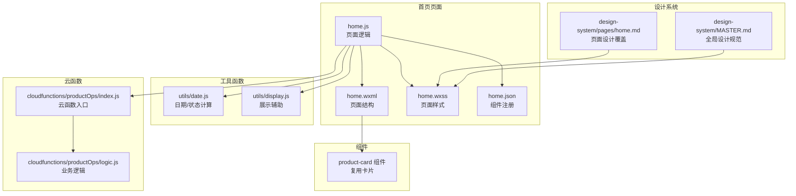
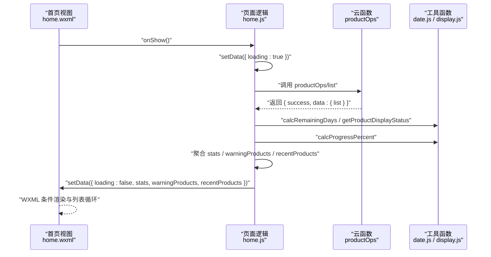
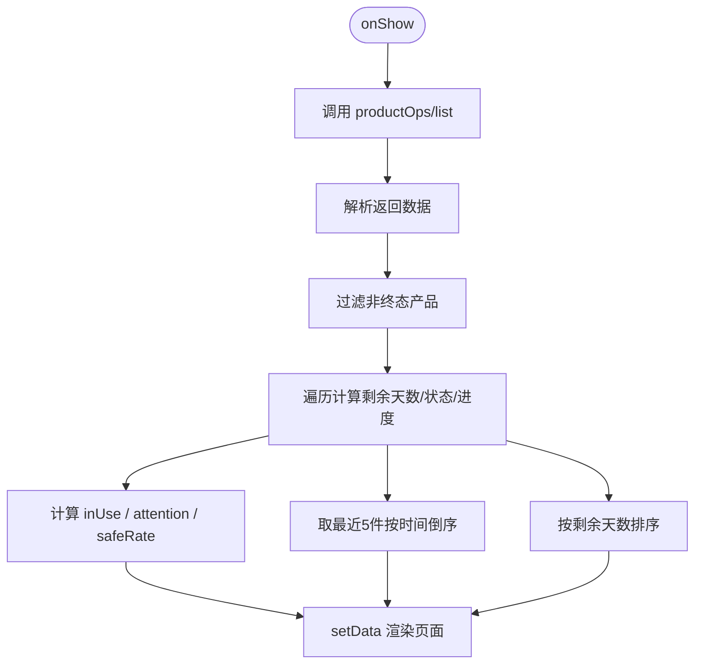
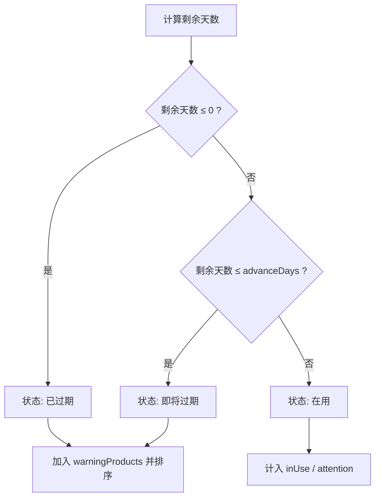
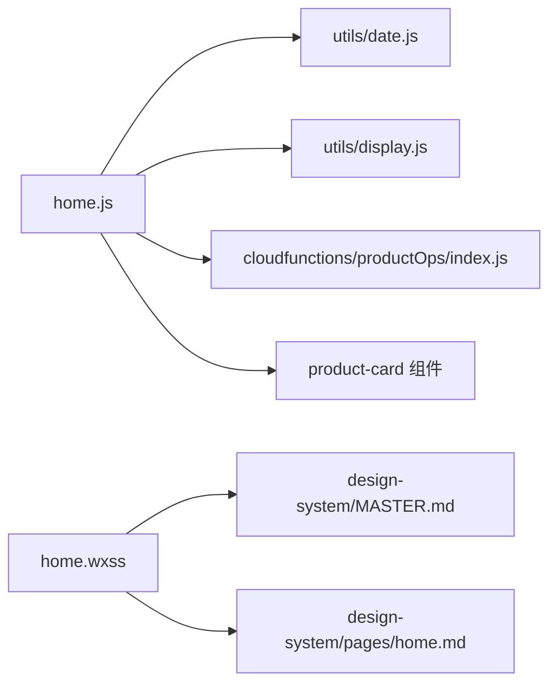

# 首页设计规范

<cite>
**本文引用的文件**
- [miniprogram/pages/home/home.js](file://miniprogram/pages/home/home.js)
- [miniprogram/pages/home/home.json](file://miniprogram/pages/home/home.json)
- [miniprogram/pages/home/home.wxml](file://miniprogram/pages/home/home.wxml)
- [miniprogram/pages/home/home.wxss](file://miniprogram/pages/home/home.wxss)
- [design-system/pages/home.md](file://design-system/pages/home.md)
- [design-system/MASTER.md](file://design-system/MASTER.md)
- [miniprogram/utils/date.js](file://miniprogram/utils/date.js)
- [miniprogram/utils/display.js](file://miniprogram/utils/display.js)
- [miniprogram/components/product-card/product-card.js](file://miniprogram/components/product-card/product-card.js)
- [miniprogram/components/product-card/product-card.wxml](file://miniprogram/components/product-card/product-card.wxml)
- [miniprogram/components/product-card/product-card.wxss](file://miniprogram/components/product-card/product-card.wxss)
- [cloudfunctions/productOps/index.js](file://cloudfunctions/productOps/index.js)
- [cloudfunctions/productOps/logic.js](file://cloudfunctions/productOps/logic.js)
- [tests/date.test.js](file://tests/date.test.js)
- [tests/display.test.js](file://tests/display.test.js)
</cite>

## 目录
1. [简介](#简介)
2. [项目结构](#项目结构)
3. [核心组件](#核心组件)
4. [架构总览](#架构总览)
5. [详细组件分析](#详细组件分析)
6. [依赖分析](#依赖分析)
7. [性能考虑](#性能考虑)
8. [故障排查指南](#故障排查指南)
9. [结论](#结论)
10. [附录](#附录)

## 简介
本文件面向“首页设计规范”的技术实现，围绕首页仪表板的信息架构与视觉设计进行系统化说明。重点涵盖：
- 统计卡片布局与数据可视化元素
- 快捷操作入口与通知提醒系统
- 首页如何通过视觉设计传达核心信息（库存概览、过期提醒、使用率统计等）
- 响应式网格布局与动态数据绑定的实现思路
- 性能优化建议与用户体验设计原则

## 项目结构
首页位于小程序端 pages/home，采用 WXML + WXSS + JS 的经典三件套组织；同时引入设计系统 MASTER 与页面级 home.md 作为设计约束；数据处理依赖 utils/date 与 utils/display；部分复用组件 product-card；数据来源通过云函数 productOps 获取。

图表来源
- [miniprogram/pages/home/home.js:1-119](file://miniprogram/pages/home/home.js#L1-L119)
- [miniprogram/pages/home/home.wxml:1-105](file://miniprogram/pages/home/home.wxml#L1-L105)
- [miniprogram/pages/home/home.wxss:1-324](file://miniprogram/pages/home/home.wxss#L1-L324)
- [miniprogram/pages/home/home.json:1-6](file://miniprogram/pages/home/home.json#L1-L6)
- [design-system/pages/home.md:1-52](file://design-system/pages/home.md#L1-L52)
- [design-system/MASTER.md:1-190](file://design-system/MASTER.md#L1-L190)
- [miniprogram/utils/date.js:1-76](file://miniprogram/utils/date.js#L1-L76)
- [miniprogram/utils/display.js:1-76](file://miniprogram/utils/display.js#L1-L76)
- [miniprogram/components/product-card/product-card.js:1-51](file://miniprogram/components/product-card/product-card.js#L1-L51)
- [cloudfunctions/productOps/index.js:1-171](file://cloudfunctions/productOps/index.js#L1-L171)
- [cloudfunctions/productOps/logic.js:1-105](file://cloudfunctions/productOps/logic.js#L1-L105)

章节来源
- [miniprogram/pages/home/home.js:1-119](file://miniprogram/pages/home/home.js#L1-L119)
- [miniprogram/pages/home/home.wxml:1-105](file://miniprogram/pages/home/home.wxml#L1-L105)
- [miniprogram/pages/home/home.wxss:1-324](file://miniprogram/pages/home/home.wxss#L1-L324)
- [miniprogram/pages/home/home.json:1-6](file://miniprogram/pages/home/home.json#L1-L6)
- [design-system/pages/home.md:1-52](file://design-system/pages/home.md#L1-L52)
- [design-system/MASTER.md:1-190](file://design-system/MASTER.md#L1-L190)

## 核心组件
- 首页页面（home.js / home.wxml / home.wxss / home.json）
  - 负责加载数据、渲染统计卡片、过期提醒列表、最近添加列表、空状态与加载态，并提供跳转能力。
- 工具函数（utils/date.js, utils/display.js）
  - 提供过期时间计算、剩余天数、状态判断、进度百分比、展示文本格式化等纯函数，确保逻辑可测试且跨组件复用。
- 产品卡片组件（product-card）
  - 复用卡片样式与交互，支持根据状态自动计算颜色类名、进度条与剩余天数文本。
- 云函数（productOps）
  - 提供产品列表查询、新增、更新、删除、状态变更等操作，首页通过调用该云函数获取数据。

章节来源
- [miniprogram/pages/home/home.js:1-119](file://miniprogram/pages/home/home.js#L1-L119)
- [miniprogram/utils/date.js:1-76](file://miniprogram/utils/date.js#L1-L76)
- [miniprogram/utils/display.js:1-76](file://miniprogram/utils/display.js#L1-L76)
- [miniprogram/components/product-card/product-card.js:1-51](file://miniprogram/components/product-card/product-card.js#L1-L51)
- [cloudfunctions/productOps/index.js:1-171](file://cloudfunctions/productOps/index.js#L1-L171)

## 架构总览
首页的数据流从云函数拉取产品列表，前端进行筛选与聚合，再以模板语法渲染到页面。设计系统通过 MASTER 与页面级 home.md 约束视觉与交互。

图表来源
- [miniprogram/pages/home/home.js:24-101](file://miniprogram/pages/home/home.js#L24-L101)
- [cloudfunctions/productOps/index.js:92-110](file://cloudfunctions/productOps/index.js#L92-L110)
- [miniprogram/utils/date.js:42-57](file://miniprogram/utils/date.js#L42-L57)
- [miniprogram/utils/display.js:13-27](file://miniprogram/utils/display.js#L13-L27)
- [miniprogram/pages/home/home.wxml:34-87](file://miniprogram/pages/home/home.wxml#L34-L87)

## 详细组件分析

### 首页页面（home.js / home.wxml / home.wxss / home.json）
- 数据模型与状态
  - loading：控制加载态显示
  - stats：包含 inUse（在用）、attention（注意）、safeRate（安全率）
  - warningProducts：即将过期/已过期产品列表，含剩余天数、进度、状态等派生字段
  - recentProducts：最近添加的若干产品
  - advanceDays：过期提醒阈值（默认30天）
- 关键流程
  - onShow 触发加载仪表盘数据
  - 调用云函数 productOps/list 获取产品列表
  - 过滤非终态产品（排除 used_up、discarded）
  - 计算每个产品的剩余天数与展示状态，生成 warningProducts
  - 计算安全率 safeRate = inUse / total × 100
  - 按创建时间倒序取最近5件生成 recentProducts
  - 渲染统计卡片、过期提醒区、最近添加区、空状态与加载态
- 交互与跳转
  - 点击卡片跳转详情页
  - “查看全部”跳转库存页
  - “添加产品”跳转添加页

图表来源
- [miniprogram/pages/home/home.js:29-101](file://miniprogram/pages/home/home.js#L29-L101)

章节来源
- [miniprogram/pages/home/home.js:1-119](file://miniprogram/pages/home/home.js#L1-L119)
- [miniprogram/pages/home/home.wxml:1-105](file://miniprogram/pages/home/home.wxml#L1-L105)
- [miniprogram/pages/home/home.wxss:1-324](file://miniprogram/pages/home/home.wxss#L1-L324)
- [miniprogram/pages/home/home.json:1-6](file://miniprogram/pages/home/home.json#L1-L6)

### 统计卡片布局与数据可视化
- 布局结构
  - 顶部渐变背景 + 几何装饰
  - 三列统计卡片：在用、注意、安全率
- 视觉与语义
  - 大号数字 + 渐变底色 + 语义色边框
  - 安全率以百分比单位展示
- 数据绑定
  - 通过模板语法 {{stats.*}} 动态渲染

章节来源
- [design-system/pages/home.md:31-37](file://design-system/pages/home.md#L31-L37)
- [design-system/MASTER.md:14-49](file://design-system/MASTER.md#L14-L49)
- [miniprogram/pages/home/home.wxml:17-31](file://miniprogram/pages/home/home.wxml#L17-L31)
- [miniprogram/pages/home/home.wxss:72-118](file://miniprogram/pages/home/home.wxss#L72-L118)

### 过期提醒系统（即将过期/已过期）
- 数据来源与筛选
  - 仅展示 expirationDate 距今小于等于 advanceDays 的产品
  - 已过期产品与即将过期产品使用不同边框色（危险/警告）
- 展示元素
  - 产品名、分类、剩余天数（突出显示）、进度条
- 状态判定
  - 基于剩余天数与 advanceDays 的比较结果
- 无提醒时的反馈
  - 显示“所有产品状态安全，继续保持！”的激励文案

图表来源
- [miniprogram/utils/date.js:42-57](file://miniprogram/utils/date.js#L42-L57)
- [miniprogram/pages/home/home.js:57-77](file://miniprogram/pages/home/home.js#L57-L77)

章节来源
- [design-system/pages/home.md:38-45](file://design-system/pages/home.md#L38-L45)
- [miniprogram/pages/home/home.wxml:34-63](file://miniprogram/pages/home/home.wxml#L34-L63)
- [miniprogram/pages/home/home.wxss:133-198](file://miniprogram/pages/home/home.wxss#L133-L198)

### 最近添加区
- 展示规则
  - 最多5件，按 createdAt 倒序
  - 卡片包含首字母图标、名称、分类+规格、添加日期
- 交互
  - 点击卡片跳转详情
  - 底部“查看全部”跳转库存页

章节来源
- [design-system/pages/home.md:47-51](file://design-system/pages/home.md#L47-L51)
- [miniprogram/pages/home/home.wxml:65-87](file://miniprogram/pages/home/home.wxml#L65-L87)
- [miniprogram/pages/home/home.wxss:206-269](file://miniprogram/pages/home/home.wxss#L206-L269)

### 空状态与加载态
- 空状态
  - 无产品时显示引导文案与“添加产品”按钮
- 加载态
  - 请求期间显示加载提示

章节来源
- [miniprogram/pages/home/home.wxml:89-102](file://miniprogram/pages/home/home.wxml#L89-L102)
- [miniprogram/pages/home/home.wxss:271-323](file://miniprogram/pages/home/home.wxss#L271-L323)

### 产品卡片组件（复用）
- 属性
  - product：产品对象
  - advanceDays：提醒阈值
- 观察器
  - 监听 product 与 advanceDays，计算 remainingText、statusLabel、colorClass、progressPercent
- 交互
  - 点击卡片跳转详情

章节来源
- [miniprogram/components/product-card/product-card.js:1-51](file://miniprogram/components/product-card/product-card.js#L1-L51)
- [miniprogram/components/product-card/product-card.wxml:1-29](file://miniprogram/components/product-card/product-card.wxml#L1-L29)
- [miniprogram/components/product-card/product-card.wxss:1-122](file://miniprogram/components/product-card/product-card.wxss#L1-L122)

### 云函数与数据模型
- 云函数入口
  - 提供 add/list/get/update/updateStatus/delete 等操作
  - 列表查询支持分页与关键词检索
- 业务逻辑
  - 校验输入、构建产品记录、根据过期时间与提醒天数决定初始状态
  - 更新时按需重算过期时间与状态

章节来源
- [cloudfunctions/productOps/index.js:1-171](file://cloudfunctions/productOps/index.js#L1-L171)
- [cloudfunctions/productOps/logic.js:1-105](file://cloudfunctions/productOps/logic.js#L1-L105)

## 依赖分析
- 页面对工具函数的依赖
  - 日期与状态：utils/date.js
  - 展示辅助：utils/display.js
- 页面对云函数的依赖
  - 产品列表与状态变更：cloudfunctions/productOps/index.js
- 页面对组件的依赖
  - 产品卡片复用：components/product-card
- 设计系统对样式的约束
  - MASTER 与 pages/home.md 为样式与交互提供规范

图表来源
- [miniprogram/pages/home/home.js:6-7](file://miniprogram/pages/home/home.js#L6-L7)
- [miniprogram/pages/home/home.wxss:1-4](file://miniprogram/pages/home/home.wxss#L1-L4)
- [design-system/MASTER.md:1-4](file://design-system/MASTER.md#L1-L4)
- [design-system/pages/home.md:1-4](file://design-system/pages/home.md#L1-L4)

章节来源
- [miniprogram/pages/home/home.js:1-119](file://miniprogram/pages/home/home.js#L1-L119)
- [miniprogram/pages/home/home.wxss:1-324](file://miniprogram/pages/home/home.wxss#L1-L324)
- [design-system/MASTER.md:1-190](file://design-system/MASTER.md#L1-L190)
- [design-system/pages/home.md:1-52](file://design-system/pages/home.md#L1-L52)

## 性能考虑
- 列表渲染优化
  - 使用 wx:for + wx:key（_id）减少重排
  - 控制列表长度（最近添加最多5件），避免一次性渲染过多节点
- 数据计算与缓存
  - 剩余天数与状态在页面侧计算一次后写入临时字段，避免重复计算
  - 进度百分比按需计算，避免频繁重算
- 网络请求
  - 云函数分页参数 pageSize 控制单次拉取数量，降低内存占用
  - onShow 生命周期触发加载，避免重复请求
- 样式与动画
  - 使用语义色与渐变背景，减少复杂阴影与过度动画
  - 进度条宽度动画配合颜色渐变，提升感知效率

## 故障排查指南
- 加载失败
  - 检查云函数返回 success 字段与错误信息
  - 页面侧捕获异常并提示 Toast
- 状态不正确
  - 核对剩余天数计算与状态判定逻辑
  - 确认 advanceDays 是否符合预期
- 进度条异常
  - 校验生产日期与过期日期合法性
  - 确保当前日期归一化处理（仅取日期部分）
- 单元测试参考
  - 日期与状态相关逻辑可通过测试用例验证边界条件

章节来源
- [miniprogram/pages/home/home.js:36-100](file://miniprogram/pages/home/home.js#L36-L100)
- [tests/date.test.js:1-130](file://tests/date.test.js#L1-L130)
- [tests/display.test.js:1-111](file://tests/display.test.js#L1-L111)

## 结论
首页通过“统计卡片 + 过期提醒 + 最近添加”的信息架构，结合设计系统规范，形成清晰、直观且具备激励反馈的视觉语言。页面逻辑简洁、数据流明确，配合工具函数与组件复用，既保证了可维护性，也便于扩展更多指标与交互。

## 附录
- 设计系统要点速览
  - 色彩系统：主色、辅色、语义色与表面色
  - 字体系统：层级与字号
  - 圆角与阴影：卡片与交互反馈
  - 几何装饰：圆、三角、矩形的使用规范
- 代码实现路径
  - 首页页面：[home.js:1-119](file://miniprogram/pages/home/home.js#L1-L119)、[home.wxml:1-105](file://miniprogram/pages/home/home.wxml#L1-L105)、[home.wxss:1-324](file://miniprogram/pages/home/home.wxss#L1-L324)、[home.json:1-6](file://miniprogram/pages/home/home.json#L1-L6)
  - 工具函数：[date.js:1-76](file://miniprogram/utils/date.js#L1-L76)、[display.js:1-76](file://miniprogram/utils/display.js#L1-L76)
  - 组件：[product-card.js:1-51](file://miniprogram/components/product-card/product-card.js#L1-L51)、[product-card.wxml:1-29](file://miniprogram/components/product-card/product-card.wxml#L1-L29)、[product-card.wxss:1-122](file://miniprogram/components/product-card/product-card.wxss#L1-L122)
  - 云函数：[index.js:1-171](file://cloudfunctions/productOps/index.js#L1-L171)、[logic.js:1-105](file://cloudfunctions/productOps/logic.js#L1-L105)
  - 设计规范：[pages/home.md:1-52](file://design-system/pages/home.md#L1-L52)、[MASTER.md:1-190](file://design-system/MASTER.md#L1-L190)