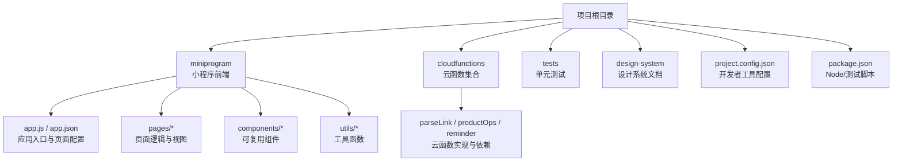
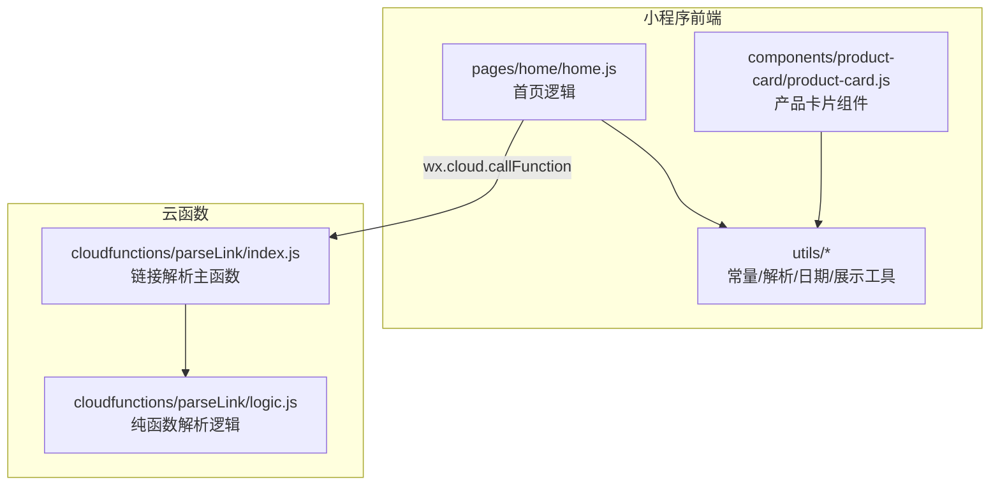
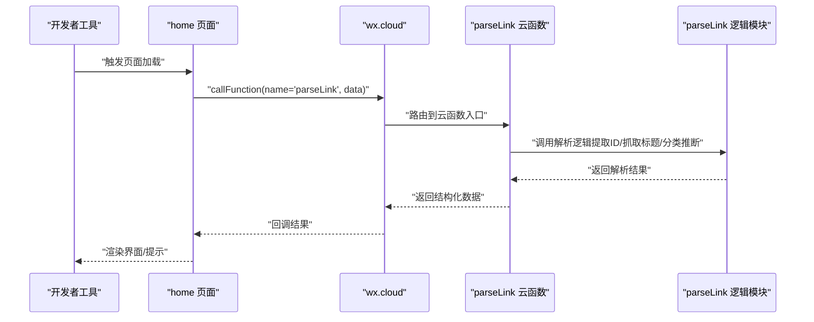
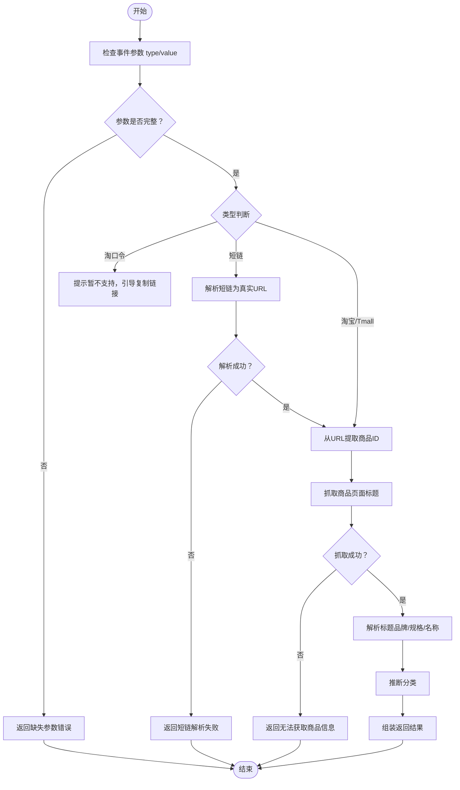
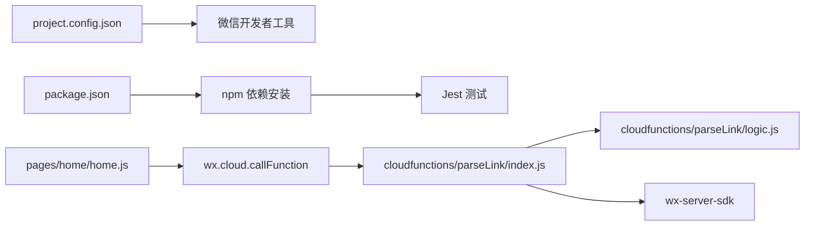

# 开发环境配置

<cite>
**本文引用的文件**
- [project.config.json](file://project.config.json)
- [package.json](file://package.json)
- [miniprogram/app.js](file://miniprogram/app.js)
- [miniprogram/app.json](file://miniprogram/app.json)
- [cloudfunctions/parseLink/index.js](file://cloudfunctions/parseLink/index.js)
- [cloudfunctions/parseLink/logic.js](file://cloudfunctions/parseLink/logic.js)
- [cloudfunctions/parseLink/package.json](file://cloudfunctions/parseLink/package.json)
- [cloudfunctions/productOps/package.json](file://cloudfunctions/productOps/package.json)
- [cloudfunctions/reminder/package.json](file://cloudfunctions/reminder/package.json)
- [miniprogram/utils/constants.js](file://miniprogram/utils/constants.js)
- [miniprogram/utils/parser.js](file://miniprogram/utils/parser.js)
- [miniprogram/utils/date.js](file://miniprogram/utils/date.js)
- [miniprogram/utils/display.js](file://miniprogram/utils/display.js)
- [miniprogram/pages/home/home.js](file://miniprogram/pages/home/home.js)
- [miniprogram/components/product-card/product-card.js](file://miniprogram/components/product-card/product-card.js)
- [tests/parseLink.test.js](file://tests/parseLink.test.js)
</cite>

## 目录
1. [简介](#简介)
2. [项目结构](#项目结构)
3. [核心组件](#核心组件)
4. [架构总览](#架构总览)
5. [详细组件分析](#详细组件分析)
6. [依赖关系分析](#依赖关系分析)
7. [性能考虑](#性能考虑)
8. [故障排查指南](#故障排查指南)
9. [结论](#结论)
10. [附录](#附录)

## 简介
本指南面向开发环境的搭建与配置，围绕微信开发者工具的安装与配置、项目根目录与云函数根目录设置、编译类型与项目配置文件 project.config.json 的参数说明展开；同时覆盖本地开发环境（Node.js、npm）与测试运行、断点调试、网络请求与云函数调试方法，以及团队开发规范与代码风格建议，帮助团队快速达成一致、高效协作。

## 项目结构
该项目采用“小程序前端 + 云函数 + 设计系统 + 文档”的组织方式，核心目录如下：
- miniprogram：小程序前端源码，包含页面、组件、工具函数与全局配置
- cloudfunctions：云函数目录，包含多个功能云函数及其依赖
- tests：单元测试目录，使用 Jest 运行
- docs/design-system：设计系统与规范文档
- 顶层配置：project.config.json（开发者工具配置）、package.json（Node 与测试脚本）

图表来源
- [project.config.json:1-21](file://project.config.json#L1-L21)
- [package.json:1-20](file://package.json#L1-L20)
- [miniprogram/app.js:1-32](file://miniprogram/app.js#L1-L32)
- [miniprogram/app.json:1-52](file://miniprogram/app.json#L1-L52)

章节来源
- [project.config.json:1-21](file://project.config.json#L1-L21)
- [package.json:1-20](file://package.json#L1-L20)

## 核心组件
- 微信开发者工具配置：通过 project.config.json 定义小程序根目录、云函数根目录、编译类型、设置项等
- 小程序前端：页面、组件、工具函数与全局配置
- 云函数：parseLink（链接解析）、productOps（产品操作）、reminder（提醒）
- 测试：Jest 单测，覆盖解析逻辑与工具函数

章节来源
- [project.config.json:1-21](file://project.config.json#L1-L21)
- [miniprogram/app.js:1-32](file://miniprogram/app.js#L1-L32)
- [cloudfunctions/parseLink/index.js:1-112](file://cloudfunctions/parseLink/index.js#L1-L112)
- [tests/parseLink.test.js:1-111](file://tests/parseLink.test.js#L1-L111)

## 架构总览
整体架构由“前端页面 + 云函数 + 工具函数”组成，前端通过 wx.cloud 调用云函数，云函数内部调用纯函数逻辑与第三方服务，最终返回结构化结果供前端渲染。

图表来源
- [miniprogram/pages/home/home.js:1-119](file://miniprogram/pages/home/home.js#L1-L119)
- [miniprogram/components/product-card/product-card.js:1-51](file://miniprogram/components/product-card/product-card.js#L1-L51)
- [cloudfunctions/parseLink/index.js:1-112](file://cloudfunctions/parseLink/index.js#L1-L112)
- [cloudfunctions/parseLink/logic.js:1-78](file://cloudfunctions/parseLink/logic.js#L1-L78)

## 详细组件分析

### 微信开发者工具安装与配置
- 安装与登录：下载微信开发者工具，使用企业微信/个人微信扫码登录
- 项目导入：选择项目根目录（仓库根目录），确保 project.config.json 存在且正确
- 项目根目录与云函数根目录：
  - 小程序根目录：miniprogram/
  - 云函数根目录：cloudfunctions/
- 编译类型：miniprogram
- 设置项：启用 ES6+、增强编译、PostCSS、压缩等，便于开发与构建优化
- AppID：在 project.config.json 中配置真实 AppID；在 app.js 中初始化云开发时需替换为实际环境 ID

章节来源
- [project.config.json:1-21](file://project.config.json#L1-L21)
- [miniprogram/app.js:1-32](file://miniprogram/app.js#L1-L32)

### 项目配置文件 project.config.json 参数说明与最佳实践
- 关键字段
  - miniprogramRoot：小程序源码根目录
  - cloudfunctionRoot：云函数根目录
  - compileType：编译类型（miniprogram）
  - setting：编译与校验选项（如 urlCheck、es6、enhance、postcss、minified 等）
  - appid：小程序 AppID
  - projectname：项目名称
  - cloudfunctionTemplateRoot：云函数模板目录（可选）
- 最佳实践
  - 保持 setting 中的 es6/enhance/postcss 等开启，提升开发体验
  - urlCheck 在开发阶段建议开启，避免线上问题
  - 云开发相关配置在 app.js 初始化时生效，确保与 project.config.json 的 appid 一致

章节来源
- [project.config.json:1-21](file://project.config.json#L1-L21)

### 本地开发环境搭建（Node.js 与 npm）
- Node.js：建议使用 LTS 版本，确保 npm 能正常安装依赖
- npm 依赖安装：在项目根目录执行安装命令，安装测试框架 jest（用于 tests 目录）
- 测试运行：通过 package.json 中的 test 脚本运行 Jest，验证解析逻辑与工具函数

章节来源
- [package.json:1-20](file://package.json#L1-L20)
- [tests/parseLink.test.js:1-111](file://tests/parseLink.test.js#L1-L111)

### 云函数根目录与依赖管理
- 云函数目录：cloudfunctions/parseLink、cloudfunctions/productOps、cloudfunctions/reminder
- 依赖：各云函数的 package.json 引入 wx-server-sdk，确保云函数运行时可用
- 云函数入口：index.js 导出 main 函数，逻辑拆分至 logic.js，便于测试与维护

章节来源
- [cloudfunctions/parseLink/package.json:1-9](file://cloudfunctions/parseLink/package.json#L1-L9)
- [cloudfunctions/productOps/package.json:1-9](file://cloudfunctions/productOps/package.json#L1-L9)
- [cloudfunctions/reminder/package.json:1-9](file://cloudfunctions/reminder/package.json#L1-L9)
- [cloudfunctions/parseLink/index.js:1-112](file://cloudfunctions/parseLink/index.js#L1-L112)
- [cloudfunctions/parseLink/logic.js:1-78](file://cloudfunctions/parseLink/logic.js#L1-L78)

### 前端页面与组件
- 页面：home 页面通过 wx.cloud.callFunction 调用云函数，聚合统计与预警数据
- 组件：product-card 组件根据产品过期状态实时计算展示文案与颜色
- 工具函数：constants（常量与品牌词库）、parser（链接识别与提取）、date/display（日期与展示逻辑）

章节来源
- [miniprogram/pages/home/home.js:1-119](file://miniprogram/pages/home/home.js#L1-L119)
- [miniprogram/components/product-card/product-card.js:1-51](file://miniprogram/components/product-card/product-card.js#L1-L51)
- [miniprogram/utils/constants.js:1-100](file://miniprogram/utils/constants.js#L1-L100)
- [miniprogram/utils/parser.js:1-70](file://miniprogram/utils/parser.js#L1-L70)
- [miniprogram/utils/date.js:1-76](file://miniprogram/utils/date.js#L1-L76)
- [miniprogram/utils/display.js:1-76](file://miniprogram/utils/display.js#L1-L76)

### 云函数调试流程（序列图）

图表来源
- [miniprogram/pages/home/home.js:1-119](file://miniprogram/pages/home/home.js#L1-L119)
- [cloudfunctions/parseLink/index.js:1-112](file://cloudfunctions/parseLink/index.js#L1-L112)
- [cloudfunctions/parseLink/logic.js:1-78](file://cloudfunctions/parseLink/logic.js#L1-L78)

### 解析逻辑算法（流程图）

图表来源
- [cloudfunctions/parseLink/index.js:1-112](file://cloudfunctions/parseLink/index.js#L1-L112)
- [cloudfunctions/parseLink/logic.js:1-78](file://cloudfunctions/parseLink/logic.js#L1-L78)

## 依赖关系分析
- 项目配置与工具链
  - project.config.json 决定开发者工具的根目录、编译类型与设置项
  - package.json 提供测试脚本与 Jest 依赖
- 前端与云函数
  - 页面通过 wx.cloud 调用云函数，云函数内部调用纯函数逻辑
  - 工具函数模块化，便于测试与复用
- 云函数依赖
  - 各云函数依赖 wx-server-sdk，确保云函数运行时可用

图表来源
- [project.config.json:1-21](file://project.config.json#L1-L21)
- [package.json:1-20](file://package.json#L1-L20)
- [miniprogram/pages/home/home.js:1-119](file://miniprogram/pages/home/home.js#L1-L119)
- [cloudfunctions/parseLink/index.js:1-112](file://cloudfunctions/parseLink/index.js#L1-L112)
- [cloudfunctions/parseLink/logic.js:1-78](file://cloudfunctions/parseLink/logic.js#L1-L78)
- [cloudfunctions/parseLink/package.json:1-9](file://cloudfunctions/parseLink/package.json#L1-L9)

章节来源
- [project.config.json:1-21](file://project.config.json#L1-L21)
- [package.json:1-20](file://package.json#L1-L20)
- [miniprogram/pages/home/home.js:1-119](file://miniprogram/pages/home/home.js#L1-L119)
- [cloudfunctions/parseLink/index.js:1-112](file://cloudfunctions/parseLink/index.js#L1-L112)
- [cloudfunctions/parseLink/logic.js:1-78](file://cloudfunctions/parseLink/logic.js#L1-L78)
- [cloudfunctions/parseLink/package.json:1-9](file://cloudfunctions/parseLink/package.json#L1-L9)

## 性能考虑
- 构建优化：开启 es6、enhance、postcss、minified 等设置，有助于减小包体与提升运行效率
- 云函数调用：尽量减少不必要的请求与重复计算，合理缓存与降级策略（如短链解析与抓取标题的降级）
- 前端渲染：组件内基于过期状态实时计算，避免重复计算可使用 observers 与缓存中间态
- 测试先行：通过单测覆盖解析逻辑，降低回归风险，间接提升整体性能与稳定性

## 故障排查指南
- 云开发初始化失败
  - 确认 app.js 中 ENV_ID 已替换为实际云环境 ID
  - 确认 project.config.json 中 appid 与实际一致
- 云函数调用报错
  - 检查云函数入口导出 main 函数是否正确
  - 检查云函数依赖（wx-server-sdk）是否安装
- 网络请求失败
  - 检查短链解析与抓取标题的降级逻辑是否生效
  - 确认超时与异常处理分支
- 断点调试
  - 在微信开发者工具中打开“调试”，设置断点于页面逻辑与云函数入口
  - 使用“网络”面板查看请求与响应，定位问题
- 单元测试
  - 使用 Jest 运行单测，覆盖解析逻辑与工具函数，确保变更不会破坏既有行为

章节来源
- [miniprogram/app.js:1-32](file://miniprogram/app.js#L1-L32)
- [project.config.json:1-21](file://project.config.json#L1-L21)
- [cloudfunctions/parseLink/index.js:1-112](file://cloudfunctions/parseLink/index.js#L1-L112)
- [cloudfunctions/parseLink/package.json:1-9](file://cloudfunctions/parseLink/package.json#L1-L9)
- [tests/parseLink.test.js:1-111](file://tests/parseLink.test.js#L1-L111)

## 结论
通过明确的开发者工具配置、规范化的项目结构与模块化工具函数，结合云函数与前端的协同机制，团队可以高效地进行本地开发与联调。建议在日常开发中坚持测试驱动与统一的代码风格，持续优化构建与调试流程，保障交付质量与迭代速度。

## 附录

### 开发调试技巧清单
- 断点调试：在页面逻辑与云函数入口设置断点，观察变量与调用链
- 网络请求调试：使用“网络”面板查看请求头、响应体与状态码
- 云函数调试：在开发者工具中上传并调试云函数，关注日志输出
- 单元测试：运行 Jest，确保解析逻辑与工具函数稳定可靠

### 开发规范与代码风格建议
- 文件命名：采用小驼峰或中划线命名，保持前后端一致
- 模块化：将纯函数逻辑拆分至独立模块，便于测试与复用
- 注释规范：为复杂逻辑与公共函数补充注释，说明输入、输出与边界条件
- 错误处理：在关键路径增加 try/catch 与降级策略，保证健壮性
- 提交规范：遵循团队约定的提交信息格式，配合自动化检查