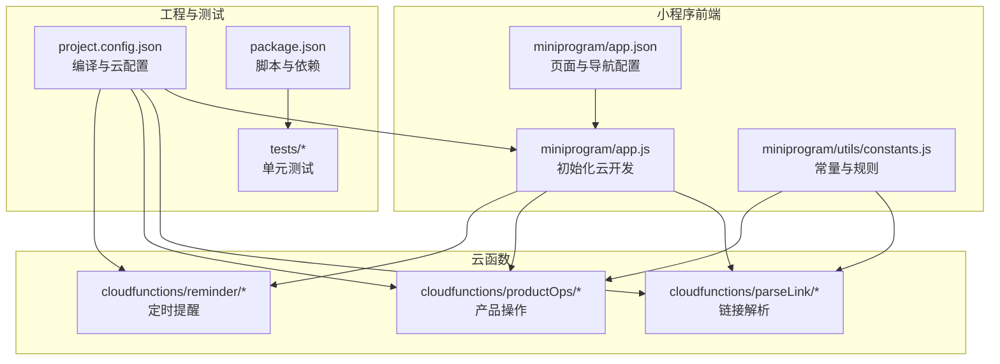
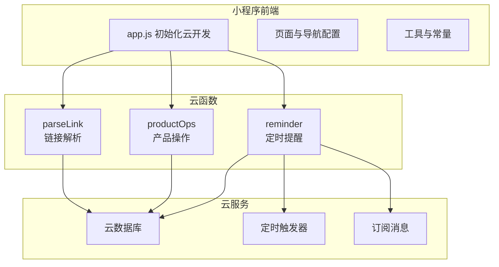
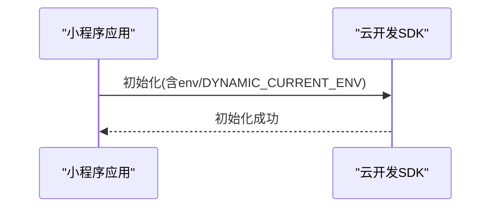
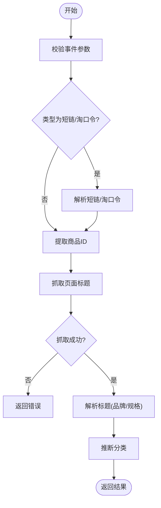
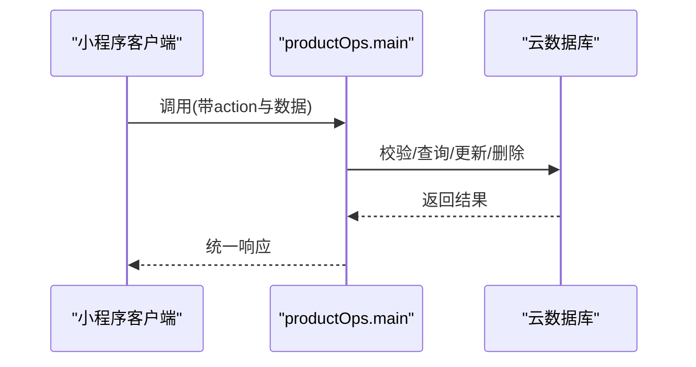
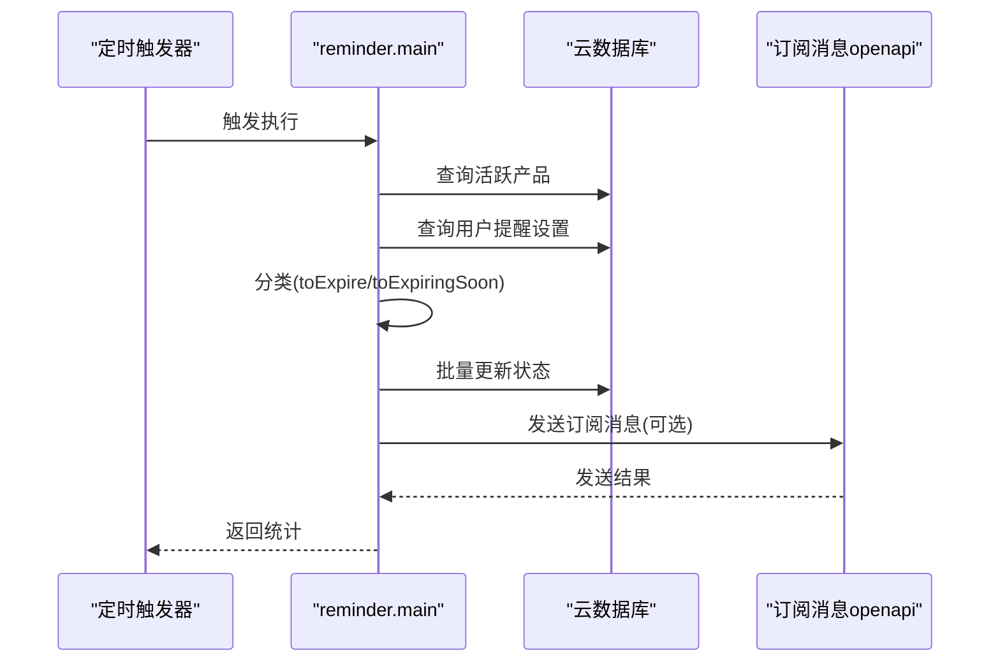
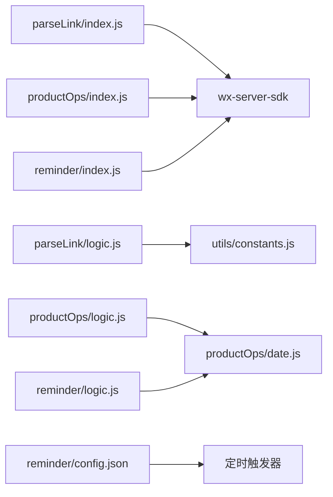

# 生产环境部署

<cite>
**本文引用的文件**
- [package.json](file://package.json)
- [project.config.json](file://project.config.json)
- [miniprogram/app.js](file://miniprogram/app.js)
- [miniprogram/app.json](file://miniprogram/app.json)
- [cloudfunctions/parseLink/index.js](file://cloudfunctions/parseLink/index.js)
- [cloudfunctions/parseLink/package.json](file://cloudfunctions/parseLink/package.json)
- [cloudfunctions/parseLink/logic.js](file://cloudfunctions/parseLink/logic.js)
- [cloudfunctions/productOps/index.js](file://cloudfunctions/productOps/index.js)
- [cloudfunctions/productOps/package.json](file://cloudfunctions/productOps/package.json)
- [cloudfunctions/productOps/logic.js](file://cloudfunctions/productOps/logic.js)
- [cloudfunctions/reminder/index.js](file://cloudfunctions/reminder/index.js)
- [cloudfunctions/reminder/package.json](file://cloudfunctions/reminder/package.json)
- [cloudfunctions/reminder/config.json](file://cloudfunctions/reminder/config.json)
- [cloudfunctions/reminder/logic.js](file://cloudfunctions/reminder/logic.js)
- [miniprogram/utils/constants.js](file://miniprogram/utils/constants.js)
- [tests/parseLink.test.js](file://tests/parseLink.test.js)
- [tests/productOps.test.js](file://tests/productOps.test.js)
</cite>

## 目录
1. [简介](#简介)
2. [项目结构](#项目结构)
3. [核心组件](#核心组件)
4. [架构总览](#架构总览)
5. [详细组件分析](#详细组件分析)
6. [依赖关系分析](#依赖关系分析)
7. [性能与稳定性考量](#性能与稳定性考量)
8. [故障排查指南](#故障排查指南)
9. [结论](#结论)
10. [附录](#附录)

## 简介
本指南面向生产环境部署，覆盖微信小程序发布流程（代码上传、版本管理、审核准备）、云函数部署配置（目录结构、依赖管理、环境变量）、云开发服务初始化（数据库、存储、云函数）、域名与 HTTPS 证书配置、发布前测试验证、发布后功能检查清单、版本控制策略与回滚机制。文档基于仓库现有配置与代码进行说明，确保读者能按步骤完成从开发到上线的全流程。

## 项目结构
项目采用“小程序前端 + 云函数 + 测试 + 设计系统”分层组织：
- 小程序前端位于 miniprogram，包含页面、组件、工具与全局配置
- 云函数位于 cloudfunctions，包含 parseLink、productOps、reminder 三个函数
- 测试位于 tests，覆盖云函数业务逻辑
- 设计系统位于 design-system，用于规范与文档
- 工程化配置位于根目录，如项目配置、包管理等

图表来源
- [project.config.json:1-21](file://project.config.json#L1-L21)
- [miniprogram/app.js:1-32](file://miniprogram/app.js#L1-L32)
- [miniprogram/app.json:1-52](file://miniprogram/app.json#L1-L52)
- [miniprogram/utils/constants.js:1-100](file://miniprogram/utils/constants.js#L1-L100)
- [cloudfunctions/parseLink/index.js:1-112](file://cloudfunctions/parseLink/index.js#L1-L112)
- [cloudfunctions/productOps/index.js:1-171](file://cloudfunctions/productOps/index.js#L1-L171)
- [cloudfunctions/reminder/index.js:1-106](file://cloudfunctions/reminder/index.js#L1-L106)
- [package.json:1-20](file://package.json#L1-L20)
- [tests/parseLink.test.js:1-111](file://tests/parseLink.test.js#L1-L111)
- [tests/productOps.test.js:1-202](file://tests/productOps.test.js#L1-L202)

章节来源
- [project.config.json:1-21](file://project.config.json#L1-L21)
- [miniprogram/app.js:1-32](file://miniprogram/app.js#L1-L32)
- [miniprogram/app.json:1-52](file://miniprogram/app.json#L1-L52)
- [miniprogram/utils/constants.js:1-100](file://miniprogram/utils/constants.js#L1-L100)
- [package.json:1-20](file://package.json#L1-L20)

## 核心组件
- 小程序入口与云初始化：在应用启动时初始化云开发，支持动态环境 ID 切换
- 页面与导航：定义页面路径、导航栏样式、tabBar 结构与图标
- 云函数：
  - parseLink：解析淘宝/天猫链接，提取商品信息
  - productOps：产品增删改查与状态管理
  - reminder：定时任务，批量更新产品状态并发送订阅消息
- 工具与常量：状态枚举、预设分类、品牌词库、解析规则
- 测试：针对云函数业务逻辑的单元测试

章节来源
- [miniprogram/app.js:10-26](file://miniprogram/app.js#L10-L26)
- [miniprogram/app.json:2-48](file://miniprogram/app.json#L2-L48)
- [cloudfunctions/parseLink/index.js:11-56](file://cloudfunctions/parseLink/index.js#L11-L56)
- [cloudfunctions/productOps/index.js:40-64](file://cloudfunctions/productOps/index.js#L40-L64)
- [cloudfunctions/reminder/index.js:15-105](file://cloudfunctions/reminder/index.js#L15-L105)
- [miniprogram/utils/constants.js:6-56](file://miniprogram/utils/constants.js#L6-L56)
- [tests/parseLink.test.js:12-110](file://tests/parseLink.test.js#L12-L110)
- [tests/productOps.test.js:13-201](file://tests/productOps.test.js#L13-L201)

## 架构总览
生产部署涉及小程序前端与云函数协同工作，云函数通过云开发 SDK 访问数据库与调用云能力；定时触发器驱动 reminder 函数执行周期性任务。

图表来源
- [miniprogram/app.js:10-26](file://miniprogram/app.js#L10-L26)
- [cloudfunctions/parseLink/index.js:6-9](file://cloudfunctions/parseLink/index.js#L6-L9)
- [cloudfunctions/productOps/index.js:5-11](file://cloudfunctions/productOps/index.js#L5-L11)
- [cloudfunctions/reminder/index.js:8-13](file://cloudfunctions/reminder/index.js#L8-L13)
- [cloudfunctions/reminder/config.json:2-8](file://cloudfunctions/reminder/config.json#L2-L8)

## 详细组件分析

### 小程序入口与云初始化
- 初始化方式：通过 wx.cloud.init 配置 traceUser 与动态环境 ID
- 环境 ID 来源：可在项目配置中指定，或在运行时通过环境变量注入
- 前置条件：基础库版本需满足云能力要求

图表来源
- [miniprogram/app.js:10-26](file://miniprogram/app.js#L10-L26)

章节来源
- [miniprogram/app.js:10-26](file://miniprogram/app.js#L10-L26)

### 页面与导航配置
- 页面路径：home、add、inventory、profile、detail、category
- 导航栏与 tabBar：颜色、图标、标题文本
- 全局样式：v2 版本样式

章节来源
- [miniprogram/app.json:2-48](file://miniprogram/app.json#L2-L48)

### 云函数：parseLink（链接解析）
- 功能：根据事件类型解析短链/淘口令，提取商品 ID，抓取页面标题，解析品牌、规格、分类
- 依赖：wx-server-sdk
- 触发：由小程序前端调用云函数
- 降级策略：API 失败时返回提示，页面抓取失败时返回错误

图表来源
- [cloudfunctions/parseLink/index.js:11-56](file://cloudfunctions/parseLink/index.js#L11-L56)
- [cloudfunctions/parseLink/logic.js:13-71](file://cloudfunctions/parseLink/logic.js#L13-L71)

章节来源
- [cloudfunctions/parseLink/index.js:11-56](file://cloudfunctions/parseLink/index.js#L11-L56)
- [cloudfunctions/parseLink/logic.js:13-71](file://cloudfunctions/parseLink/logic.js#L13-L71)
- [cloudfunctions/parseLink/package.json:1-9](file://cloudfunctions/parseLink/package.json#L1-L9)

### 云函数：productOps（产品操作）
- 功能：统一入口分发 add/list/get/update/updateStatus/delete
- 数据库：products 与 reminder_settings 集合
- 权限：通过 openid 校验记录归属
- 状态计算：根据生产日期、保质期、开启日期等计算过期时间与状态

图表来源
- [cloudfunctions/productOps/index.js:40-64](file://cloudfunctions/productOps/index.js#L40-L64)
- [cloudfunctions/productOps/index.js:75-170](file://cloudfunctions/productOps/index.js#L75-L170)

章节来源
- [cloudfunctions/productOps/index.js:40-64](file://cloudfunctions/productOps/index.js#L40-L64)
- [cloudfunctions/productOps/index.js:75-170](file://cloudfunctions/productOps/index.js#L75-L170)
- [cloudfunctions/productOps/logic.js:11-96](file://cloudfunctions/productOps/logic.js#L11-L96)
- [cloudfunctions/productOps/package.json:1-9](file://cloudfunctions/productOps/package.json#L1-L9)

### 云函数：reminder（定时提醒）
- 触发器：每日 08:00 的定时触发器
- 流程：查询活跃产品 → 合并用户设置 → 分类 → 批量更新状态 → 发送订阅消息
- 依赖：wx-server-sdk、订阅消息 openapi

图表来源
- [cloudfunctions/reminder/index.js:15-105](file://cloudfunctions/reminder/index.js#L15-L105)
- [cloudfunctions/reminder/config.json:2-8](file://cloudfunctions/reminder/config.json#L2-L8)

章节来源
- [cloudfunctions/reminder/index.js:15-105](file://cloudfunctions/reminder/index.js#L15-L105)
- [cloudfunctions/reminder/logic.js:17-40](file://cloudfunctions/reminder/logic.js#L17-L40)
- [cloudfunctions/reminder/config.json:2-8](file://cloudfunctions/reminder/config.json#L2-L8)
- [cloudfunctions/reminder/package.json:1-9](file://cloudfunctions/reminder/package.json#L1-L9)

### 工具与常量：状态、分类、品牌词库
- 状态枚举：in_use、expiring_soon、expired、used_up、discarded
- 预设分类：护肤、彩妆、美发、身体护理、香水、工具
- 品牌词库：覆盖国际高端、彩妆、日韩、欧美平价、国货等
- 解析工具：品牌匹配、规格提取、分类推断

章节来源
- [miniprogram/utils/constants.js:6-56](file://miniprogram/utils/constants.js#L6-L56)

### 测试：业务逻辑验证
- parseLink：extractItemId、parseProductTitle、inferCategory 的行为验证
- productOps：输入校验、状态解析、记录构建、更新重算

章节来源
- [tests/parseLink.test.js:12-110](file://tests/parseLink.test.js#L12-L110)
- [tests/productOps.test.js:13-201](file://tests/productOps.test.js#L13-L201)

## 依赖关系分析
- 云函数依赖 wx-server-sdk
- 业务逻辑拆分为纯函数，便于测试与复用
- 小程序通过云开发 SDK 调用云函数
- 定时触发器依赖云函数配置文件

图表来源
- [cloudfunctions/parseLink/index.js:6-9](file://cloudfunctions/parseLink/index.js#L6-L9)
- [cloudfunctions/productOps/index.js:5-11](file://cloudfunctions/productOps/index.js#L5-L11)
- [cloudfunctions/reminder/index.js:8-13](file://cloudfunctions/reminder/index.js#L8-L13)
- [cloudfunctions/parseLink/logic.js:6-77](file://cloudfunctions/parseLink/logic.js#L6-L77)
- [cloudfunctions/productOps/logic.js:5-104](file://cloudfunctions/productOps/logic.js#L5-L104)
- [cloudfunctions/reminder/logic.js:6-44](file://cloudfunctions/reminder/logic.js#L6-L44)
- [cloudfunctions/reminder/config.json:2-8](file://cloudfunctions/reminder/config.json#L2-L8)

章节来源
- [cloudfunctions/parseLink/package.json:1-9](file://cloudfunctions/parseLink/package.json#L1-L9)
- [cloudfunctions/productOps/package.json:1-9](file://cloudfunctions/productOps/package.json#L1-L9)
- [cloudfunctions/reminder/package.json:1-9](file://cloudfunctions/reminder/package.json#L1-L9)

## 性能与稳定性考量
- 云函数冷启动：合理设置超时与内存，避免长时间阻塞
- 数据库查询：对高频查询建立索引，限制单次查询数量
- 定时任务：控制批处理规模，避免一次性更新过多记录
- 依赖管理：仅引入必要依赖，减少冷启动时间
- 错误处理：对网络请求、数据库操作、订阅消息发送进行异常捕获与降级

## 故障排查指南
- 云初始化失败：确认基础库版本、ENV_ID 配置正确
- 数据库访问异常：检查集合权限、索引与查询条件
- 订阅消息发送失败：检查模板 ID、用户授权状态
- 定时任务未触发：核对触发器配置与函数部署状态
- 测试用例失败：定位具体逻辑函数，补充边界用例

章节来源
- [miniprogram/app.js:10-26](file://miniprogram/app.js#L10-L26)
- [cloudfunctions/reminder/index.js:80-93](file://cloudfunctions/reminder/index.js#L80-L93)
- [cloudfunctions/reminder/config.json:2-8](file://cloudfunctions/reminder/config.json#L2-L8)
- [tests/parseLink.test.js:12-110](file://tests/parseLink.test.js#L12-L110)
- [tests/productOps.test.js:13-201](file://tests/productOps.test.js#L13-L201)

## 结论
本指南提供了从项目配置、云函数部署、云开发初始化到域名与证书、发布前后检查与回滚策略的完整流程。建议在正式发布前完成全链路联调与压测，并建立版本控制与回滚预案，确保线上稳定运行。

## 附录

### 微信小程序发布流程
- 开发者工具本地构建与上传
- 选择合适的版本号与灰度策略
- 准备审核材料（截图、说明、隐私政策）
- 提交审核并跟踪审核状态

### 云函数部署配置
- 目录结构：每个云函数包含 index.js、logic.js、package.json
- 依赖管理：在 package.json 中声明 wx-server-sdk 等依赖
- 环境变量：通过云开发控制台或代码中动态环境 ID 注入
- 触发器：在 config.json 中配置定时触发器

章节来源
- [cloudfunctions/parseLink/package.json:1-9](file://cloudfunctions/parseLink/package.json#L1-L9)
- [cloudfunctions/productOps/package.json:1-9](file://cloudfunctions/productOps/package.json#L1-L9)
- [cloudfunctions/reminder/package.json:1-9](file://cloudfunctions/reminder/package.json#L1-L9)
- [cloudfunctions/reminder/config.json:2-8](file://cloudfunctions/reminder/config.json#L2-L8)

### 云开发服务初始化
- 云数据库：在云开发控制台创建集合（如 products、reminder_settings），设置安全规则
- 云存储：上传静态资源，配置访问权限
- 云函数：在开发者工具中上传并部署

章节来源
- [cloudfunctions/productOps/index.js:8-11](file://cloudfunctions/productOps/index.js#L8-L11)
- [cloudfunctions/reminder/index.js:12-13](file://cloudfunctions/reminder/index.js#L12-L13)

### 域名与 HTTPS 证书
- 为小程序服务器域名申请并配置 HTTPS 证书
- 在微信公众平台配置合法域名与 TLS 版本
- 确保云函数与第三方接口通信符合证书要求

### 发布前测试验证
- 单元测试：运行 jest 脚本，确保逻辑函数通过
- 端到端联调：小程序调用云函数，验证数据库读写与状态流转
- 性能测试：模拟高并发场景，评估冷启动与数据库性能

章节来源
- [package.json:10-12](file://package.json#L10-L12)
- [tests/parseLink.test.js:12-110](file://tests/parseLink.test.js#L12-L110)
- [tests/productOps.test.js:13-201](file://tests/productOps.test.js#L13-L201)

### 发布后功能检查清单
- 小程序页面加载与交互正常
- 云函数调用成功，数据库写入/更新正确
- 定时任务按时执行，订阅消息发送正常
- 异常场景（网络抖动、数据库锁）具备降级处理

### 版本控制策略与回滚机制
- 版本命名：语义化版本号（主.次.修订），配合发布分支
- 回滚策略：保留最近 N 个稳定版本，出现问题快速回滚至上一个稳定版本
- 发布窗口：固定时间段发布，降低对用户影响