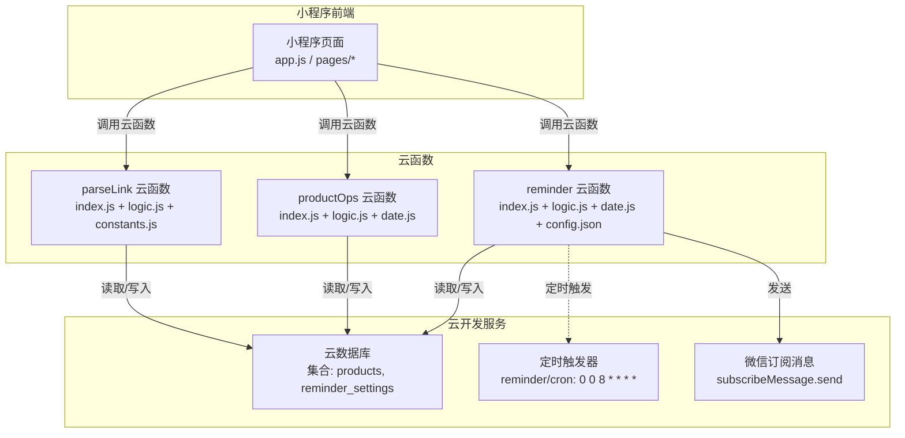
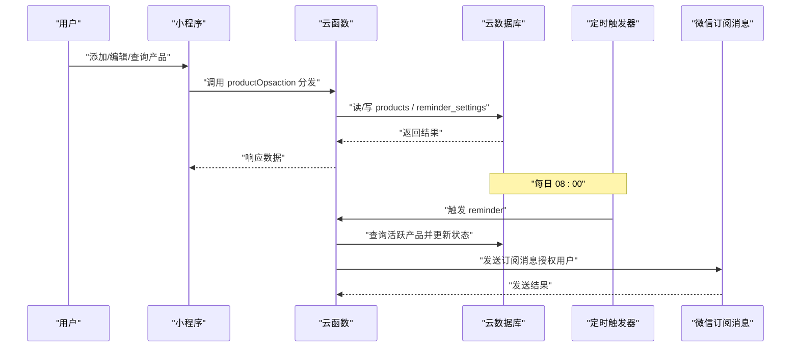
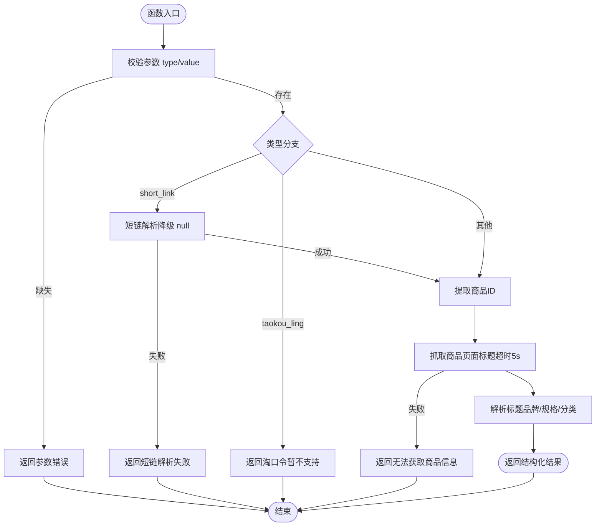
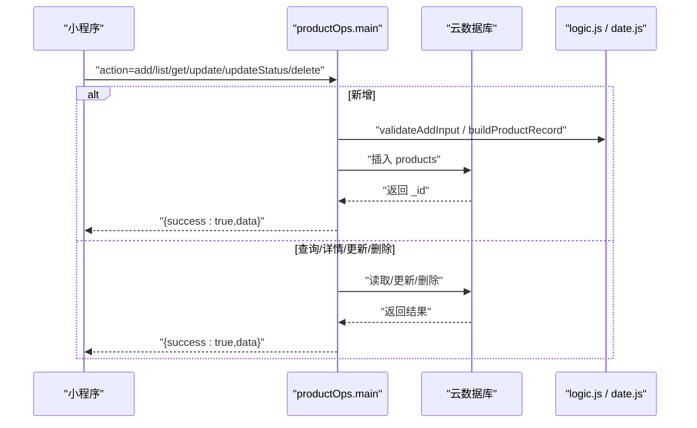
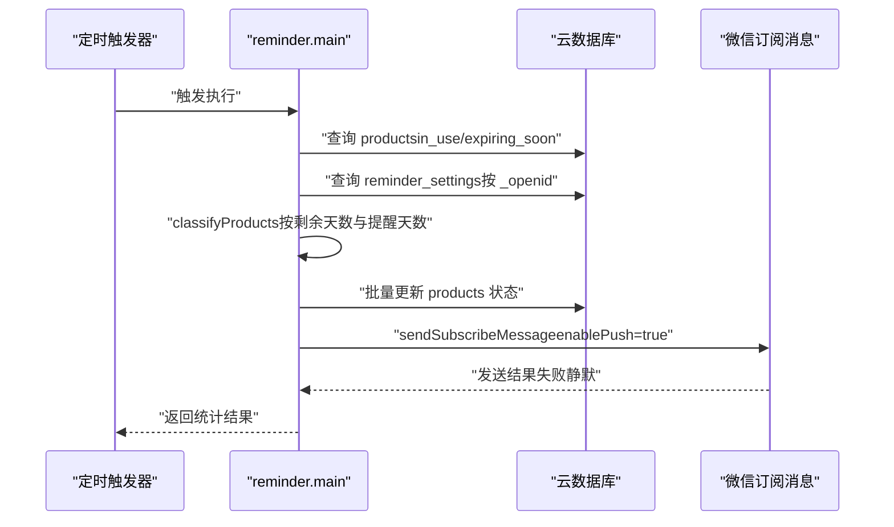
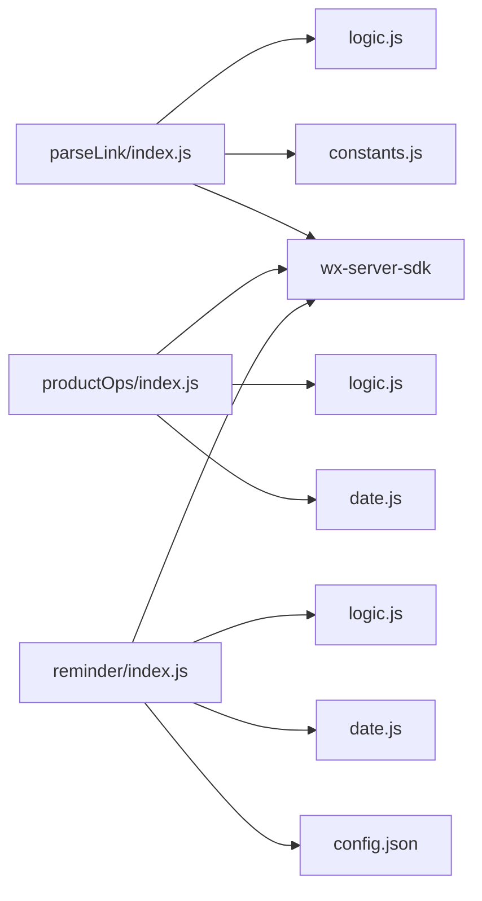

# 监控与维护

<cite>
**本文引用的文件**
- [cloudfunctions/parseLink/index.js](file://cloudfunctions/parseLink/index.js)
- [cloudfunctions/parseLink/logic.js](file://cloudfunctions/parseLink/logic.js)
- [cloudfunctions/parseLink/constants.js](file://cloudfunctions/parseLink/constants.js)
- [cloudfunctions/productOps/index.js](file://cloudfunctions/productOps/index.js)
- [cloudfunctions/productOps/logic.js](file://cloudfunctions/productOps/logic.js)
- [cloudfunctions/productOps/date.js](file://cloudfunctions/productOps/date.js)
- [cloudfunctions/reminder/index.js](file://cloudfunctions/reminder/index.js)
- [cloudfunctions/reminder/logic.js](file://cloudfunctions/reminder/logic.js)
- [cloudfunctions/reminder/date.js](file://cloudfunctions/reminder/date.js)
- [cloudfunctions/reminder/config.json](file://cloudfunctions/reminder/config.json)
- [tests/parseLink.test.js](file://tests/parseLink.test.js)
- [tests/productOps.test.js](file://tests/productOps.test.js)
- [package.json](file://package.json)
- [project.config.json](file://project.config.json)
- [findings.md](file://findings.md)
- [design-system/MASTER.md](file://design-system/MASTER.md)
</cite>

## 目录
1. [简介](#简介)
2. [项目结构](#项目结构)
3. [核心组件](#核心组件)
4. [架构总览](#架构总览)
5. [详细组件分析](#详细组件分析)
6. [依赖分析](#依赖分析)
7. [性能考虑](#性能考虑)
8. [故障排查指南](#故障排查指南)
9. [结论](#结论)
10. [附录](#附录)

## 简介
本运维文档面向“化妆品库存管理”微信小程序项目的监控与维护工作，聚焦以下目标：
- 性能监控指标：云函数执行时间、内存使用、错误率
- 日志管理策略：云函数日志收集、错误追踪、异常告警
- 系统健康检查：数据库连接、API 接口可用性、第三方依赖（HTTP 抓取、微信订阅消息）
- 故障排查与快速修复：常见问题定位与处理步骤
- 定期维护任务：数据清理、缓存更新、安全补丁
- 运维自动化与告警配置：脚本与配置示例路径

## 项目结构
项目采用“云开发 + 小程序原生”的技术栈，云函数按功能拆分，包含链接解析、产品运营、定时提醒三大模块，并配套单元测试与设计规范。

图表来源
- [cloudfunctions/parseLink/index.js:1-112](file://cloudfunctions/parseLink/index.js#L1-L112)
- [cloudfunctions/productOps/index.js:1-171](file://cloudfunctions/productOps/index.js#L1-L171)
- [cloudfunctions/reminder/index.js:1-106](file://cloudfunctions/reminder/index.js#L1-L106)
- [cloudfunctions/reminder/config.json:1-9](file://cloudfunctions/reminder/config.json#L1-L9)

章节来源
- [project.config.json:1-21](file://project.config.json#L1-L21)

## 核心组件
- 链接解析云函数（parseLink）：支持短链解析与页面抓取，降级策略完善；解析标题提取品牌、规格与分类。
- 产品运营云函数（productOps）：统一入口分发增删改查；服务端计算过期时间与状态，保障一致性。
- 定时提醒云函数（reminder）：每日定时运行，批量更新产品状态并发送订阅消息（需用户授权）。

章节来源
- [cloudfunctions/parseLink/index.js:1-112](file://cloudfunctions/parseLink/index.js#L1-L112)
- [cloudfunctions/productOps/index.js:1-171](file://cloudfunctions/productOps/index.js#L1-L171)
- [cloudfunctions/reminder/index.js:1-106](file://cloudfunctions/reminder/index.js#L1-L106)

## 架构总览
云函数间通过微信云开发 SDK 与云数据库交互，定时触发器驱动 reminder 执行。前端通过云函数暴露的 API 完成业务操作。

图表来源
- [cloudfunctions/productOps/index.js:40-64](file://cloudfunctions/productOps/index.js#L40-L64)
- [cloudfunctions/reminder/index.js:15-105](file://cloudfunctions/reminder/index.js#L15-L105)
- [cloudfunctions/reminder/config.json:1-9](file://cloudfunctions/reminder/config.json#L1-L9)

## 详细组件分析

### 链接解析组件（parseLink）
职责与流程
- 参数校验：缺失 type/value 直接返回错误
- 类型分支：短链解析（降级为空时返回 null）、淘口令提示暂不支持
- 商品 ID 提取：从 URL 参数中解析
- 页面抓取：构造 H5 链接，超时 5 秒，解析 HTML title
- 标题解析：品牌匹配、规格提取、分类推断
- 异常兜底：捕获错误并返回统一错误结构

图表来源
- [cloudfunctions/parseLink/index.js:11-56](file://cloudfunctions/parseLink/index.js#L11-L56)
- [cloudfunctions/parseLink/index.js:61-111](file://cloudfunctions/parseLink/index.js#L61-L111)
- [cloudfunctions/parseLink/logic.js:13-71](file://cloudfunctions/parseLink/logic.js#L13-L71)
- [cloudfunctions/parseLink/constants.js:64-92](file://cloudfunctions/parseLink/constants.js#L64-L92)

章节来源
- [cloudfunctions/parseLink/index.js:1-112](file://cloudfunctions/parseLink/index.js#L1-L112)
- [cloudfunctions/parseLink/logic.js:1-78](file://cloudfunctions/parseLink/logic.js#L1-L78)
- [cloudfunctions/parseLink/constants.js:1-101](file://cloudfunctions/parseLink/constants.js#L1-L101)

### 产品运营组件（productOps）
职责与流程
- 统一入口：根据 action 分发到 add/list/get/update/updateStatus/delete
- 数据校验：新增输入校验、状态更新校验
- 状态计算：服务端计算 expirationDate 与状态，避免前端不一致
- 权限控制：通过 ownerOpenid/_openid 校验资源归属
- 分页查询：支持关键词正则检索、排序与分页

图表来源
- [cloudfunctions/productOps/index.js:40-171](file://cloudfunctions/productOps/index.js#L40-L171)
- [cloudfunctions/productOps/logic.js:11-104](file://cloudfunctions/productOps/logic.js#L11-L104)
- [cloudfunctions/productOps/date.js:26-49](file://cloudfunctions/productOps/date.js#L26-L49)

章节来源
- [cloudfunctions/productOps/index.js:1-171](file://cloudfunctions/productOps/index.js#L1-L171)
- [cloudfunctions/productOps/logic.js:1-105](file://cloudfunctions/productOps/logic.js#L1-L105)
- [cloudfunctions/productOps/date.js:1-77](file://cloudfunctions/productOps/date.js#L1-L77)

### 定时提醒组件（reminder）
职责与流程
- 每日定时触发（08:00），查询活跃产品
- 读取用户提醒设置，按用户分组
- 分类待过期/即将过期产品，批量更新状态
- 对开启推送的用户发送订阅消息（授权失效时静默）

图表来源
- [cloudfunctions/reminder/index.js:15-105](file://cloudfunctions/reminder/index.js#L15-L105)
- [cloudfunctions/reminder/logic.js:17-40](file://cloudfunctions/reminder/logic.js#L17-L40)
- [cloudfunctions/reminder/date.js:43-49](file://cloudfunctions/reminder/date.js#L43-L49)
- [cloudfunctions/reminder/config.json:1-9](file://cloudfunctions/reminder/config.json#L1-L9)

章节来源
- [cloudfunctions/reminder/index.js:1-106](file://cloudfunctions/reminder/index.js#L1-L106)
- [cloudfunctions/reminder/logic.js:1-45](file://cloudfunctions/reminder/logic.js#L1-L45)
- [cloudfunctions/reminder/date.js:1-77](file://cloudfunctions/reminder/date.js#L1-L77)
- [cloudfunctions/reminder/config.json:1-9](file://cloudfunctions/reminder/config.json#L1-L9)

## 依赖分析
- 云函数间依赖
  - parseLink 依赖 logic.js 与 constants.js（品牌词库、规格提取）
  - productOps 依赖 logic.js 与 date.js（日期计算）
  - reminder 依赖 logic.js 与 date.js（日期计算），并配置定时触发器
- 外部依赖
  - 微信云开发 SDK（初始化、数据库、openapi）
  - 第三方 HTTP 抓取（解析商品页 title）
  - 微信订阅消息（一次性订阅，需前端引导授权）

图表来源
- [cloudfunctions/parseLink/index.js:6-7](file://cloudfunctions/parseLink/index.js#L6-L7)
- [cloudfunctions/productOps/index.js:5-11](file://cloudfunctions/productOps/index.js#L5-L11)
- [cloudfunctions/reminder/index.js:8-13](file://cloudfunctions/reminder/index.js#L8-L13)
- [cloudfunctions/reminder/config.json:1-9](file://cloudfunctions/reminder/config.json#L1-L9)

章节来源
- [cloudfunctions/parseLink/index.js:1-112](file://cloudfunctions/parseLink/index.js#L1-L112)
- [cloudfunctions/productOps/index.js:1-171](file://cloudfunctions/productOps/index.js#L1-L171)
- [cloudfunctions/reminder/index.js:1-106](file://cloudfunctions/reminder/index.js#L1-L106)

## 性能考虑
- 云函数执行时间
  - parseLink 的页面抓取设置超时 5 秒，建议在云函数日志中记录请求耗时与最终标题命中情况，便于评估抓取成功率与耗时分布。
  - productOps 的分页查询限制了单次最大读取量，建议结合索引优化与分页参数调优。
  - reminder 的批量更新循环逐条更新，建议评估是否可改为聚合更新以减少写放大。
- 内存使用
  - 抓取阶段会拼接 HTML 片段，建议对超大响应进行截断或流式处理（当前实现为一次性拼接，注意内存占用）。
  - 品牌词库与分类关键词映射为静态常量，建议在逻辑层避免重复构建。
- 错误率监控
  - 统一返回结构包含 error 字段，便于在日志中聚合错误类型（参数缺失、短链解析失败、抓取失败、数据库访问异常等）。
  - 定时任务的订阅消息发送失败应静默处理，避免阻塞主流程。

章节来源
- [cloudfunctions/parseLink/index.js:89-107](file://cloudfunctions/parseLink/index.js#L89-L107)
- [cloudfunctions/reminder/index.js:58-70](file://cloudfunctions/reminder/index.js#L58-L70)

## 故障排查指南
- 链接解析失败
  - 短链解析降级为空：确认网络可达性与第三方重定向服务稳定性。
  - 抓取失败：检查目标站点结构变化、User-Agent 是否被拦截、超时阈值是否合理。
  - 标题解析为空：确认品牌词库覆盖范围与规格正则匹配。
- 产品状态异常
  - 服务端计算过期时间与状态：检查生产日期、保质期、开封日期与开启后保质期的输入合法性。
  - 权限校验失败：确认用户 openid 与记录 ownerOpenid/_openid 是否一致。
- 定时提醒未生效
  - 确认定时触发器配置正确（0 0 8 * * * *）且云函数已部署。
  - 订阅消息发送失败：检查用户授权状态与模板 ID 配置。
- 数据库连接问题
  - 云开发安全规则需允许读取 categories 集合（系统数据），确保查询不受限。
- 日志与告警
  - 使用云开发日志面板查看 parseLink/productOps/reminder 的执行日志，关注错误堆栈与耗时。
  - 建议在 CI 中运行测试（Jest）以尽早发现逻辑回归。

章节来源
- [findings.md:13-36](file://findings.md#L13-L36)
- [tests/parseLink.test.js:1-111](file://tests/parseLink.test.js#L1-L111)
- [tests/productOps.test.js:1-202](file://tests/productOps.test.js#L1-L202)
- [package.json:10-11](file://package.json#L10-L11)

## 结论
本项目通过“统一入口 + 服务端计算 + 定时任务”的架构实现了稳定的库存管理能力。建议在现有基础上完善日志埋点与告警、优化批量更新与抓取策略，并持续通过测试保障质量。

## 附录

### A. 性能监控指标建议
- 云函数执行时间
  - parseLink：抓取耗时、标题解析耗时、整体耗时
  - productOps：查询/插入/更新/删除耗时
  - reminder：查询活跃产品耗时、批量更新耗时、消息发送耗时
- 内存使用
  - 抓取阶段内存峰值、逻辑层对象构建次数
- 错误率
  - 参数错误、网络错误、数据库错误、消息发送失败

### B. 日志管理策略
- 采集范围
  - 云函数 stdout/stderr、错误堆栈、关键参数与耗时
- 错误追踪
  - 统一错误结构（含 error 字段），按类型聚合
- 异常告警
  - 执行时间超过阈值、错误率上升、定时任务失败

### C. 系统健康检查流程
- 数据库连接
  - 读取 products/reminder_settings 集合元数据，验证查询与写入
- API 接口可用性
  - productOps.main(action=list/get/update/delete) 与 parseLink.main(type=short_link/taokou_ling) 响应时间与错误率
- 第三方服务依赖
  - HTTP 抓取（目标站点可达性）、微信订阅消息（模板 ID 与授权状态）

### D. 故障排查清单
- parseLink
  - 短链/淘口令解析是否按降级策略返回
  - 抓取超时与标题命中率
- productOps
  - 输入校验是否通过、状态计算是否正确、权限校验是否通过
- reminder
  - 定时触发器是否生效、批量更新是否完成、消息发送是否静默失败

### E. 定期维护任务
- 数据清理
  - 清理长期无人使用的测试数据或历史冗余记录
- 缓存更新
  - 品牌词库与分类关键词定期维护
- 安全补丁
  - 依赖升级与安全扫描（Jest、云开发 SDK）

### F. 运维自动化与监控告警配置示例
- 测试执行
  - 使用 Jest 在 CI 中运行测试套件，确保逻辑回归不引入新问题。
- 定时任务配置
  - reminder 的定时触发器配置示例路径：[cloudfunctions/reminder/config.json:1-9](file://cloudfunctions/reminder/config.json#L1-L9)
- 设计规范参考
  - 设计系统 Master 文档：[design-system/MASTER.md:1-190](file://design-system/MASTER.md#L1-L190)

章节来源
- [package.json:10-11](file://package.json#L10-L11)
- [cloudfunctions/reminder/config.json:1-9](file://cloudfunctions/reminder/config.json#L1-L9)
- [design-system/MASTER.md:1-190](file://design-system/MASTER.md#L1-L190)