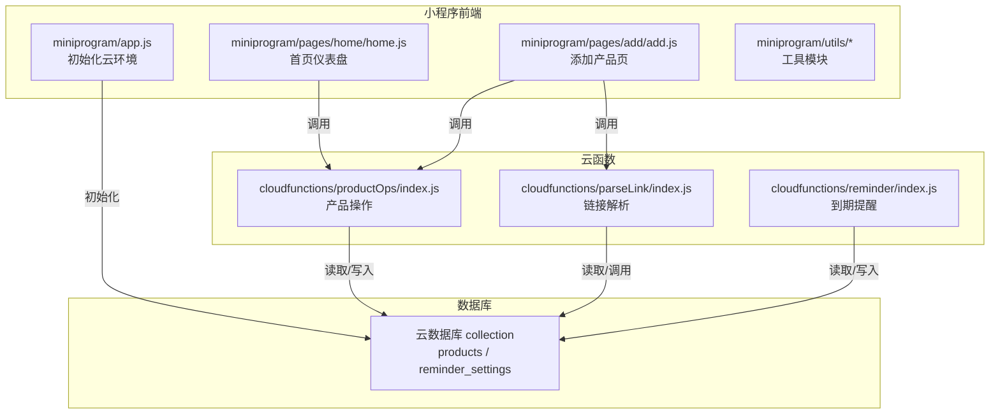
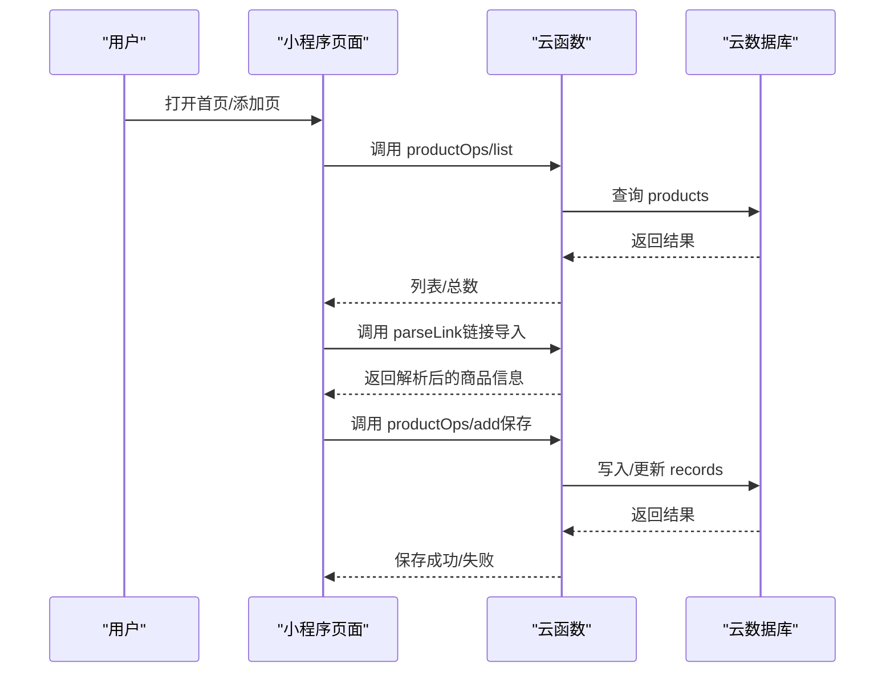
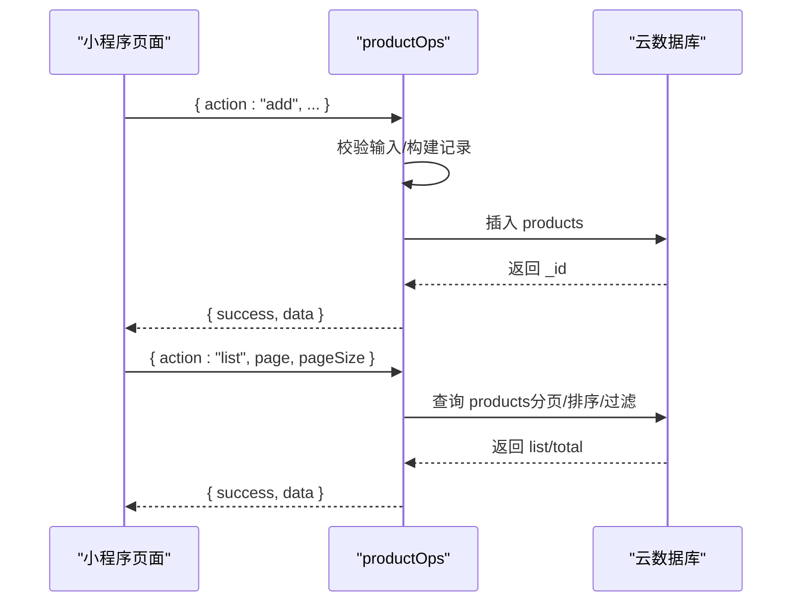
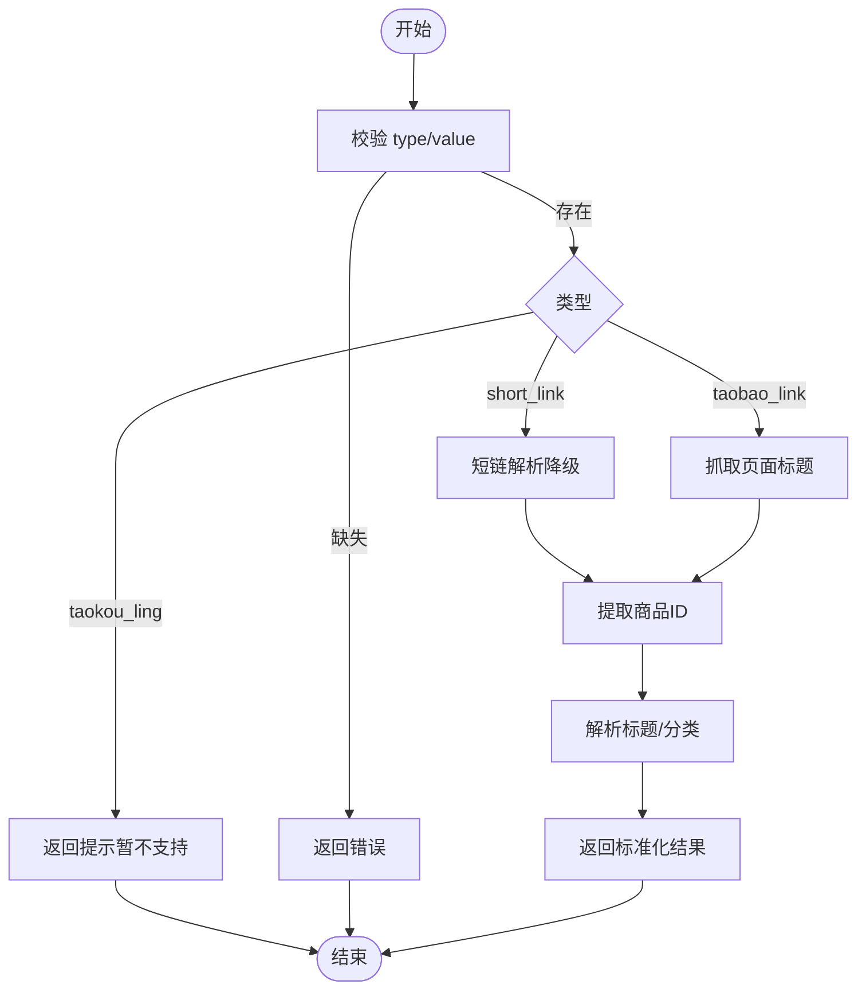
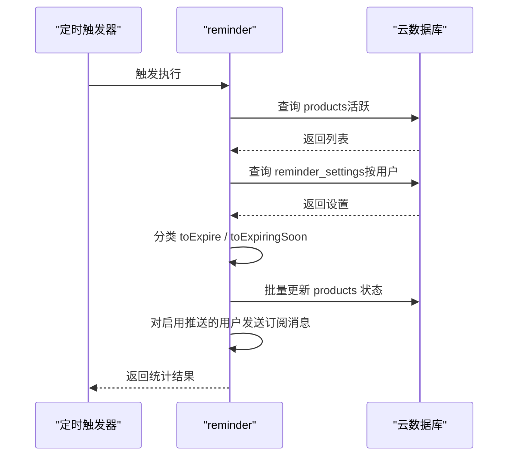
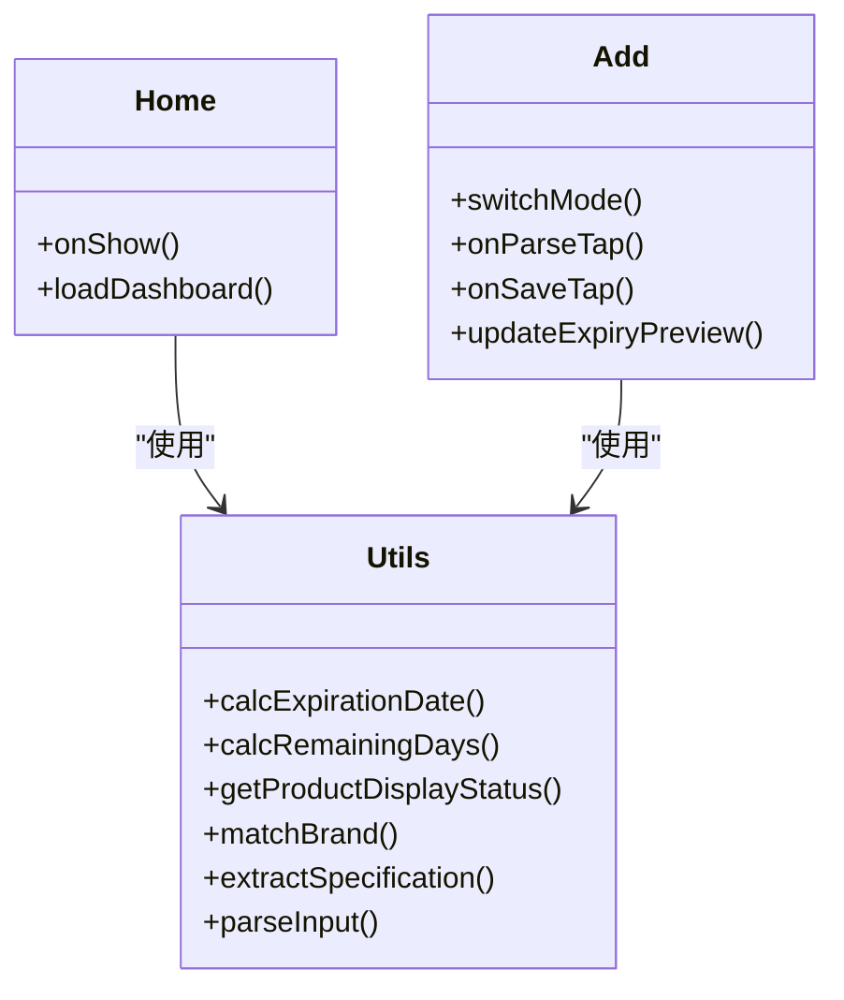
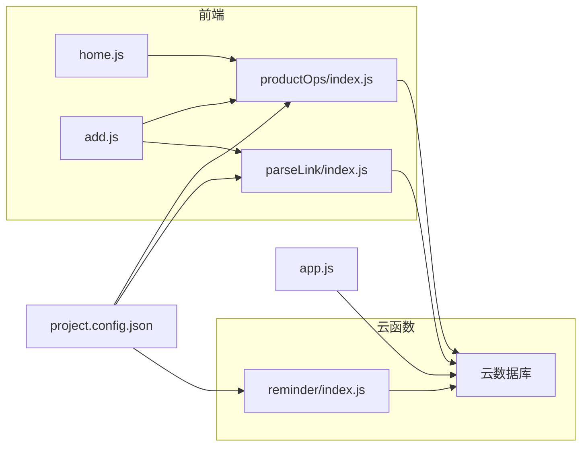

# 部署与运维

<cite>
**本文引用的文件**   
- [package.json](file://package.json)
- [project.config.json](file://project.config.json)
- [app.js](file://miniprogram/app.js)
- [home.js](file://miniprogram/pages/home/home.js)
- [add.js](file://miniprogram/pages/add/add.js)
- [constants.js](file://miniprogram/utils/constants.js)
- [date.js](file://miniprogram/utils/date.js)
- [parser.js](file://miniprogram/utils/parser.js)
- [parseLink/index.js](file://cloudfunctions/parseLink/index.js)
- [parseLink/logic.js](file://cloudfunctions/parseLink/logic.js)
- [productOps/index.js](file://cloudfunctions/productOps/index.js)
- [productOps/logic.js](file://cloudfunctions/productOps/logic.js)
- [reminder/index.js](file://cloudfunctions/reminder/index.js)
- [reminder/logic.js](file://cloudfunctions/reminder/logic.js)
- [parseLink.test.js](file://tests/parseLink.test.js)
- [productOps.test.js](file://tests/productOps.test.js)
- [reminder.test.js](file://tests/reminder.test.js)
</cite>

## 目录
1. [简介](#简介)
2. [项目结构](#项目结构)
3. [核心组件](#核心组件)
4. [架构总览](#架构总览)
5. [详细组件分析](#详细组件分析)
6. [依赖关系分析](#依赖关系分析)
7. [性能考虑](#性能考虑)
8. [故障排查指南](#故障排查指南)
9. [结论](#结论)
10. [附录](#附录)

## 简介
本运维文档面向部署与运维团队，覆盖开发环境配置、本地调试、生产部署（云函数、数据库、域名与证书）、监控与维护、版本与发布、回滚策略、云开发服务配置与权限管理、成本优化以及故障排查与性能优化建议。文档基于仓库现有代码与配置进行梳理，确保团队能高效管理与维护系统。

## 项目结构
项目采用“小程序前端 + 微信云开发 + 云函数 + 数据库”的典型架构。前端位于 miniprogram 目录，云函数位于 cloudfunctions 目录，测试用例位于 tests 目录，整体通过微信开发者工具与云开发进行联调与部署。

图表来源
- [project.config.json:1-21](file://project.config.json#L1-L21)
- [app.js:10-26](file://miniprogram/app.js#L10-L26)
- [home.js:33-42](file://miniprogram/pages/home/home.js#L33-L42)
- [add.js:70-78](file://miniprogram/pages/add/add.js#L70-L78)
- [parseLink/index.js:11-56](file://cloudfunctions/parseLink/index.js#L11-L56)
- [productOps/index.js:40-64](file://cloudfunctions/productOps/index.js#L40-L64)
- [reminder/index.js:15-105](file://cloudfunctions/reminder/index.js#L15-L105)

章节来源
- [project.config.json:1-21](file://project.config.json#L1-L21)
- [app.js:10-26](file://miniprogram/app.js#L10-L26)

## 核心组件
- 小程序前端
  - 初始化云环境：在应用启动时根据环境变量初始化云能力。
  - 页面交互：首页统计与预警、添加产品（链接导入/手动录入）。
- 云函数
  - 链接解析：解析淘宝/天猫链接，提取商品信息。
  - 产品操作：增删改查、状态计算与权限校验。
  - 到期提醒：定时任务批量更新状态并发送订阅消息。
- 工具模块
  - 常量与分类、品牌词库、规格提取。
  - 日期计算、状态推断、输入解析。

章节来源
- [app.js:10-26](file://miniprogram/app.js#L10-L26)
- [home.js:28-101](file://miniprogram/pages/home/home.js#L28-L101)
- [add.js:55-235](file://miniprogram/pages/add/add.js#L55-L235)
- [parseLink/index.js:11-56](file://cloudfunctions/parseLink/index.js#L11-L56)
- [productOps/index.js:40-171](file://cloudfunctions/productOps/index.js#L40-L171)
- [reminder/index.js:15-105](file://cloudfunctions/reminder/index.js#L15-L105)
- [constants.js:6-99](file://miniprogram/utils/constants.js#L6-L99)
- [date.js:25-57](file://miniprogram/utils/date.js#L25-L57)
- [parser.js:17-63](file://miniprogram/utils/parser.js#L17-L63)

## 架构总览
系统运行时的关键交互如下：

图表来源
- [home.js:33-42](file://miniprogram/pages/home/home.js#L33-L42)
- [add.js:70-78](file://miniprogram/pages/add/add.js#L70-L78)
- [add.js:196-208](file://miniprogram/pages/add/add.js#L196-L208)
- [parseLink/index.js:11-56](file://cloudfunctions/parseLink/index.js#L11-L56)
- [productOps/index.js:40-90](file://cloudfunctions/productOps/index.js#L40-L90)

## 详细组件分析

### 组件A：云函数“产品操作”（productOps）
职责与流程
- 入口分发：根据 action 调用对应处理器（新增、查询、获取、更新、更新状态、删除）。
- 权限校验：通过 openid 限制记录归属，防止越权访问。
- 状态计算：根据生产日期、保质期、开封日期等动态计算过期时间与展示状态。
- 数据持久化：读写云数据库 products 与 reminder_settings。

图表来源
- [productOps/index.js:40-171](file://cloudfunctions/productOps/index.js#L40-L171)
- [productOps/logic.js:11-96](file://cloudfunctions/productOps/logic.js#L11-L96)

章节来源
- [productOps/index.js:40-171](file://cloudfunctions/productOps/index.js#L40-L171)
- [productOps/logic.js:11-96](file://cloudfunctions/productOps/logic.js#L11-L96)

### 组件B：云函数“链接解析”（parseLink）
职责与流程
- 输入校验：要求 type 与 value。
- 类型处理：短链解析（降级）、淘口令提示（当前不支持）。
- 页面抓取：通过 HTTP/HTTPS 请求目标页面，提取标题。
- 标题解析：品牌匹配、规格提取、分类推断。
- 输出：标准化商品信息。

图表来源
- [parseLink/index.js:11-56](file://cloudfunctions/parseLink/index.js#L11-L56)
- [parseLink/logic.js:13-71](file://cloudfunctions/parseLink/logic.js#L13-L71)

章节来源
- [parseLink/index.js:11-56](file://cloudfunctions/parseLink/index.js#L11-L56)
- [parseLink/logic.js:13-71](file://cloudfunctions/parseLink/logic.js#L13-L71)

### 组件C：云函数“到期提醒”（reminder）
职责与流程
- 定时触发：每日固定时间执行。
- 查询活跃产品：筛选 in_use/expiring_soon。
- 用户设置：读取 reminder_settings 的提醒天数。
- 分类与批量更新：将即将过期与已过期产品更新状态。
- 订阅消息：对开启推送的用户发送订阅通知。

图表来源
- [reminder/index.js:15-105](file://cloudfunctions/reminder/index.js#L15-L105)
- [reminder/logic.js:17-40](file://cloudfunctions/reminder/logic.js#L17-L40)

章节来源
- [reminder/index.js:15-105](file://cloudfunctions/reminder/index.js#L15-L105)
- [reminder/logic.js:17-40](file://cloudfunctions/reminder/logic.js#L17-L40)

### 组件D：前端页面与工具模块
- 首页 home：调用 productOps 列表接口，实时计算展示状态，汇总统计与预警。
- 添加页 add：支持链接导入（调用 parseLink）与手动录入（调用 productOps），含表单校验与过期预览。
- 工具模块：常量与分类、品牌词库、规格提取；日期计算与状态推断；输入解析。

图表来源
- [home.js:24-101](file://miniprogram/pages/home/home.js#L24-L101)
- [add.js:55-235](file://miniprogram/pages/add/add.js#L55-L235)
- [date.js:25-57](file://miniprogram/utils/date.js#L25-L57)
- [constants.js:63-91](file://miniprogram/utils/constants.js#L63-L91)
- [parser.js:59-63](file://miniprogram/utils/parser.js#L59-L63)

章节来源
- [home.js:24-101](file://miniprogram/pages/home/home.js#L24-L101)
- [add.js:55-235](file://miniprogram/pages/add/add.js#L55-L235)
- [date.js:25-57](file://miniprogram/utils/date.js#L25-L57)
- [constants.js:63-91](file://miniprogram/utils/constants.js#L63-L91)
- [parser.js:59-63](file://miniprogram/utils/parser.js#L59-L63)

## 依赖关系分析
- 前端依赖云函数：首页与添加页均通过 wx.cloud.callFunction 调用云函数。
- 云函数依赖数据库：读写 products 与 reminder_settings。
- 云函数内部逻辑可独立测试：parseLink、productOps、reminder 的 logic 模块均为纯函数，便于单元测试。
- 配置与入口：project.config.json 指定云函数目录与编译类型；app.js 指定云环境 ID。

图表来源
- [project.config.json:3-4](file://project.config.json#L3-L4)
- [home.js:33-42](file://miniprogram/pages/home/home.js#L33-L42)
- [add.js:70-78](file://miniprogram/pages/add/add.js#L70-L78)
- [parseLink/index.js:9](file://cloudfunctions/parseLink/index.js#L9)
- [productOps/index.js:6](file://cloudfunctions/productOps/index.js#L6)
- [reminder/index.js:11](file://cloudfunctions/reminder/index.js#L11)
- [app.js:10-26](file://miniprogram/app.js#L10-L26)

章节来源
- [project.config.json:3-4](file://project.config.json#L3-L4)
- [home.js:33-42](file://miniprogram/pages/home/home.js#L33-L42)
- [add.js:70-78](file://miniprogram/pages/add/add.js#L70-L78)
- [parseLink/index.js:9](file://cloudfunctions/parseLink/index.js#L9)
- [productOps/index.js:6](file://cloudfunctions/productOps/index.js#L6)
- [reminder/index.js:11](file://cloudfunctions/reminder/index.js#L11)
- [app.js:10-26](file://miniprogram/app.js#L10-L26)

## 性能考虑
- 云函数冷启动与并发
  - 合理设置超时时间与内存上限，避免长耗时操作阻塞。
  - 对 parseLink 的页面抓取增加超时与失败降级，减少失败重试带来的资源浪费。
- 数据库查询与索引
  - 在 products 上建立复合索引（ownerOpenid + status + expirationDate），提升分页与筛选性能。
  - 控制单次查询数量，reminder 限制每次最多处理 1000 条。
- 前端渲染
  - 首页仅请求少量活跃产品（pageSize 控制），避免一次性渲染过多数据。
  - 使用本地状态计算展示状态，减少重复请求。
- 缓存与降级
  - 对 parseLink 的短链解析与页面抓取实现降级策略，保证功能可用性。
- 日志与监控
  - 为云函数添加结构化日志，区分 info/warn/error，便于定位慢查询与异常。
- 成本优化
  - 合理规划云函数配额与数据库容量，避免不必要的写放大。
  - 定时任务仅处理必要范围内的数据，避免全量扫描。

## 故障排查指南
- 云开发未配置/权限不足
  - 现象：调用云函数报错或提示无权限。
  - 排查：确认已在 app.js 中填写正确的云环境 ID；在微信开发者工具中开通云开发并部署云函数；检查数据库集合权限。
  - 参考路径：[app.js:10-26](file://miniprogram/app.js#L10-L26)、[add.js:212-234](file://miniprogram/pages/add/add.js#L212-L234)
- 链接解析失败
  - 现象：parseLink 返回错误或无法获取商品信息。
  - 排查：确认输入链接类型识别正确；检查短链解析与页面抓取的降级逻辑是否生效；查看云函数日志。
  - 参考路径：[parseLink/index.js:11-56](file://cloudfunctions/parseLink/index.js#L11-L56)、[parseLink/logic.js:13-71](file://cloudfunctions/parseLink/logic.js#L13-L71)
- 产品状态异常
  - 现象：状态未按预期更新或显示异常。
  - 排查：核对日期计算逻辑与提前天数设置；检查 reminder 的分类与批量更新流程。
  - 参考路径：[date.js:25-57](file://miniprogram/utils/date.js#L25-L57)、[reminder/logic.js:17-40](file://cloudfunctions/reminder/logic.js#L17-L40)
- 数据库权限与集合
  - 现象：读写失败或无权限。
  - 排查：确认 products 与 reminder_settings 集合存在且具备相应权限；检查规则表达式。
  - 参考路径：[productOps/index.js:8-11](file://cloudfunctions/productOps/index.js#L8-L11)、[reminder/index.js:20-49](file://cloudfunctions/reminder/index.js#L20-L49)
- 定时任务未执行
  - 现象：到期提醒未更新状态或未发送消息。
  - 排查：确认定时触发器配置；检查云函数日志；验证订阅模板 ID 与用户授权状态。
  - 参考路径：[reminder/index.js:15-105](file://cloudfunctions/reminder/index.js#L15-L105)

章节来源
- [app.js:10-26](file://miniprogram/app.js#L10-L26)
- [add.js:212-234](file://miniprogram/pages/add/add.js#L212-L234)
- [parseLink/index.js:11-56](file://cloudfunctions/parseLink/index.js#L11-L56)
- [parseLink/logic.js:13-71](file://cloudfunctions/parseLink/logic.js#L13-L71)
- [date.js:25-57](file://miniprogram/utils/date.js#L25-L57)
- [reminder/logic.js:17-40](file://cloudfunctions/reminder/logic.js#L17-L40)
- [productOps/index.js:8-11](file://cloudfunctions/productOps/index.js#L8-L11)
- [reminder/index.js:15-105](file://cloudfunctions/reminder/index.js#L15-L105)

## 结论
本项目通过小程序前端与微信云开发形成清晰的前后端分离架构。云函数承担业务逻辑与数据处理，数据库提供持久化能力。通过规范化的开发流程、完善的测试体系与可观测的日志监控，运维团队可以稳定地进行部署、监控与维护。建议在生产中完善数据库索引、优化云函数超时与并发、加强日志与告警，并制定严格的发布与回滚流程，以保障系统的可靠性与可维护性。

## 附录

### 开发环境配置与本地调试
- 安装依赖
  - 使用包管理器安装测试依赖，运行测试脚本验证逻辑。
  - 参考路径：[package.json:10-11](file://package.json#L10-L11)
- 项目配置
  - 确认 project.config.json 中的 miniprogramRoot、cloudfunctionRoot、cloud 等配置项。
  - 参考路径：[project.config.json:3-4](file://project.config.json#L3-L4)
- 云环境初始化
  - 在 app.js 中填写正确的云环境 ID 并初始化云能力。
  - 参考路径：[app.js:10-26](file://miniprogram/app.js#L10-L26)
- 本地调试
  - 在微信开发者工具中打开项目，选择云开发环境，部署云函数后进行联调。
  - 参考路径：[project.config.json:2-20](file://project.config.json#L2-L20)

章节来源
- [package.json:10-11](file://package.json#L10-L11)
- [project.config.json:3-4](file://project.config.json#L3-L4)
- [app.js:10-26](file://miniprogram/app.js#L10-L26)
- [project.config.json:2-20](file://project.config.json#L2-L20)

### 生产环境部署流程
- 云函数部署
  - 在微信开发者工具中上传并部署 parseLink、productOps、reminder。
  - 参考路径：[parseLink/index.js:9](file://cloudfunctions/parseLink/index.js#L9)、[productOps/index.js:6](file://cloudfunctions/productOps/index.js#L6)、[reminder/index.js:11](file://cloudfunctions/reminder/index.js#L11)
- 数据库配置
  - 创建并授权 products 与 reminder_settings 集合；设置合适的读写权限与索引。
  - 参考路径：[productOps/index.js:8-11](file://cloudfunctions/productOps/index.js#L8-L11)、[reminder/index.js:20-49](file://cloudfunctions/reminder/index.js#L20-L49)
- 定时任务配置
  - 在云开发控制台配置定时触发器，确保 reminder 按计划执行。
  - 参考路径：[reminder/index.js:15-105](file://cloudfunctions/reminder/index.js#L15-L105)
- 域名与证书
  - 若小程序涉及服务器域名调用，需在微信公众平台配置域名并在云托管/云 API 中正确设置证书与跨域策略。
  - 参考路径：[parseLink/index.js:85-107](file://cloudfunctions/parseLink/index.js#L85-L107)

章节来源
- [parseLink/index.js:9](file://cloudfunctions/parseLink/index.js#L9)
- [productOps/index.js:6](file://cloudfunctions/productOps/index.js#L6)
- [reminder/index.js:11](file://cloudfunctions/reminder/index.js#L11)
- [productOps/index.js:8-11](file://cloudfunctions/productOps/index.js#L8-L11)
- [reminder/index.js:20-49](file://cloudfunctions/reminder/index.js#L20-L49)
- [reminder/index.js:15-105](file://cloudfunctions/reminder/index.js#L15-L105)
- [parseLink/index.js:85-107](file://cloudfunctions/parseLink/index.js#L85-L107)

### 监控与维护策略
- 性能监控
  - 关注云函数耗时、错误率与超时次数；对 parseLink 的页面抓取设置超时阈值。
  - 参考路径：[parseLink/index.js:90-107](file://cloudfunctions/parseLink/index.js#L90-L107)
- 错误追踪
  - 为云函数添加结构化日志，记录关键参数与异常堆栈；结合微信开发者工具日志面板定位问题。
  - 参考路径：[parseLink/index.js:53-55](file://cloudfunctions/parseLink/index.js#L53-L55)、[productOps/index.js:61-63](file://cloudfunctions/productOps/index.js#L61-L63)、[reminder/index.js:102-104](file://cloudfunctions/reminder/index.js#L102-L104)
- 日志管理
  - 前端页面对错误进行统一提示与上报；云函数返回明确的错误信息以便前端展示。
  - 参考路径：[home.js:38-42](file://miniprogram/pages/home/home.js#L38-L42)、[add.js:99-107](file://miniprogram/pages/add/add.js#L99-L107)

章节来源
- [parseLink/index.js:53-55](file://cloudfunctions/parseLink/index.js#L53-L55)
- [productOps/index.js:61-63](file://cloudfunctions/productOps/index.js#L61-L63)
- [reminder/index.js:102-104](file://cloudfunctions/reminder/index.js#L102-L104)
- [home.js:38-42](file://miniprogram/pages/home/home.js#L38-L42)
- [add.js:99-107](file://miniprogram/pages/add/add.js#L99-L107)

### 版本管理、发布与回滚
- 版本管理
  - 使用 Git 管理代码版本，分支策略建议采用 feature/develop/release/master。
  - 参考路径：[package.json:1-20](file://package.json#L1-L20)
- 发布流程
  - 在微信开发者工具中完成本地联调与测试，上传云函数与小程序代码，灰度发布。
  - 参考路径：[project.config.json:2-20](file://project.config.json#L2-L20)
- 回滚策略
  - 保留最近 N 个版本的云函数版本；出现问题时回滚至上一个稳定版本。
  - 参考路径：[parseLink/index.js:9](file://cloudfunctions/parseLink/index.js#L9)、[productOps/index.js:6](file://cloudfunctions/productOps/index.js#L6)、[reminder/index.js:11](file://cloudfunctions/reminder/index.js#L11)

章节来源
- [package.json:1-20](file://package.json#L1-L20)
- [project.config.json:2-20](file://project.config.json#L2-L20)
- [parseLink/index.js:9](file://cloudfunctions/parseLink/index.js#L9)
- [productOps/index.js:6](file://cloudfunctions/productOps/index.js#L6)
- [reminder/index.js:11](file://cloudfunctions/reminder/index.js#L11)

### 云开发服务配置、权限与成本优化
- 云开发配置
  - 在 app.js 中设置正确的环境 ID；在项目配置中启用云开发。
  - 参考路径：[app.js:10-26](file://miniprogram/app.js#L10-L26)、[project.config.json:2](file://project.config.json#L2)
- 权限管理
  - 设置数据库集合的读写权限；为云函数配置合适的权限策略。
  - 参考路径：[productOps/index.js:8-11](file://cloudfunctions/productOps/index.js#L8-L11)、[reminder/index.js:20-49](file://cloudfunctions/reminder/index.js#L20-L49)
- 成本优化
  - 合理设置云函数超时与并发；控制查询范围与数量；定期清理历史数据。
  - 参考路径：[reminder/index.js:24](file://cloudfunctions/reminder/index.js#L24)

章节来源
- [app.js:10-26](file://miniprogram/app.js#L10-L26)
- [project.config.json:2](file://project.config.json#L2)
- [productOps/index.js:8-11](file://cloudfunctions/productOps/index.js#L8-L11)
- [reminder/index.js:20-49](file://cloudfunctions/reminder/index.js#L20-L49)
- [reminder/index.js:24](file://cloudfunctions/reminder/index.js#L24)

### 测试与质量保障
- 单元测试
  - parseLink：extractItemId、parseProductTitle、inferCategory。
  - productOps：validateAddInput、validateUpdateStatusInput、resolveStatus、buildProductRecord、recalcOnUpdate。
  - reminder：classifyProducts。
  - 参考路径：[parseLink.test.js:12-110](file://tests/parseLink.test.js#L12-L110)、[productOps.test.js:13-201](file://tests/productOps.test.js#L13-L201)、[reminder.test.js:8-86](file://tests/reminder.test.js#L8-L86)

章节来源
- [parseLink.test.js:12-110](file://tests/parseLink.test.js#L12-L110)
- [productOps.test.js:13-201](file://tests/productOps.test.js#L13-L201)
- [reminder.test.js:8-86](file://tests/reminder.test.js#L8-L86)