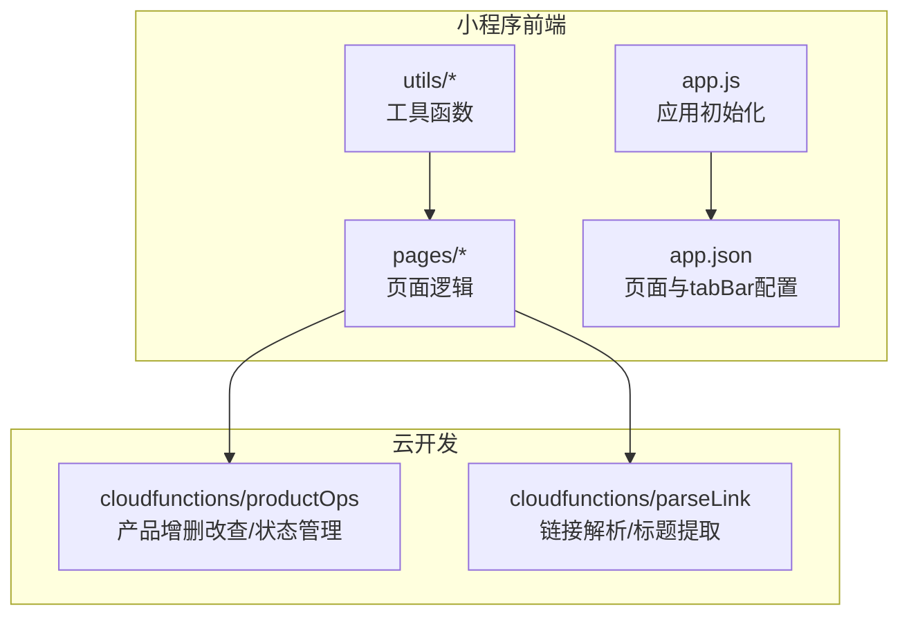
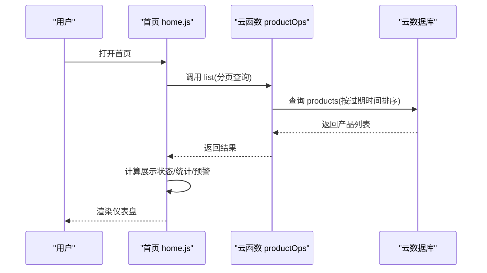
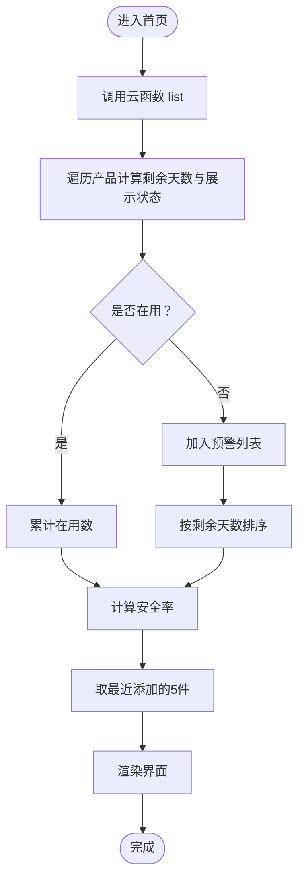
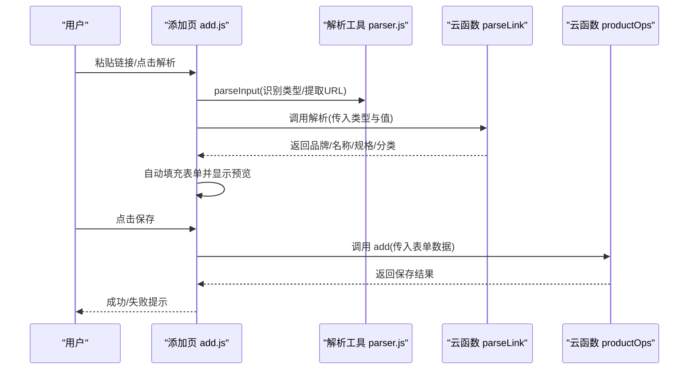
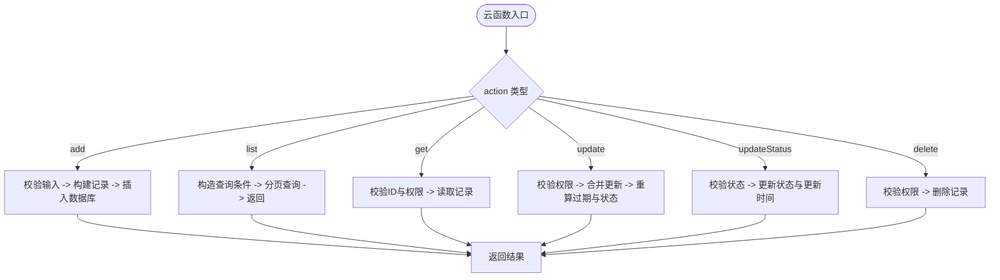
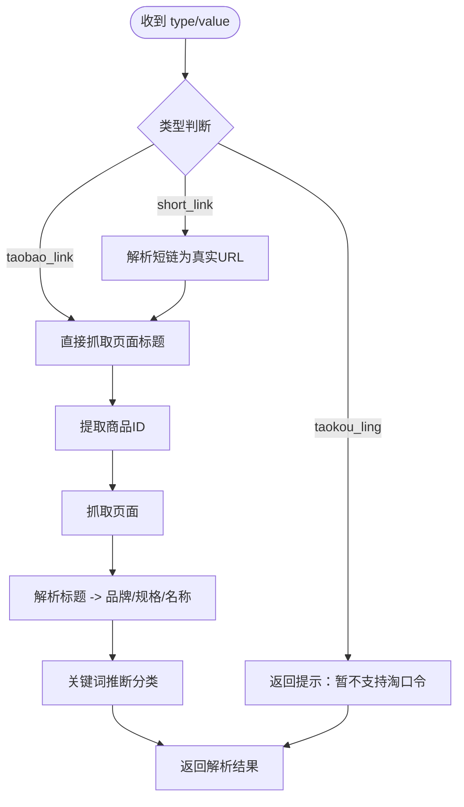
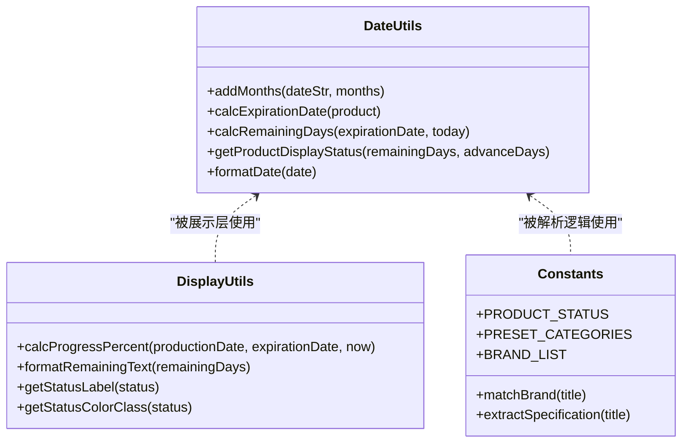
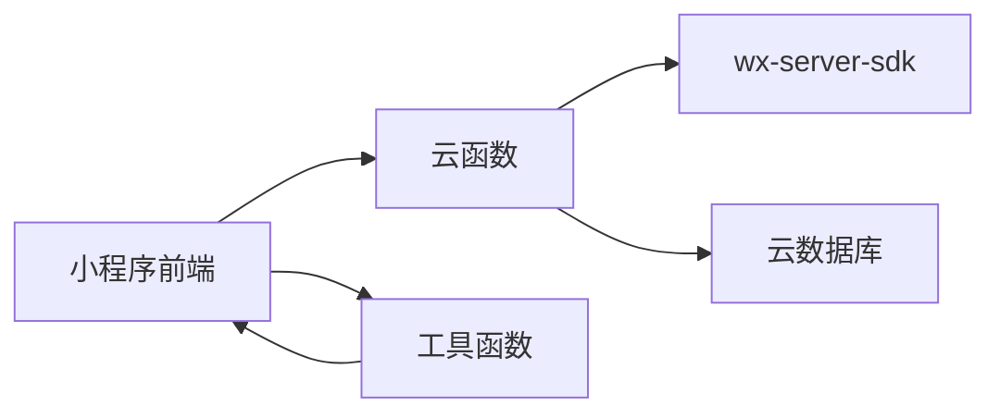

# 项目概述

<cite>
**本文引用的文件**
- [package.json](file://package.json)
- [miniprogram/app.js](file://miniprogram/app.js)
- [miniprogram/app.json](file://miniprogram/app.json)
- [miniprogram/pages/home/home.js](file://miniprogram/pages/home/home.js)
- [miniprogram/pages/add/add.js](file://miniprogram/pages/add/add.js)
- [miniprogram/utils/constants.js](file://miniprogram/utils/constants.js)
- [miniprogram/utils/parser.js](file://miniprogram/utils/parser.js)
- [miniprogram/utils/date.js](file://miniprogram/utils/date.js)
- [miniprogram/utils/display.js](file://miniprogram/utils/display.js)
- [cloudfunctions/productOps/index.js](file://cloudfunctions/productOps/index.js)
- [cloudfunctions/productOps/logic.js](file://cloudfunctions/productOps/logic.js)
- [cloudfunctions/parseLink/index.js](file://cloudfunctions/parseLink/index.js)
- [cloudfunctions/parseLink/logic.js](file://cloudfunctions/parseLink/logic.js)
- [design-system/MASTER.md](file://design-system/MASTER.md)
</cite>

## 目录
1. [引言](#引言)
2. [项目结构](#项目结构)
3. [核心组件](#核心组件)
4. [架构总览](#架构总览)
5. [详细组件分析](#详细组件分析)
6. [依赖分析](#依赖分析)
7. [性能考虑](#性能考虑)
8. [故障排查指南](#故障排查指南)
9. [结论](#结论)
10. [附录](#附录)

## 引言
CosmeticBox 是一款面向个人护理与化妆品的库存管理微信小程序。其核心目标是帮助用户高效管理化妆品和个人护理产品，提供“链接一键导入”“智能过期提醒”“状态可视化”等能力，降低管理成本，避免浪费与健康风险。项目采用“前端 + 云开发”的轻量架构，结合云函数与云数据库，实现低门槛部署与稳定运行。

## 项目结构
项目采用“小程序前端 + 云函数 + 设计系统”的组织方式：
- 小程序前端：页面、组件、工具函数、样式与全局配置
- 云函数：产品操作、链接解析、提醒相关逻辑
- 设计系统：统一的设计语言、色彩、排版与交互规范

图表来源
- [miniprogram/app.js:1-32](file://miniprogram/app.js#L1-L32)
- [miniprogram/app.json:1-52](file://miniprogram/app.json#L1-L52)
- [cloudfunctions/productOps/index.js:1-171](file://cloudfunctions/productOps/index.js#L1-L171)
- [cloudfunctions/parseLink/index.js:1-112](file://cloudfunctions/parseLink/index.js#L1-L112)

章节来源
- [miniprogram/app.js:1-32](file://miniprogram/app.js#L1-L32)
- [miniprogram/app.json:1-52](file://miniprogram/app.json#L1-L52)
- [package.json:1-20](file://package.json#L1-L20)

## 核心组件
- 仪表盘（首页）：聚合统计、即将过期预警、最近添加
- 添加产品：双模式（链接导入/手动录入）、实时过期预览
- 库存列表：按分类/状态/关键词筛选，支持状态变更
- 详情页：查看产品信息与状态
- 分类页：浏览与筛选
- 云函数：产品操作（增删改查/状态变更）、链接解析（淘宝/天猫）

章节来源
- [miniprogram/pages/home/home.js:1-119](file://miniprogram/pages/home/home.js#L1-L119)
- [miniprogram/pages/add/add.js:1-260](file://miniprogram/pages/add/add.js#L1-L260)
- [cloudfunctions/productOps/index.js:1-171](file://cloudfunctions/productOps/index.js#L1-L171)
- [cloudfunctions/parseLink/index.js:1-112](file://cloudfunctions/parseLink/index.js#L1-L112)

## 架构总览
系统采用“前端调用云函数，云函数读写云数据库”的典型微信云开发架构。前端负责用户交互与展示；云函数负责业务逻辑与数据持久化；工具函数横跨前后端，保证算法与规则的一致性。

图表来源
- [miniprogram/pages/home/home.js:28-101](file://miniprogram/pages/home/home.js#L28-L101)
- [cloudfunctions/productOps/index.js:92-110](file://cloudfunctions/productOps/index.js#L92-L110)

章节来源
- [miniprogram/pages/home/home.js:1-119](file://miniprogram/pages/home/home.js#L1-L119)
- [cloudfunctions/productOps/index.js:1-171](file://cloudfunctions/productOps/index.js#L1-L171)

## 详细组件分析

### 仪表盘（首页）组件
- 数据来源：调用产品云函数列出产品，过滤活跃状态，计算展示状态与安全率
- 展示内容：在用/关注数量、安全率、即将过期预警列表、最近添加
- 交互：点击跳转详情、跳转库存、跳转添加

图表来源
- [miniprogram/pages/home/home.js:28-101](file://miniprogram/pages/home/home.js#L28-L101)
- [miniprogram/utils/date.js:42-57](file://miniprogram/utils/date.js#L42-L57)
- [miniprogram/utils/display.js:13-27](file://miniprogram/utils/display.js#L13-L27)

章节来源
- [miniprogram/pages/home/home.js:1-119](file://miniprogram/pages/home/home.js#L1-L119)
- [miniprogram/utils/date.js:1-76](file://miniprogram/utils/date.js#L1-L76)
- [miniprogram/utils/display.js:1-76](file://miniprogram/utils/display.js#L1-L76)

### 添加产品（双模式）组件
- 链接导入：识别链接类型（淘宝/天猫/短链/淘口令），调用解析云函数，回填表单
- 手动录入：基础校验后提交到产品云函数
- 实时预览：根据生产日期与保质期计算过期时间

图表来源
- [miniprogram/pages/add/add.js:55-108](file://miniprogram/pages/add/add.js#L55-L108)
- [miniprogram/utils/parser.js:17-63](file://miniprogram/utils/parser.js#L17-L63)
- [cloudfunctions/parseLink/index.js:11-56](file://cloudfunctions/parseLink/index.js#L11-L56)
- [cloudfunctions/productOps/index.js:75-90](file://cloudfunctions/productOps/index.js#L75-L90)

章节来源
- [miniprogram/pages/add/add.js:1-260](file://miniprogram/pages/add/add.js#L1-L260)
- [miniprogram/utils/parser.js:1-70](file://miniprogram/utils/parser.js#L1-L70)
- [cloudfunctions/parseLink/index.js:1-112](file://cloudfunctions/parseLink/index.js#L1-L112)
- [cloudfunctions/parseLink/logic.js:1-78](file://cloudfunctions/parseLink/logic.js#L1-L78)

### 产品操作（云函数）组件
- 职责：接收前端请求，按 action 分发到具体处理函数（新增/列表/获取/更新/删除/更新状态）
- 权限：通过 openid 校验记录归属
- 状态：根据过期时间与用户“提前提醒天数”推导初始状态

图表来源
- [cloudfunctions/productOps/index.js:40-171](file://cloudfunctions/productOps/index.js#L40-L171)
- [cloudfunctions/productOps/logic.js:11-96](file://cloudfunctions/productOps/logic.js#L11-L96)

章节来源
- [cloudfunctions/productOps/index.js:1-171](file://cloudfunctions/productOps/index.js#L1-L171)
- [cloudfunctions/productOps/logic.js:1-105](file://cloudfunctions/productOps/logic.js#L1-L105)

### 链接解析（云函数）组件
- 支持类型：淘宝/天猫商品链接、短链、淘口令（部分降级）
- 解析流程：短链/淘口令 → 解析真实链接 → 提取商品ID → 抓取页面标题 → 标题解析（品牌/规格/名称）+ 分类推断
- 降级策略：API不可用时返回提示，页面抓取失败时返回错误

图表来源
- [cloudfunctions/parseLink/index.js:11-56](file://cloudfunctions/parseLink/index.js#L11-L56)
- [cloudfunctions/parseLink/logic.js:13-71](file://cloudfunctions/parseLink/logic.js#L13-L71)

章节来源
- [cloudfunctions/parseLink/index.js:1-112](file://cloudfunctions/parseLink/index.js#L1-L112)
- [cloudfunctions/parseLink/logic.js:1-78](file://cloudfunctions/parseLink/logic.js#L1-L78)

### 工具函数与展示组件
- 日期工具：加月、计算过期、剩余天数、展示状态
- 展示工具：进度百分比、剩余天数文案、状态标签与颜色映射
- 常量与解析：状态枚举、预设分类、品牌词库、规格提取、分类关键词

图表来源
- [miniprogram/utils/date.js:1-76](file://miniprogram/utils/date.js#L1-L76)
- [miniprogram/utils/display.js:1-76](file://miniprogram/utils/display.js#L1-L76)
- [miniprogram/utils/constants.js:1-100](file://miniprogram/utils/constants.js#L1-L100)

章节来源
- [miniprogram/utils/date.js:1-76](file://miniprogram/utils/date.js#L1-L76)
- [miniprogram/utils/display.js:1-76](file://miniprogram/utils/display.js#L1-L76)
- [miniprogram/utils/constants.js:1-100](file://miniprogram/utils/constants.js#L1-L100)

## 依赖分析
- 前端依赖：微信小程序基础库（用于云开发能力）、本地工具函数
- 云函数依赖：微信云开发 SDK（wx-server-sdk）
- 关系：前端通过 wx.cloud.callFunction 调用云函数；云函数通过云数据库进行数据持久化

图表来源
- [miniprogram/app.js:10-26](file://miniprogram/app.js#L10-L26)
- [cloudfunctions/productOps/package.json:1-9](file://cloudfunctions/productOps/package.json#L1-L9)
- [cloudfunctions/parseLink/package.json:1-9](file://cloudfunctions/parseLink/package.json#L1-L9)

章节来源
- [miniprogram/app.js:1-32](file://miniprogram/app.js#L1-L32)
- [cloudfunctions/productOps/package.json:1-9](file://cloudfunctions/productOps/package.json#L1-L9)
- [cloudfunctions/parseLink/package.json:1-9](file://cloudfunctions/parseLink/package.json#L1-L9)

## 性能考虑
- 云函数分页查询：首页与库存列表均限制分页大小，避免一次性传输大量数据
- 前端本地计算：展示状态与进度百分比在前端计算，减少云端重复逻辑
- 降级策略：链接解析在无法抓取或 API 不可用时给出明确提示，避免长时间等待
- 日期计算：月末溢出修正与标准化日期格式，确保过期时间计算准确

## 故障排查指南
- 云开发未配置：前端保存/解析报错时，提示检查云开发环境 ID 与云函数部署
- 超时问题：云函数执行超时，建议检查网络、数据库权限与索引
- 权限不足：访问他人数据或未登录场景，返回无权访问
- 解析失败：短链/淘口令解析异常或页面抓取失败，引导用户复制真实链接

章节来源
- [miniprogram/pages/add/add.js:212-234](file://miniprogram/pages/add/add.js#L212-L234)
- [cloudfunctions/parseLink/index.js:22-31](file://cloudfunctions/parseLink/index.js#L22-L31)
- [cloudfunctions/parseLink/index.js:77-111](file://cloudfunctions/parseLink/index.js#L77-L111)
- [cloudfunctions/productOps/index.js:117-119](file://cloudfunctions/productOps/index.js#L117-L119)

## 结论
CosmeticBox 通过“前端 + 云开发”的轻量架构，实现了化妆品库存管理的易用性与可靠性。其设计以“极简几何、激励反馈、清新柔和”为核心，配合“链接导入”“智能过期提醒”“状态可视化”等特性，既适合入门用户快速上手，也为进阶用户提供可扩展的云函数与工具函数支撑。项目具备良好的模块化与可测试性，便于后续迭代与维护。

## 附录
- 设计系统：统一的色彩、字体、圆角、阴影与动画规范，确保一致的用户体验
- 页面与tabBar：首页、添加、库存、我的、详情、分类页面布局清晰，符合美妆类应用的定位

章节来源
- [design-system/MASTER.md:1-190](file://design-system/MASTER.md#L1-L190)
- [miniprogram/app.json:17-48](file://miniprogram/app.json#L17-L48)