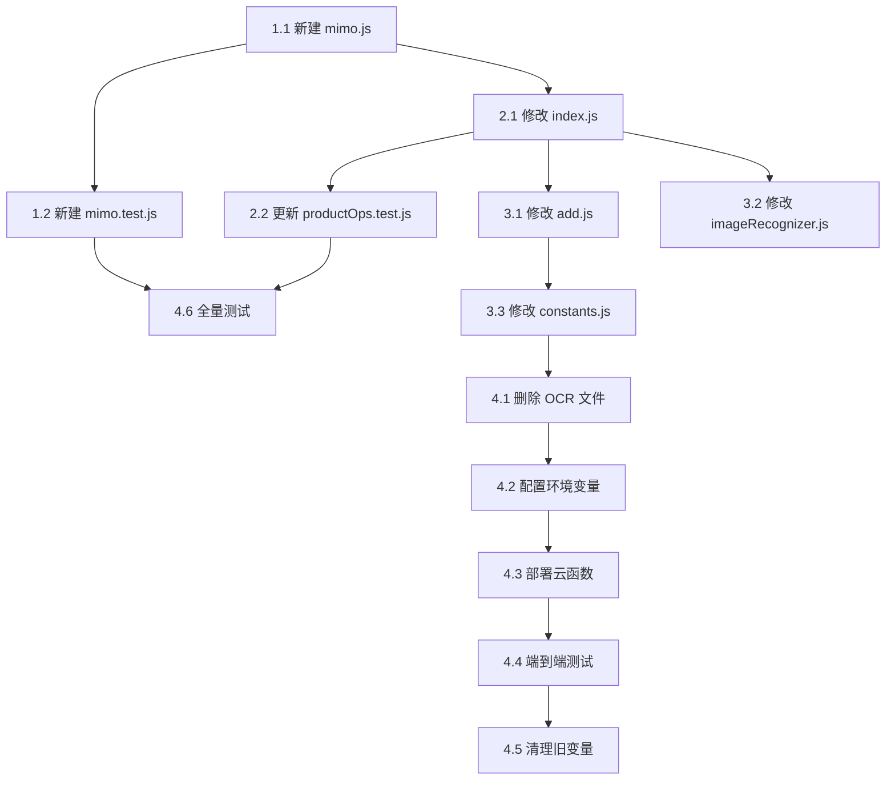

# MiMo 图片识别 — 实施计划

> 基于 `docs/superpowers/specs/2026-06-26-mimo-image-recognition-design.md`

## 执行摘要

- **目标**：将 OCR 图片识别替换为 MiMo 多模态大模型
- **规模**：删除 3 个文件，新建 2 个文件，修改 5 个文件
- **阶段数**：4 个阶段，约 18 个任务

---

## Phase 1: 新建 MiMo 调用模块

### Task 1.1: 创建 `cloudfunctions/productOps/mimo.js`

**文件**：`cloudfunctions/productOps/mimo.js`（新建）  
**依赖**：无  
**产出**：`callMiMo(imageBuffer)` 函数，返回 `{ info, rawContent }`

**实现要点**：
- OpenAI 兼容 API 调用 `https://api.xiaomimimo.com/v1/chat/completions`
- 认证：`api-key: process.env.MIMO_API_KEY`
- 图片以 Base64 传入 `messages[].content[]` 的 `image_url`
- System/User prompt 严格按 spec 中的文本
- 参数：`model: "mimo-v2.5-pro"`, `response_format: { type: "json_object" }`, `temperature: 0.1`, `thinking: { type: "disabled" }`, `max_completion_tokens: 1024`
- HTTPS 请求 `timeout: 30000`
- HTTP 状态码映射：401→"识别服务暂时不可用"，429→"识别服务繁忙，请稍后重试"，5xx→"识别服务暂时不可用"
- 响应解析：strip Markdown 代码块 → JSON.parse → 返回 `{ info, rawContent }`
- 模块导出：`module.exports = { callMiMo }`

**验证**：`node -e "const m = require('./mimo.js'); console.log(typeof m.callMiMo)"`

---

### Task 1.2: 创建 `tests/mimo.test.js`

**文件**：`tests/mimo.test.js`（新建）  
**依赖**：Task 1.1

**测试用例**：
1. Mock HTTPS 正常响应 → 验证返回 `{ info, rawContent }` 格式
2. Mock Markdown 代码块包裹的 JSON → 验证正确 strip
3. JSON 解析失败 → 验证 reject
4. HTTP 401 → reject "识别服务暂时不可用"
5. HTTP 429 → reject "识别服务繁忙，请稍后重试"
6. HTTP 5xx → reject "识别服务暂时不可用"
7. MIMO_API_KEY 未配置 → reject "MiMo 未配置"
8. 空 content → reject "MiMo 返回内容为空"
9. 网络错误 → reject "MiMo 请求失败: ..."
10. 验证请求体格式（model、messages、response_format、temperature、thinking、timeout）

**运行**：`npx jest tests/mimo.test.js`

---

## Phase 2: 修改云函数入口

### Task 2.1: 修改 `cloudfunctions/productOps/index.js`

**文件**：`cloudfunctions/productOps/index.js`（修改）  
**依赖**：Task 1.1

**具体改动**：

1. **替换导入**：
   ```javascript
   // 删除
   const { callOCR } = require('./ocr');
   const { extractProductInfo } = require('./textParser');
   // 新增
   const { callMiMo } = require('./mimo');
   ```

2. **重写 `handleRecognizeProduct`**：
   - 下载图片逻辑不变
   - `callOCR(imageBuffer)` → `callMiMo(imageBuffer)`
   - 删除 `extractProductInfo(lines)` 调用
   - 新增字段校验（shelfLifeMonths → Number，日期 → YYYY-MM-DD 正则）
   - 新增错误映射层（内部错误 → 合约字符串）：
     - `"MiMo 返回内容为空"` → `"未能识别，请手动录入"`
     - `"MiMo 响应解析失败: *"` → `"识别结果异常，请手动录入"`
     - `"MiMo 请求失败: *"` → `"识别服务暂时不可用"`
     - `"MiMo HTTP 4xx: *"` → `"识别服务暂时不可用"`
   - `rawText: lines.join('\n')` → `rawResponse: rawContent`
   - remainingDays 计算逻辑不变

**验证**：`node -e "require('./index.js')"` 无语法错误

---

### Task 2.2: 更新 `tests/productOps.test.js`

**文件**：`tests/productOps.test.js`（修改）  
**依赖**：Task 2.1

**改动**：
- 更新 `recognizeProduct` 相关测试用例，适配新响应格式（`rawResponse` 替代 `rawText`）
- Mock `callMiMo` 替代 `callOCR` + `extractProductInfo`
- 添加字段校验测试（shelfLifeMonths 字符串→数字，日期格式非法→null）
- 添加错误映射测试

**运行**：`npx jest tests/productOps.test.js`

---

## Phase 3: 客户端清理与适配

### Task 3.1: 修改 `miniprogram/pages/add/add.js`

**文件**：`miniprogram/pages/add/add.js`（修改）  
**依赖**：Task 2.1

**删除的代码块**（精确行号以实际文件为准）：

1. **`PRODUCT_NAME_INDICATORS` 数组** — 约 15 行，在文件顶部 `const { chooseImage, ... }` 下方
2. **`looksLikeProductName()` 函数** — 约 8 行
3. **`CLIENT_BRAND_LIST` 数组** — 约 10 行
4. **`parseFromRawText()` 函数** — 约 100 行，含完整解析逻辑
5. **`onChooseImage` 中的回退调用** — 删除 `const fallback = parseFromRawText(data.rawText)`
6. **字段来源回退逻辑** — `data.name || fallback.name || ''` → `data.name || ''`

**保留的降级逻辑**：
- 名称未识别 → 默认 "待确认产品名称"
- 生产日期未识别 → 默认今天
- 保质期未识别 → 默认 "36"

**适配新响应格式**：
- `data.rawText` → `data.rawResponse`
- 移除 `rawText` 的 split 和 join 操作

**验证**：微信开发者工具编译通过，无引用错误

---

### Task 3.2: 修改 `miniprogram/utils/imageRecognizer.js`

**文件**：`miniprogram/utils/imageRecognizer.js`（修改）  
**依赖**：Task 2.1

**改动**：
- JSDoc 中 `rawText` → `rawResponse`
- `recognizeFromImage` 返回值：`rawText: result.data.rawText` → `rawResponse: result.data.rawResponse`
- 移除 `rawText` 相关注释

**验证**：微信开发者工具编译通过

---

### Task 3.3: 修改 `miniprogram/utils/constants.js`

**文件**：`miniprogram/utils/constants.js`（修改）  
**依赖**：无（独立改动）

**改动**：
- 在 `BRAND_LIST` 上方添加注释：
  ```
  // 注意：以下品牌识别工具（BRAND_LIST、matchBrand、extractSpecification）
  // 仅用于淘宝链接解析（parseLink），图片识别已改用 MiMo 多模态模型
  ```
- **不删除** `BRAND_LIST`、`matchBrand`、`extractSpecification`——`parseLink` 仍依赖它们

**验证**：`npx jest tests/parseLink.test.js` 通过

---

## Phase 4: 清理与部署

### Task 4.1: 删除 OCR 相关文件

**删除的文件**：
- `cloudfunctions/productOps/ocr.js`
- `cloudfunctions/productOps/textParser.js`
- `tests/textParser.test.js`

**验证**：全局搜索无残留引用：
```bash
grep -r "require('./ocr')" cloudfunctions/  # 应无结果
grep -r "require('./textParser')" cloudfunctions/  # 应无结果
grep -r "extractProductInfo" cloudfunctions/  # 应无结果（或仅 spec 文档中有）
grep -r "callOCR" cloudfunctions/  # 应无结果
```

---

### Task 4.2: 配置环境变量

在微信云开发控制台 → 云函数 → `productOps` → 环境变量：

| 操作 | 变量名 | 值 |
|------|--------|----|
| **新增** | `MIMO_API_KEY` | 从 https://platform.xiaomimimo.com/ 获取 |
| **保留** | `OCR_SECRET_ID` | 暂不删除（用于回滚） |
| **保留** | `OCR_SECRET_KEY` | 暂不删除（用于回滚） |

---

### Task 4.3: 部署云函数

上传 `productOps` 云函数（右键 → 上传并部署：云端安装依赖）。

验证：在云函数日志中确认启动无错误。

---

### Task 4.4: 端到端测试

**测试场景**（按验收标准）：

| # | 场景 | 操作 | 预期 |
|---|------|------|------|
| 1 | 清晰包装 | 拍一张化妆品包装照片 | 提取 ≥ 1 个字段成功 |
| 2 | 模糊图片 | 拍模糊/非化妆品图片 | 返回友好错误信息 |
| 3 | 网络异常 | 断开手机网络后识别 | 提示网络错误 |
| 4 | 手动录入兜底 | 识别失败后切换手动模式 | 可正常手动填写提交 |

---

### Task 4.5: 清理旧环境变量（验证后）

端到端测试通过且稳定运行 1 天后：

| 操作 | 变量名 |
|------|--------|
| **删除** | `OCR_SECRET_ID` |
| **删除** | `OCR_SECRET_KEY` |

---

### Task 4.6: 运行全部测试

```bash
npx jest tests/ --passWithNoTests
```

预期：所有测试通过，无 `textParser.test.js` 残留引用。

---

## 执行顺序图



---

## 风险检查点

| 阶段 | 检查点 | 不通过则 |
|------|--------|---------|
| Phase 1 完成 | `mimo.test.js` 全部通过 | 检查 API 格式 / prompt / 网络 |
| Phase 2 完成 | `productOps.test.js` 全部通过 | 检查字段映射 / 错误处理 |
| Phase 3 完成 | 微信开发者工具编译通过 | 检查 import 残留 / 变量引用 |
| Phase 4.4 完成 | 端到端测试通过 | 检查环境变量 / 网络 / prompt |

---

*计划版本: 1.0 | 日期: 2026-06-26*
